# **High Level Design: Esper - Morphogenetic Training Platform**

**Version:** 1.4
**Status:** Production-Ready
**Date:** 01 July 2025
**Author:** John Morrissey

## Executive Summary

### Overview

The Esper Morphogenetic Training Platform represents a fundamental shift in how neural networks are designed, trained, and deployed. Rather than treating neural networks as static artifacts that must be carefully architected and then frozen, Esper enables models to function as adaptive, evolving entities capable of autonomous structural modification while they are being trained.

This High Level Design document specifies the complete architectural framework for implementing morphogenetic architectures—neural networks that can detect their own computational bottlenecks and patch them in-situ by grafting specialized sub-networks called Blueprints into their structure. The result is a system that delivers targeted performance improvements with exceptional parameter efficiency while maintaining rigorous safety guarantees.

### Core Innovation

The central innovation of Esper lies in its use of two sophisticated neural network agents that govern the entire adaptation process. The Strategic Controller (Tamiyo) continuously analyzes the host model during its training loop, treating it as a complex adaptive system, and identifying precisely where and when architectural interventions will yield the greatest benefit. The Generative Architect (Karn) operates as an automated research and development engine, continuously inventing and refining new architectural primitives that expand the system's problem-solving capabilities. This creates a Nested Learning Paradigm where multiple learning processes operate simultaneously: the base model learns its primary task, the controller learns optimal intervention strategies, and the architect learns to design better solutions.

A cornerstone of the platform is a fully **asynchronous compilation and validation pipeline** that ensures **zero training disruption**. Blueprint compilation, a traditionally expensive and blocking operation, is offloaded to a dedicated background service. This allows the primary training loop to proceed uninterrupted while new architectural solutions are compiled, validated, and characterized in parallel, making them available for deployment without ever pausing the model's training momentum.

This approach fundamentally addresses the limitations of current neural network architectures. Traditional models must be over-provisioned for worst-case scenarios, wasting computational resources on uniform capacity distribution. They cannot adapt to changing requirements without expensive retraining. Most critically, they cannot improve themselves—every enhancement requires human intervention. Esper changes this paradigm by enabling models that grow capacity precisely where needed, continuously improve their architecture, and adapt to new requirements while maintaining stable performance on existing capabilities.

### Architectural Approach

The Esper reference architecture implements these concepts through **eleven** specialized subsystems organized into three functional planes:

* **The Training Plane:** Manages the core learning process through Tolaria (the training orchestrator) and **Kasmina (the execution layer)**.
* **The Control Plane:** Provides intelligent decision-making through Tamiyo (the strategic controller), Simic (the policy training environment), and Emrakul (the architectural sculptor).
* **The Innovation Plane:** Drives continuous improvement through Karn (the generative architect), **Tezzeret (the compilation forge)**, **Urabrask (the evaluation engine)**, and **Urza (the central library)**.

This explicit separation of compilation (Tezzeret) and validation (Urabrask) from pure execution (Kasmina) is critical, enabling the use of pre-compiled, optimized kernels without disrupting the training loop. Additionally, Oona serves as the message bus for inter-component communication, while Nissa provides observability and auditing capabilities.

These components communicate through an event-driven architecture using the Oona message bus, ensuring loose coupling and enabling independent evolution of subsystems. The Nissa observability platform provides comprehensive monitoring and auditing capabilities, creating complete transparency into the system's operation and decision-making processes.

The architecture incorporates multiple safety mechanisms to ensure that autonomous adaptation never compromises system stability. Every potential adaptation undergoes an 11-stage lifecycle with three distinct validation phases. The Testing Crucible (Urabrask) rigorously evaluates every new blueprint before it can be deployed. The Strategic Controller includes both learned policies and deterministic safety checks. Failed adaptations can be rolled back instantly, and the entire evolutionary history is cryptographically tracked for complete auditability.

### Implementation Strategy

The implementation follows a carefully planned two-phase approach. Phase 1 focuses on validating the core morphogenetic mechanics through a single-server deployment suitable for smaller models and research environments. This phase, targeted for completion within three months, will demonstrate the fundamental viability of autonomous architectural evolution and establish baseline performance metrics.

Phase 2 expands the system into a fully distributed, production-ready platform leveraging Kubernetes for orchestration and capable of handling large-scale models and concurrent training runs. This phase has been successfully completed, including the implementation of the Tamiyo GNN-based intelligence system, autonomous decision-making capabilities, and production-ready safety mechanisms. Future phases will add enterprise-grade security, comprehensive MLOps integration, and the scalability required for large-scale distributed deployment.

### Expected Outcomes

Organizations implementing the Esper platform can expect transformative improvements in how they develop and deploy neural networks. The system delivers dramatic parameter efficiency, requiring 10 to 100 times fewer parameters than traditional fine-tuning approaches while achieving comparable or superior performance gains. Models demonstrate exceptional stability, maintaining less than 5% performance degradation on original tasks even after numerous adaptation cycles.

From an operational perspective, Esper enables the deployment of truly adaptive AI in domains where traditional retraining is infeasible or dangerous. The platform's comprehensive audit trail and safety mechanisms make it suitable for regulated industries where model behavior must be traceable and predictable. The automated architectural exploration accelerates research and development cycles, allowing organizations to discover optimal architectures without manual intervention.

### Current Status and Next Steps

The project has successfully validated its foundational concepts and established the core architecture. A functional single-node prototype demonstrates the end-to-end morphogenetic process on benchmark tasks. The immediate priorities for the next quarter focus on implementing the neural policies for the Strategic Controller and Generative Architect, conducting comprehensive benchmarking against traditional approaches, and hardening the security architecture.

This High Level Design provides the blueprint for building a new class of self-improving AI systems. By enabling neural networks to evolve their own architecture while maintaining safety and predictability, Esper represents a fundamental advance in how we conceptualize, train, and deploy artificial intelligence. The framework transforms machine learning models from static artifacts requiring constant human oversight into autonomous systems capable of continuous self-improvement within rigorously defined safety boundaries

---

## **1. Document Purpose and Scope**

### **1.1. Purpose**

The purpose of this document is to provide the formal framework and technical reference architecture for implementing **Morphogenetic Architectures**. It serves as the primary engineering counterpart to the foundational research on the topic, translating theoretical principles of seed-based evolution into a concrete, reproducible system design.

A core innovation detailed in this framework is the move beyond simple, heuristic-based adaptation. This document specifies an architecture driven by two distinct, learning-based agents:

1. A **Strategic Controller Network** that learns to analyze the entire host model as a system, identifying and targeting the most critical areas of underperformance with contextual awareness.
2. A **Generative Architect Network** that continuously invents, tests, and refines novel sub-network primitives (Blueprints), ensuring the system's problem-solving capabilities evolve over time.

To make this dynamic process viable in a production environment, the architecture is built upon a fully **asynchronous compilation and validation pipeline**. This cornerstone technology offloads expensive optimization tasks to a dedicated background service, ensuring the primary training loop proceeds with **zero training disruption**. By detailing the design for these intelligent agents and their supporting asynchronous infrastructure, this framework provides the blueprint for a truly autonomous system that learns not only how to fix itself, but how to get better at inventing solutions.

### **1.2. Scope**

To effectively define the system, the scope of this document is bounded as follows:

**In Scope:**

* **Primary Use Case (Proof of Concept):** The framework's initial validation focuses on demonstrating Tamiyo's role as a strategic architect that monitors a host model during its initial training, identifying learning bottlenecks and patching in new capacity to improve the final trained artifact.
* **Architectural Framework:** A detailed description of the logical components, including the design for a **learning-based Strategic Controller** (for intelligent targeting) and a **Generative Architect** (for creating new structural primitives).
* **Data Contracts:** Precise schemas and definitions for core entities, including `Seeds`, `Blueprints`, and the `telemetry` signals required by the controller.
* **The Morphogenetic Lifecycle:** A formal definition of the state machine governing a seed's evolution from `DORMANT` through `GERMINATED`, `TRAINING`, `GRAFTING`, and finally to `FOSSILIZED` or `CULLED`.
* **Architectural & Training Constraints:** The set of rules that a host network must satisfy to support adaptation, and the MLOps/RL training requirements for the controller and architect agents.
* **Reference Interfaces:** High-level API and communication protocol definitions for interaction between the system's components.
* **Evaluation Strategies:** Methodologies for assessing the stability of adaptations and the performance of the controller and architect networks.
* **MVP Reference Design:** A high-level design for a prototype system demonstrating the core concepts on benchmark tasks.

**Out of Scope:**

* **Re-derivation of Foundational Theory:** This document will assume the reader is familiar with the general concepts of monitoring and germination as detailed in the parent research paper. It will not reproduce the mathematical proofs.
* **Exhaustive Literature Review:** While prior art is surveyed, this is not intended as a comprehensive academic review of reinforcement learning for NAS or graph neural networks.
* **Low-Level Implementation Details:** This document specifies architectures and interfaces, not specific code implementations, function signatures, or class-level designs.
* **Production-Hardening:** The focus is on a functional MVP framework. Concerns such as advanced security, large-scale deployment orchestration, and enterprise-grade observability are noted but not specified in detail.
* **Specific Hardware Optimization:** The framework is designed to be hardware-aware, but it is not a compiler or optimization guide for specific GPU/TPU/NPU targets.
* **Post-Training Adaptation:** Enhancing already trained and frozen models is a valuable future application but is out of scope for the initial proof-of-concept, which focuses on in-training adaptation.

### **1.3. Acknowledgment of Prior Research**

This framework synthesizes concepts from several mature fields of artificial intelligence research. The autonomous design of architectural `Blueprints` is an evolution of ideas from **Neural Architecture Search (NAS)**, while the `Strategic Controller`'s decision-making process is guided by techniques from **Reinforcement Learning (RL)** for policy optimization. Furthermore, the system's ability to evolve without compromising existing capabilities addresses core challenges in **Continual Learning**.

While this document presents a unique architecture that integrates these principles into a novel system, it gratefully acknowledges the extensive body of foundational work contributed by the many researchers in these and related fields. [Actual discussion and citations here.]

---

## **2. Conceptual Framework & Value Proposition**

### **2.1 A Paradigm of Living Architectures**

This framework introduces **Morphogenetic Architectures**, a class of neural networks that rejects the paradigm of static, immutable design. Instead, it enables models to function as adaptive, evolving entities. The core purpose of this framework is to provide the technical means for a neural network to **autonomously detect its own computational or representational bottlenecks and patch them in-situ** by intervening directly in the training process itself.

This is achieved by grafting specialized, pre-compiled, and rigorously validated sub-networks, or **Blueprints**, into a larger host model as it is being trained. This transforms the training loop from a linear progression into a dynamic process of architectural discovery, allowing models to become not just trained artifacts, but evolving systems capable of targeted, surgical growth in response to needs that emerge during the training process.

### **2.2 Key Innovation: The Learning-Based Control System**

The central innovation of the Morphogenetic Framework is its use of a **learning-based control system** to guide the entire evolutionary process. This replaces static rules or simple heuristics with a trio of symbiotic systems that govern adaptation:

1. **The Strategic Controller:** A dedicated policy network (`Tamiyo`) that analyzes the entire host model as a complex system. It learns to **identify and target systemic weaknesses** with high precision, going beyond simple local metrics to understand the contextual source of underperformance. It acts as the system's "diagnostician," deciding *where* and *when* intervention is most needed.
2. **The Generative Architect:** A generative model (`Karn`) responsible for continuously **inventing novel architectural primitives (Blueprints)**. By creating and proposing new solutions for testing, it provides an evolutionary pressure on the system's library of available adaptations. It acts as the system's "R&D lab," ensuring the platform's problem-solving capacity is never static.
3. **The Asynchronous Innovation Pipeline:** A cornerstone engineering innovation that ensures **zero training disruption**. The entire lifecycle of a Blueprint—from compilation and optimization (`Tezzeret`) to empirical benchmarking and characterization (`Urabrask`)—is handled by dedicated background services. This allows the primary training loop to proceed uninterrupted while a rich portfolio of safe, validated architectural solutions is prepared for deployment.

These three systems enable a **Nested Learning Paradigm**, where multiple learning cycles operate simultaneously at different scales: the foundational training of the host model, the policy training of the Strategic Controller, and the generative training of the Architect, all supported by a resilient, non-blocking engineering backbone.

### **2.3 Core Value Proposition**

A system built on this framework delivers fundamental advantages over traditional static models:

* **Adaptive Performance:** Models automatically grow capacity precisely where needed, resolving bottlenecks without wasteful, uniform parameter scaling.
* **Continuous Innovation:** The architecture is a self-improving asset, capable of inventing and integrating novel solutions through its own evolutionary design process.
* **Operational Safety:** A multi-stage validation lifecycle for every adaptation prevents unstable or harmful modifications from being permanently integrated into the host model.
* **Zero Training Disruption:** The asynchronous compilation pipeline guarantees that the primary training loop is never paused or blocked. Architectural evolution occurs in parallel, not in sequence, preserving training momentum and stability.
* **Resource Efficiency:** Targeted capacity injection is dramatically more parameter-efficient than full model retraining or fine-tuning. This is best demonstrated by the framework's core application: enhancing knowledge distillation. By embedding a seed lattice into a smaller "student" model (e.g., 3B parameters) at the start of its training, the system can distill knowledge from a larger "teacher" model (e.g., 7B parameters) more effectively. While `Tolaria` manages the distillation training, `Tamiyo` monitors the student model's learning process in real-time. She can then concurrently deploy pre-validated capacity via germination precisely where the student model struggles most to absorb the teacher's complexity—all without ever pausing the distillation process. This unified approach directly solves the core industry trade-off between model size and performance, producing an efficient, edge-ready model that retains the critical capabilities of its much larger parent.

### **2.4 Capabilities of a Morphogenetic System**

A system successfully implementing this framework will demonstrate the following capabilities, establishing significant advances in how neural networks are trained, deployed, and maintained.

#### **2.4.1 Foundational Principles**

The system is built upon and validates a set of foundational principles that distinguish it from traditional architectures:

* It leverages the proven concept of **seed-driven local evolution**, applying the theory of targeted structural adaptation (originally validated on static networks) to the dynamic context of a model undergoing training.
* It provides a concrete implementation of **autonomous architectural self-modification**, demonstrating that a network can evolve while maintaining global functional stability.
* It establishes formal methods for verifying **interface contract preservation** and **gradient isolation**, ensuring the safety of grafting live, trainable modules into a host network.

#### **2.4.2 Novel Training & Adaptation Paradigms**

* Successfully implements the **Nested Learning Paradigm**, where the controller and architect agents are trained based on feedback from the host model's performance.
* Demonstrates **policy-governed germination** as a safe and intelligent alternative to unconstrained neural architecture search.
* Proves that **local objective encapsulation** enables targeted capacity expansion and localized learning without requiring global retraining.

#### **2.4.3 Architectural & Engineering Innovations**

* Implements **cryptographic lineage tracking**, creating auditable, biographical architectures where every modification is securely recorded.
* Achieves robust **multi-stage lifecycle validation** (e.g., isolated training, controlled grafting, stabilization, evaluation) to rigorously test and de-risk every potential adaptation.
* Achieves **asynchronous, non-blocking architectural modification**, allowing the host model's training to proceed without interruption while new components are compiled and validated in parallel.
* Provides **open-source reference implementations and formalisms** (seeds, germination, grafting, fossilization) to enable broader research in adaptive architectures.

#### **2.4.4 Target Empirical Benchmarks**

A successful implementation will be measured against the following performance and stability targets on canonical benchmark tasks:

* **High-Fidelity Germination:** The ability to resolve identified bottlenecks with greater than 90% accuracy.
* **Stability & Low-Impact Adaptation:** Performance degradation on original tasks of less than 5% after numerous (20+) successful germination events.
* **Exceptional Parameter Efficiency:** Targeted performance gains achieved with 10 to 100 times fewer parameters used compared to full model fine-tuning.
* **Representational Integrity:** Cosine drift in the latent representations of un-modified network sections of less than 0.05, proving the effectiveness of gradient isolation.

These capabilities collectively enable a fundamental shift from building static ML artifacts to engineering dynamic, evolving, and truly adaptive intelligent systems.

---

## **3. Scientific Context & Validation**

### **3.1. Scientific Challenge**

Current neural network training paradigms are constrained by fundamental limitations that hinder the development of efficient, adaptive systems:

* **Static Allocation:** Network topology is fixed before training begins, forcing developers to over-provision resources based on worst-case assumptions rather than allowing capacity to grow organically based on demonstrated need.
* **Inefficient Optimization:** The entire parameter space is optimized simultaneously, preventing targeted, surgical interventions to resolve specific learning bottlenecks as they emerge during the training process.
* **Destructive Interference:** Traditional methods for adapting models, such as fine-tuning, often lead to catastrophic forgetting, where new capabilities are learned at the expense of existing ones.
* **Sequential Bottlenecks:** The need to discover, compile, and validate new architectural components is typically a synchronous, blocking process that stalls training momentum and complicates resource management.
* **Opaque Design Process:** Conventional Neural Architecture Search (NAS) methods are often black boxes, lacking the auditability and safety guarantees required for critical applications.

### **3.2. Research Approach**

The morphogenetic approach introduces a novel scientific framework that reimagines neural networks as systems capable of controlled, externally guided structural evolution. This approach synthesizes insights from:

#### **3.2.1. Biological Morphogenesis**

* `Seeds` as multipotent stem cells with latent developmental potential.
* `Germination` as controlled differentiation in response to local signals.
* Apoptosis-inspired rollback mechanisms for failed adaptations.

#### **3.2.2. Distributed Systems Theory**

* **Separation of concerns** is paramount: control (`Tamiyo`, the Strategic Controller) is decoupled from execution (`Kasmina`), and innovation (`Karn`, the Generative Architect) is isolated from operations. The introduction of an asynchronous compilation forge (`Tezzeret`) further exemplifies this principle.
* Event-driven architecture for loose coupling and fault tolerance.
* Immutable audit logs for system observability.

#### **3.2.3. Continual Learning**

* Elastic Weight Consolidation principles applied at the architectural level.
* Gradient isolation to prevent interference with stable, non-adapting parameters.
* Local objective encapsulation for targeted learning.

The research methodology follows three complementary investigation threads:

1. **Theoretical Foundations**: Establishing formal frameworks for seed-based evolution, interface contracts, and safety bounds under controller-driven adaptation.
2. **Systems Engineering**: Building robust, scalable infrastructure for managing the distributed morphogenetic process, including the asynchronous compilation and validation pipeline.
3. **Empirical Validation**: Comprehensive evaluation across diverse tasks, architectures, and deployment scenarios.

### **3.3. Scientific Validation Criteria**

Success will be measured through rigorous empirical and theoretical validation across multiple dimensions.

From a theoretical perspective, the research must establish fundamental guarantees about system behavior. This includes developing a formal proof that gradient isolation mechanisms maintain the integrity of **stable, non-adapting parameters** throughout an adaptation event. Additionally, we will derive mathematical bounds on cumulative drift over extended evolution cycles, quantifying the maximum deviation from original model behavior. The work will also establish a theoretical framework for local function approximation under **stable priors**, providing the mathematical foundation for understanding how `Seeds` can learn meaningful transformations. Finally, we aim to prove convergence guarantees for seed-specific optimization objectives, demonstrating that local learning processes reliably reach stable solutions.

Empirical validation will focus on demonstrating practical effectiveness. The system will be judged on its ability to resolve identified computational bottlenecks with **a target success rate of greater than 90%**, validating that the controller reliably addresses the problems it detects. Critically, stability preservation will be measured against a target of **less than 5% performance degradation** on original tasks after 20 or more adaptation cycles. The parameter efficiency of the approach should yield dramatic improvements, targeting **10 to 100 times fewer parameters** than traditional full model retraining for comparable performance gains. This must be accomplished with minimal overhead, maintaining **inference latency increases below a 5% target**. A key validation criterion is **Zero Training Disruption**: the system must demonstrate zero compilation-related stalls or pauses in the `Tolaria` training loop.

The system itself must exhibit robust engineering properties. **Deterministic Reproduction** is essential, guaranteeing identical architectural outcomes given the same initial state and inputs. **Asynchronous Pipeline Integrity** must be proven, validating the end-to-end data flow from `Karn` to `Tamiyo` without blocking operations. The **Rollback Mechanism** must achieve 100% reliability in restoring systems to their pre-germination state. Every structural modification must be fully traceable through **Comprehensive Audit Logs**. The approach must also demonstrate **Cross-Architecture Generalization**, operating successfully across MLPs, CNNs, and Transformer architectures.

Safety validation is paramount. **Interface Integrity** must be absolute, with zero tolerance for shape or type violations. **Resource Consumption** must strictly adhere to predefined budgets. A critical safety guarantee is **Validated Kernel Deployment**, which mandates that 100% of kernels executed by `Kasmina` have passed the full `Urabrask` validation gauntlet. The system must also demonstrate **Adversarial Robustness** against attempts to force unnecessary germination, and **Long-Term Stability**, ensuring that final models produced by the system remain predictable and reliable.

### **3.4. Scientific Impact**

This research aims to establish morphogenetic architectures as a foundational paradigm shift in machine learning.

The immediate contributions include establishing a new vocabulary and conceptual framework for designing adaptive training systems. By providing an open-source reference implementation, the work enables reproducible research and accelerates adoption. The comprehensive evaluation methodologies will serve as benchmarks for future work, while the formal safety protocols establish standards for responsible architectural modification. A key contribution will be a set of best practices for decoupling model training from hardware-specific kernel optimization.

In the medium term, this research enables the deployment of highly specialized, efficient AI in safety-critical and resource-constrained domains. It dramatically reduces computational waste by eliminating the need to over-provision models. The automated exploration capabilities accelerate neural architecture research, while bridging the gap between static model design and true lifelong learning systems.

The long-term vision is to establish neural ontogeny as a discrete engineering discipline. This enables the creation of complex AI systems that are grown, not just built, with rigorous safety guarantees. The foundations laid by this work will enable ambient intelligence that adapts to its environment without constant human re-engineering, transforming neural networks from static artifacts into living systems that evolve under safe, predictable, and programmatic control.

### **3.5. Research Questions**

This work addresses fundamental questions at the intersection of machine learning, systems engineering, and theoretical computer science:

1. Can a neural network's architecture be safely and autonomously modified by an external control system (`Tamiyo`) during its initial training process without compromising learning stability?
2. What minimal infrastructure is required to ensure controlled, auditable structural evolution orchestrated by intelligent agents?
3. How can a decoupled, asynchronous compilation and validation pipeline enable continuous optimization of architectural components without disrupting the primary learning process?
4. How can we formally verify that controller-driven local adaptations preserve global system properties?
5. What are the theoretical limits of expressivity for `Seed`-based architectural growth?
6. Can this morphogenetic training approach achieve better parameter efficiency for a given performance level than traditional training and transfer learning paradigms?

---

## **4. Reference Architecture Overview**

This chapter outlines the logical reference architecture, codenamed **Esper**, that implements the principles of the Morphogenetic Framework. It provides a concrete example of how the framework's concepts can be realized in a functioning system. This design is centered on an asynchronous compilation and validation pipeline that ensures the core training loop is never disrupted. While this design describes functionally distinct subsystems, the initial **Phase 1 implementation** will co-locate these components on a single server to validate the core mechanics on smaller-scale models.

### **4.1 High-Level Architecture**

The Esper reference implementation operates as a system of **eleven** specialized subsystems organized into three functional planes. This ensures a clear separation of concerns between training, control, and innovation, and is designed for future distribution, even when co-located in Phase 1.

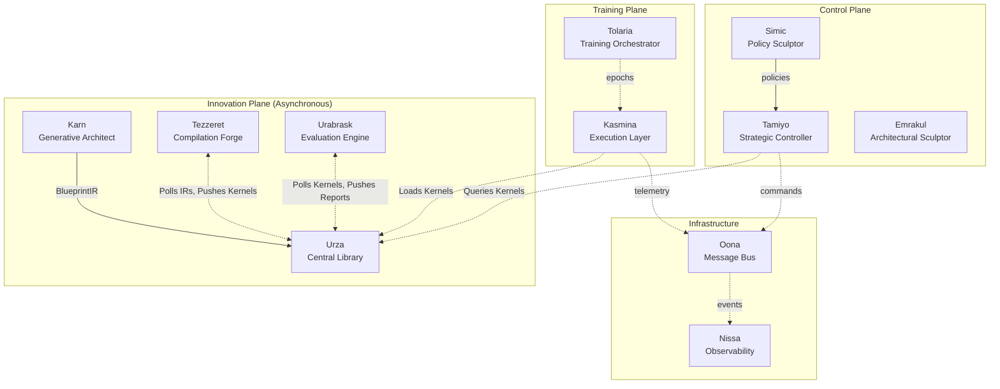

*Note: The Innovation Plane operates asynchronously to the main training loop. In the Phase 1 single-server implementation, these "planes" and "subsystems" represent logical separations of concern that may be realized as distinct processes or even modules within a single application. This design ensures that the system can be scaled out into a fully distributed architecture in subsequent phases.*

### **4.2 Core Concepts**

#### **4.2.1 Seeds**

Seeds represent the fundamental unit of morphogenetic change, embodying the theoretical principle of **localized structural evolution**. Each seed:

* **Monitors** a specific "chunk" of neurons, collecting local performance telemetry. While initial detection may rely on statistical signals (e.g., activation variance), the ultimate decision to intervene is made by the `Strategic Controller (Tamiyo)`.
* **Encapsulates** latent developmental potential, analogous to multipotent stem cells in biological systems.
* **Reports** multi-dimensional health metrics (variance, entropy, correlation) that inform the controller's learned policy.
* **Executes** the 11-stage lifecycle under strict **interface contract** preservation, ensuring gradient isolation.

*Theoretical foundation: Seeds implement the principle of **local objective encapsulation**, enabling targeted optimization without global interference.*

#### **4.2.2 Blueprints & Kernels**

The framework makes a critical distinction between a blueprint design and its executable form.

* A **Blueprint** is the architectural design (`BlueprintIR`) for a neural module, generated as a candidate solution by the `Karn` generative architect and stored in `Urza`.
* These designs are asynchronously consumed by `Tezzeret`, the **compilation forge**, which runs diverse optimization passes to produce a portfolio of `CompiledKernelArtifacts`.
* These compiled kernels are then rigorously benchmarked and characterized by the `Urabrask` **evaluation engine**, which generates empirical performance tags (e.g., `high_speed`, `low_memory`).
* Only **validated, characterized kernels** are made available in the `Urza` library for `Tamiyo` to select for deployment.

*Research insight: This pipeline separates the "genotype" (the `BlueprintIR` from Karn) from the "phenotype" (the empirically validated `CompiledKernelArtifacts`). This allows for an unbiased, data-driven selection process where adaptations are chosen based on their proven real-world characteristics, not just their theoretical design.*

#### **4.2.3 Morphogenetic Lifecycle**

The 11-stage lifecycle implements a rigorous **three-phase validation** process to ensure every adaptation is safe and effective before becoming a permanent part of the host model.

* **Phase 1 - Pre-Integration (Stages 1-3):** A Blueprint is trained in isolation to assess its potential (`DORMANT`, `GERMINATED`, `TRAINING`).
* **Phase 2 - Controlled Integration (Stages 4-6):** The trained Blueprint is gradually integrated and its impact evaluated (`GRAFTING`, `STABILIZATION`, `EVALUATING`).
* **Phase 3 - Final Determination (Stages 7-11):** A final decision is made to make the change permanent, roll it back, or discard it based on global performance (`FINE_TUNING`, `FOSSILIZED`, `CULLED`, `CANCELLED`, `ROLLED_BACK`).

*Scientific validation: This lifecycle prevents the failure modes identified in the parent research paper while enabling the specified seed design patterns.*

### **4.3 System Boundaries**

**Within Scope:**

* **In-Training Adaptation:** The framework targets structural modifications to a host model *during an active training loop*. While the base parameters are temporarily frozen during a specific grafting operation (gradient isolation), the primary scenario involves a concurrently training host model.
* **Asynchronous Compilation Pipeline:** The entire lifecycle of compiling and validating kernels happens in background services, ensuring zero disruption to the main training loop.
* **Policy-governed evolution**: Using the learned policies of the `Strategic Controller (Tamiyo)` and `Generative Architect (Karn)` to guide evolution.
* **Multi-architecture support**: Validated on MLPs, CNNs, and Transformer architectures.
* **Distributed coordination**: Event-driven communication between loosely coupled subsystems (in Phase 2).
* **Comprehensive observability**: Full, auditable trail of all morphogenetic events.

**Outside Scope:**

* **Global architecture search**: The framework assumes a frozen base topology.
* **Weight-only adaptation**: The focus is on structural, not parametric, changes.
* **Unsupervised discovery**: All adaptations are guided by performance signals and learned policies.
* **Real-time inference adaptation**: The current design targets training-time evolution.
* **Cross-model knowledge transfer**: Seeds operate within single model boundaries.
* **Hardware-specific compilation**: While hardware-aware, the framework is not a compiler or low-level optimizer.
* **Post-Hoc Enhancement:** The adaptation of fully trained, static models that are no longer in an active training loop is considered a future capability, not part of the initial proof of concept.

**External Interfaces:**

* **Training frameworks**: PyTorch `nn.Module` compatibility.
* **Hardware accelerators**: CUDA/TPU/etc. through standard PyTorch device abstraction.
* **Monitoring systems**: Prometheus/Grafana compatible metrics export.
* **Storage systems**: Checkpoint compatibility with standard model serialization.
* **Container orchestration**: Kubernetes-ready deployment manifests (for Phase 2).

### **4.4 Core Dependencies & Versions**

The framework prioritizes the latest stable versions of its core dependencies to leverage modern features, security patches, and performance improvements.

* **Python:** `~3.12` or later.
* **PyTorch:** `~2.7` or later, for dynamic graph manipulation and `torch.compile` features.
* **Numerical & Statistical Analysis:** `NumPy` / `SciPy`.
* **Message Broker:** `Apache Pulsar` or `NATS` (for distributed Phase 2). `Redis Streams` is sufficient for the single-node Phase 1 prototype.
* **Distributed Coordination:** `etcd` or `Consul` (optional, for multi-node Phase 2 deployments).

**Research Assumptions:**

* Models exhibit identifiable bottlenecks through telemetry analysis.
* Local learning can address computational deficiencies without global impact.
* Gradient isolation is programmatically achievable through careful architectural design.
* Interface contracts can be preserved through mechanisms like residual connections.
* Evolutionary pressure, guided by a learned reward signal, leads to useful architectural innovations.

---

## **5. Architecture Principles & Patterns**

The design of a system capable of autonomous neural network evolution demands a principled approach that transcends traditional software engineering practices. An architecture based on this framework emerges from the intersection of distributed systems theory, machine learning research, and biological inspiration, synthesizing insights from each domain. This section articulates the fundamental principles, patterns, and standards that should govern the design and implementation of any such system.

These architectural decisions are not merely technical choices but reflect deep commitments to safety, scientific rigor, and operational excellence. By establishing clear principles and adhering to proven patterns, a system can be built to safely navigate the uncharted territory of morphogenetic computing while remaining comprehensible, maintainable, and extensible. The architecture must simultaneously support cutting-edge research experimentation and production-grade reliability—a duality that influences every design decision documented herein.

### **5.1. Core Principles**

A morphogenetic architecture should be governed by seven foundational principles that ensure the system remains safe, effective, and scientifically rigorous throughout its operation. These principles emerge from the fundamental tension between enabling dynamic structural evolution and maintaining the predictability required for production deployment. Together, they form the philosophical backbone that guides platform design.

1. **Separation of Concerns**
    * Execution (`Kasmina`) is isolated from strategy (`Tamiyo`).
    * Innovation (`Karn`) is decoupled from operations.
    * **Compilation (`Tezzeret`) and Validation (`Urabrask`) are performed in an asynchronous pipeline, completely separate from the execution layer (`Kasmina`).**
    * Each subsystem should have a single, well-defined responsibility.

2. **Zero-Disruption Training**
    * The primary training loop must never be blocked by expensive, non-essential operations.
    * All blueprint compilation, optimization, and characterization is offloaded to asynchronous background services.
    * This ensures predictable training schedules and preserves the model's learning momentum, which is critical for achieving stable convergence.

3. **Integrity First**
    * A **rigorous, multi-stage validation pipeline** must occur before any compiled artifact has production impact.
    * The system must support automatic rollback upon detecting instability.
    * Default behaviors should be conservative and favor stability over aggressive adaptation.

4. **Evolutionary Design**
    * The system must enable continuous learning from operational outcomes for all intelligent agents.
    * `Tamiyo` and `Karn` learn from `FieldReports`, while `Tezzeret` and `Urabrask` learn from compilation and benchmarking results to improve their respective processes.
    * Mechanisms should exist to preserve architectural diversity and prevent premature convergence.

5. **Operational Transparency**
    * All architectural modifications must be traceable to a specific trigger and decision.
    * The state of all assets—from `BlueprintIR` to `CompiledKernelArtifact`—should be observable in real-time.
    * Comprehensive audit trails are required for analysis and accountability.

6. **Phased Implementation & Progressive Complexity**
    * The framework is designed to be realized in phases. **Phase 1** focuses on validating the core morphogenetic mechanics on smaller models within a **single-server environment**.
    * The logical architecture is designed from the outset to support future distribution, but the initial physical deployment prioritizes simplicity and rapid validation.
    * **Phase 2** has been completed with production-ready intelligence systems. Future phases will address full distribution, high-throughput performance, and enterprise-grade hardening.

7. **Designed for Extensibility**
    * The system must be designed with clear extension points.
    * Core components should be swappable. For example, the `Strategic Controller` should be able to test different selection policies, and the `Generative Architect` should support different generative models.
    * Adding support for new hardware backends or deep learning frameworks should not require a fundamental re-architecture.

### **5.2. Design Patterns**

The implementation of morphogenetic architectures requires sophisticated coordination between components. The following design patterns provide proven solutions to recurring challenges, from managing asynchronous communication to ensuring deterministic state transitions. These patterns were selected for their ability to make the complex interactions within a morphogenetic system comprehensible, debuggable, and extensible.

* **Event-Driven Architecture:** For loose coupling via asynchronous message passing and creating a complete, auditable system history through event sourcing. This is essential for the asynchronous compilation pipeline.
* **State Machine Pattern:** To ensure deterministic lifecycle transitions for each `Seed`, `BlueprintIR`, and `CompiledKernelArtifact`, with explicit validation at state boundaries.
* **Strategy Pattern:** To allow for pluggable behaviors, such as different `Grafting Strategies` or `Blueprint` selection policies for the controller.
* **Observer Pattern:** To enable non-blocking, real-time telemetry streaming from `Seeds` to multiple consumers (e.g., the controller and observability platform).

### **5.3. Reference Technology Stack**

The following technology stack is recommended for a reference implementation (like `Esper`) to balance research flexibility with production readiness. Each technology choice reflects specific requirements emerging from the unique challenges of adaptive neural architectures.

#### **5.3.1. Core Runtime**

* **Language**: Python (`~3.12` or later) for its rich scientific ecosystem.
* **Deep Learning Framework**: PyTorch (`~2.7` or later) for its dynamic graph manipulation capabilities.
* **Type System**: Pydantic for runtime data validation and clear schema enforcement.

#### **5.3.2. Scientific Computing & Experimentation**

* **Numerical**: NumPy for efficient array operations.
* **Machine Learning**: Scikit-learn for evaluation metrics and classical ML models.
* **Configuration**: YAML for human-readable experiment configuration.
* **Tracking & Visualization**: MLflow for experiment tracking and TensorBoard for real-time metrics.
* **Data Versioning**: DVC for creating reproducible data pipelines.

#### **5.3.3. System Infrastructure**

* **API Framework**: FastAPI for high-performance, async-native REST endpoints.
* **ASGI Server**: Uvicorn for production-grade serving of async applications.
* **Metrics**: Prometheus client libraries for standardized observability.
* **CLI**: Rich for creating powerful and user-friendly command-line interfaces.

#### **5.3.4. Messaging System**

* **Phase 1 (Single-Node):** Redis Streams, for its simplicity, persistence, and ordering guarantees in a single-node setup.
* **Phase 2 (Distributed):** Apache Pulsar, for its multi-tenancy, geo-replication, built-in schema registry, and tiered storage, which are highly advantageous for a scaled-out, multi-tenant morphogenetic system.

#### **5.3.5. Persistence & Storage**

* **Metadata Store:** PostgreSQL (`~16` or later), for its robust transactional support and relational integrity, ideal for tracking the complex lineage of `Blueprints` and `Kernels`.
* **Artifact Store:** S3-compatible object storage (e.g., MinIO), for storing large, immutable binary artifacts like model checkpoints and compiled kernels in a scalable, environment-agnostic way.
* **Caching & Volatile Storage:** Redis, for high-speed access to frequently requested data, such as hot kernel metadata or for use as the Phase 1 message broker.

#### **5.3.6. Protocol Standards**

* **Inter-component**: JSON for debugging transparency, with Protobuf as a production optimization.
* **Metrics**: OpenMetrics / Prometheus exposition format.
* **API**: OpenAPI 3.0 specification.

### **5.4. Architectural Patterns**

Beyond the component-level design patterns, a robust implementation should employ several higher-level architectural patterns to shape the overall system structure and information flow.

* **Hexagonal Architecture:** To keep the core domain logic (the morphogenetic algorithms) independent of infrastructure (databases, message brokers), making it highly testable.
* **Repository Pattern:** To abstract the storage of `Blueprints`, `CompiledKernelArtifacts`, and model checkpoints, allowing for pluggable backends (e.g., local filesystem, PostgreSQL/S3).
* **Command Query Responsibility Segregation (CQRS):** To create separate, optimized paths for state-changing commands (e.g., `germinate`, `submit_for_compilation`) and state-reading queries (e.g., system telemetry, `query_kernels_by_tag`).
* **Circuit Breaker Pattern:** To prevent cascading failures between distributed components, especially during high-load operations like blueprint testing or policy training.

---

## **6. System Architecture of the Reference Implementation**

The translation of morphogenetic principles into a functioning system requires careful orchestration of complex interactions between autonomous components. This chapter details how the `Esper` reference architecture, with its eleven specialized subsystems, coordinates to achieve controlled structural evolution while maintaining system integrity and operational safety.

This architecture is designed to solve the fundamental challenges of morphogenetic computing: maintaining consistency when the computational graph itself is mutating, ensuring deterministic behavior when components operate asynchronously, and creating robust feedback loops that enable learning without compromising stability. A core tenet of this design is the complete separation of the high-latency, resource-intensive process of blueprint compilation from the main training loop, ensuring **zero training disruption**. By examining the component interactions, data flows, and state management strategies, we reveal how theoretical concepts manifest as concrete system behaviors. The architecture presented here represents a tangible blueprint for realizing the morphogenetic framework.

### **6.1 Component Interaction Model**

The choreography of interactions between Esper's subsystems follows a dual-track protocol. The **Training & Adaptation Loop** operates on a fast, epoch-aligned cadence, while the **Innovation & Compilation Loop** runs fully asynchronously in the background. This ensures the training process is never blocked.

The sequence diagram below captures this dual-loop model. The top half shows the continuous, non-blocking training and adaptation cycle. The bottom half shows the parallel, asynchronous pipeline that prepares new architectural solutions for deployment.

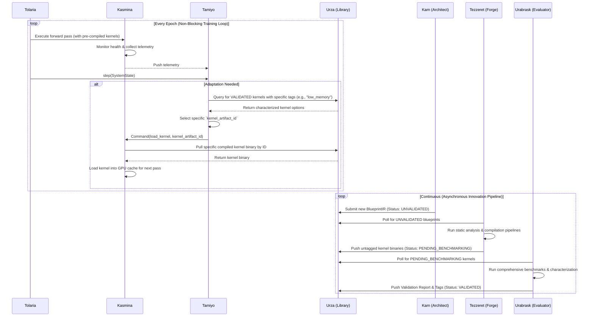

The enhanced Tezzeret workflow is shown below, illustrating how it interacts with the `Urza` library to compile and validate new architectural designs. This asynchronous compilation pipeline operates independently of the main training loop, ensuring that kernel compilation does not block training progress.

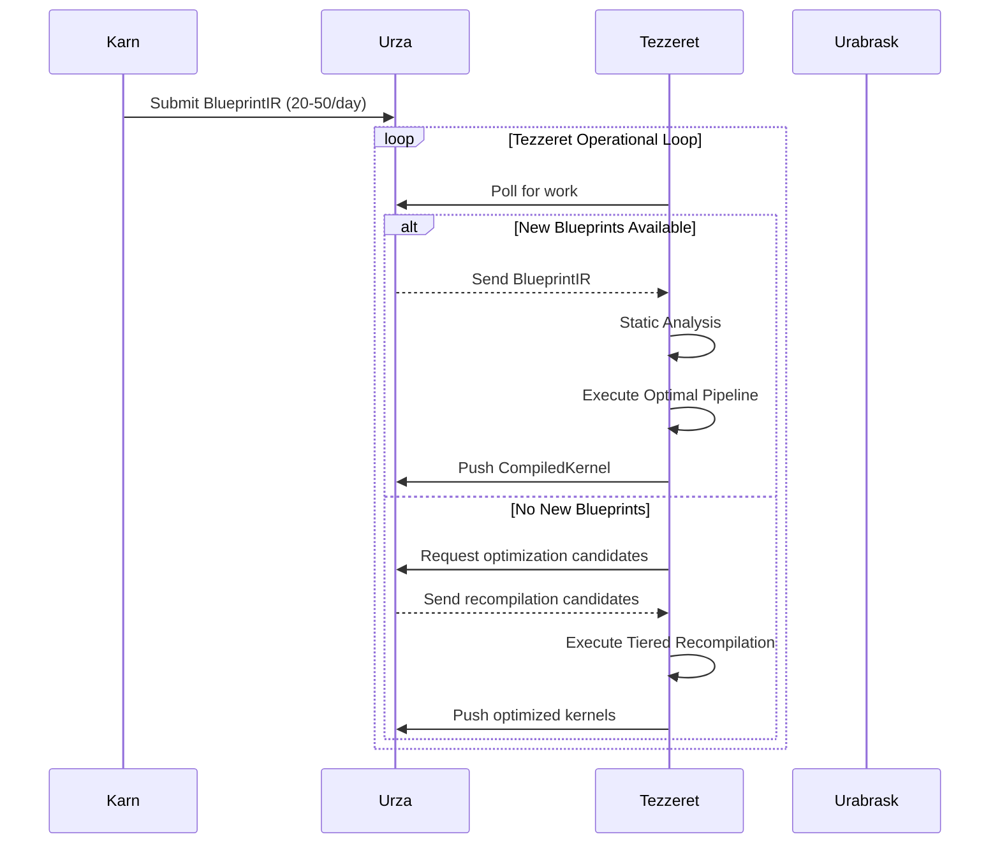

### **6.2 Data Flow Architecture**

The movement of information through Esper follows four distinct pathways, each optimized for its purpose. These flows embody the principle of separation of concerns, ensuring that high-frequency monitoring data, discrete control commands, asynchronous innovation feedback, and the new compilation pipeline traverse independent channels.

#### **6.2.1 Telemetry Flow: Sensing the System**

This high-frequency flow provides the `Strategic Controller` with the data needed to make informed decisions. Its function remains unchanged.

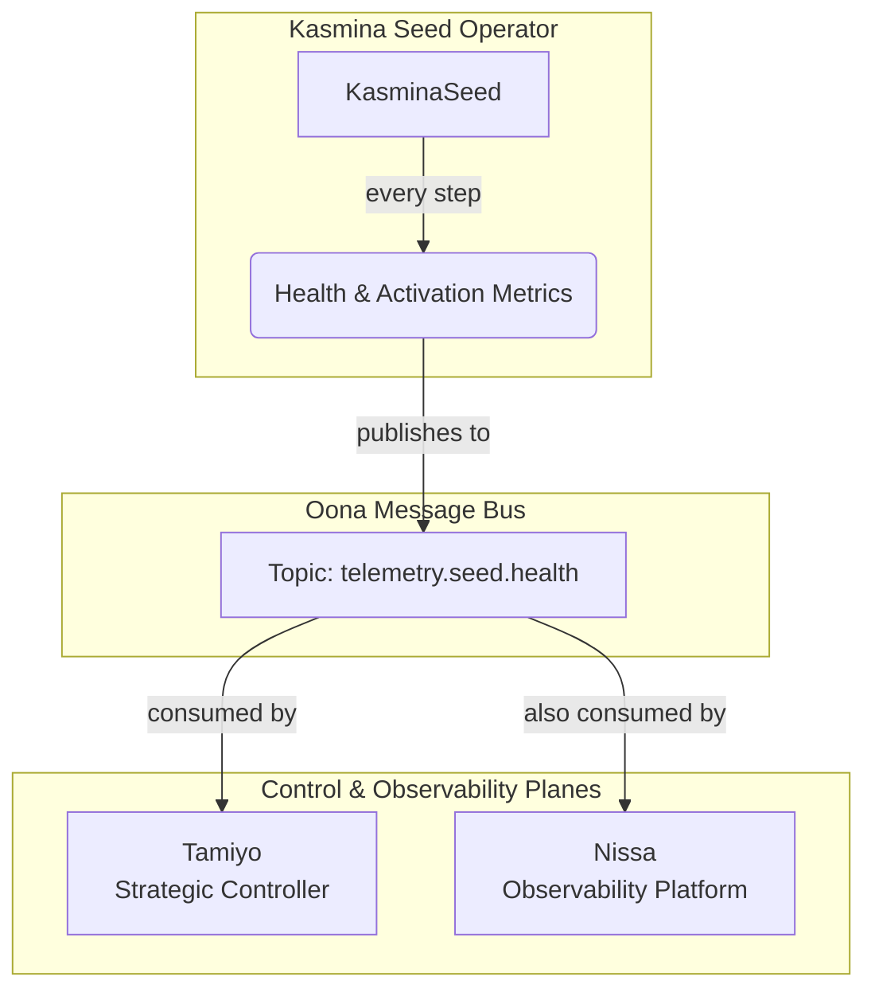

Below is a master data flow diagram, that illustrates the lifecycle of an architectural asset from conception to deployment feedback.

### **Master Data Flow Diagram: The Asset Lifecycle**

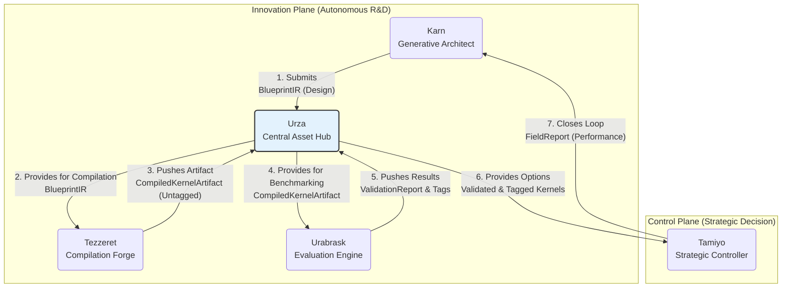

#### **6.2.2 Control Flow: Acting on the System**

This low-frequency, high-importance flow executes the decisions made by the controller. It is updated to reflect the use of pre-compiled kernels, with `Tamiyo` commanding `Kasmina` to load a specific `kernel_artifact_id` from `Urza`.

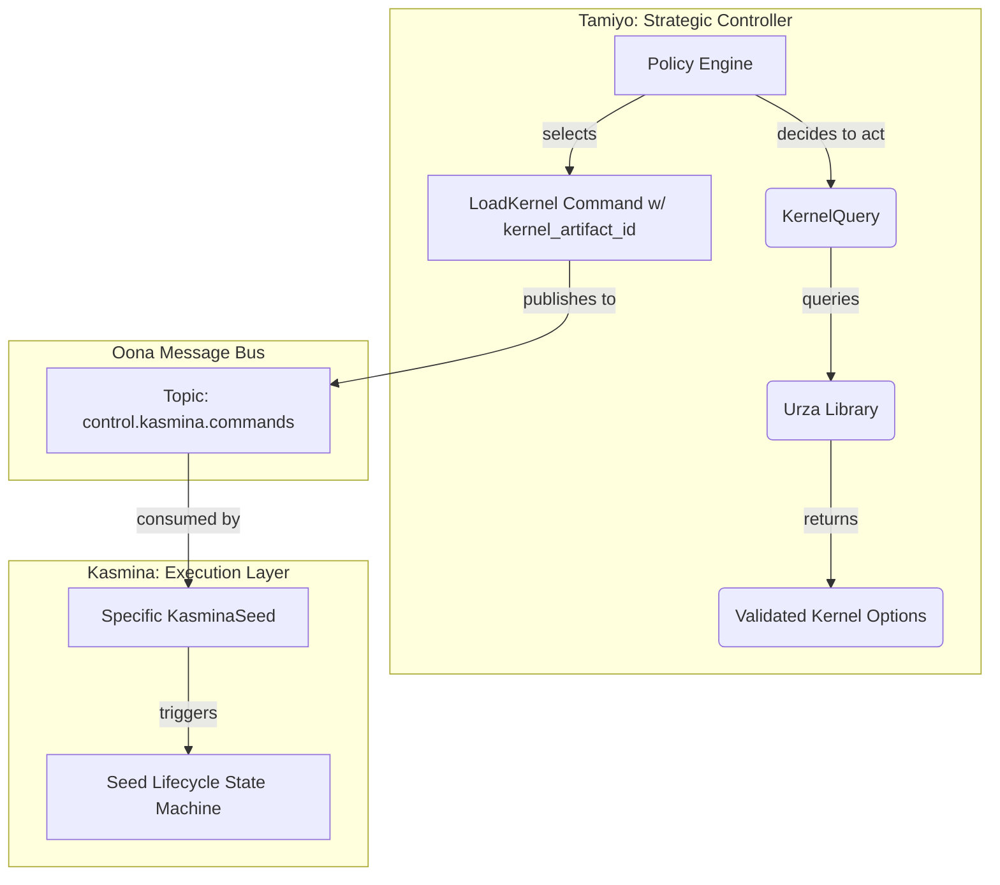

#### **6.2.3 Compilation & Validation Flow: Forging New Tools**

This new, fully asynchronous flow details how a blueprint design is transformed into a validated, deployable kernel artifact. This entire process happens in the background without impacting the main training loop.

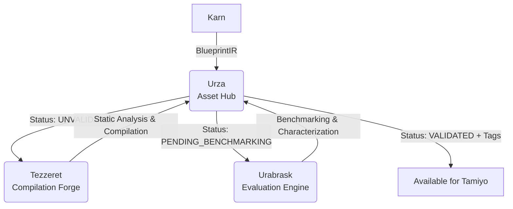

#### **6.2.4 Innovation Flow: Evolving the System**

This asynchronous feedback loop allows the system to continuously learn from its actions and improve its library of solutions. It remains conceptually similar, but the feedback from `Tamiyo` to `Karn` is now richer, including information about which kernel characteristics (tags) were most effective.

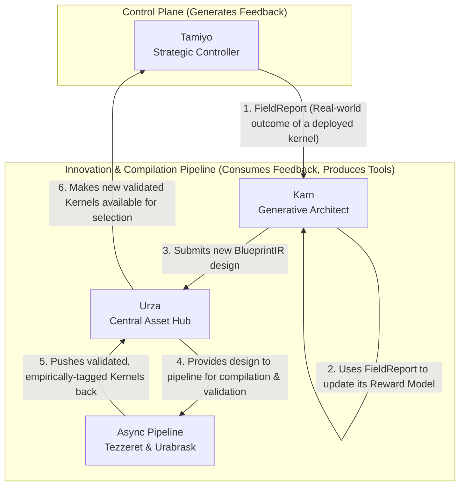

### **6.3 State Management**

Managing state in a morphogenetic system is uniquely challenging, as the state includes not just parameters but the very structure of the computational graph. Esper's approach reflects the principle that evolution must be deterministic and reversible.

The system maintains distributed state across logically separate components:

* **Tolaria**: Training state, global step/epoch, checkpoints, optimizer state.
* **Tamiyo**: Control policy state, historical metrics, germination decision queue, and kernel selection logic.
* **Kasmina**: Lifecycle state, health metric buffers for every seed, and the state of its **GPU kernel cache**.
* **Urza**: The catalog of all `BlueprintIRs`, their associated portfolio of `CompiledKernelArtifacts`, and their lifecycle statuses (e.g., `UNVALIDATED`, `COMPILING`, `VALIDATED`, `REJECTED`).

State synchronization is the mechanism that ensures global consistency, especially during architectural mutations. **This synchronization is pegged to the training loop's epoch boundaries.** `Tolaria` acts as the master clock, emitting an `EndOfEpoch` event via the message bus. On receiving this event, critical stateful components like `Tamiyo` perform their computations for that discrete time step (e.g., analyzing the epoch's telemetry to make a germination decision). This ensures that decisions are made on a complete, consistent snapshot of the system's state, preventing race conditions and ensuring deterministic, auditable behavior.

---

## **7. Component Architecture**

This chapter details the roles of the **eleven** subsystems. The architectural changes introduced by the asynchronous compilation pipeline are central to this design. The Innovation Plane (`Karn`, `Tezzeret`, `Urabrask`, `Urza`) now operates as a complete, non-blocking ecosystem that designs, compiles, and validates architectural improvements in parallel with the main training loop. This allows `Kasmina` to function as a pure, high-performance execution layer, completely decoupled from the cost of compilation.

### **7.1. Major Subsystems**

#### **7.1.1. Tolaria - The Training Academy**

* **Purpose:** To orchestrate the entire learning process, providing the stable, temporal "world" (epochs and steps) in which the host model lives and evolves.
* **Key Responsibilities:**
  * Manages the master training and validation loops.
  * Owns the core optimizer and learning rate schedulers.
  * Provides the system "heartbeat" by invoking the `Tamiyo` controller at the end of each epoch.
  * Checks the `AdaptationSignal` from Tamiyo to trigger optimizer rebuilds or emergency rollbacks.
  * Acts as the final authority on system stability and is the sole executor of emergency rollbacks. It performs its own independent, heuristic-based health monitoring. A rollback, which restores the entire system state (host model, Tamiyo controller, Kasmina seeds) from the last known-good checkpoint, is triggered by its own stability checks or after receiving an emergency rollback trigger from `Tamiyo`'s `AdaptationSignal`. `Tolaria` then sends an initialisation packet to Tamiyo noting the rollback event, which includes the last known-good state of the host model and the `Tamiyo` controller's state, as well as data on the failed seed and blueprint to allow that seed to be quarantined in ROLLED_BACK state.
  * Manages the checkpointing and restoration of both the host model and the `Tamiyo` controller's state to ensure synchronized recovery.
* **Core Logic:** Tolaria's logic is defined by its **Epoch Lifecycle**. It runs a standard training loop, followed by a validation loop. The crucial work happens in the **End-of-Epoch Hook**, where it assembles a `SystemStatePacket` with global metrics, passes control to `Tamiyo` for a decision, and then acts on the returned `AdaptationSignal`. A key internal component is the `DynamicOptimizerManager`, which can rebuild the optimizer to include parameters from newly grafted Blueprints.
* **Key Interfaces:**
  * Invokes `tamiyo.step(SystemStatePacket)`.
  * Consumes `AdaptationSignal` to drive its actions.
  * Provides `create_checkpoint()` and `restore_from_checkpoint()` methods.

#### **7.1.2. Kasmina - The Execution Layer**

* **Purpose:** To serve as a streamlined, high-performance **Pure Executor**. Its sole responsibility is to execute adaptations by loading and running pre-compiled, pre-validated kernel artifacts provided by `Tamiyo`. It performs no compilation.
* **Key Responsibilities:**
  * Manages the 11-stage lifecycle state machine for each individual `Seed`.
  * Monitors its assigned "chunk" of the network and generates execution-focused health telemetry.
  * Receives `KasminaControlCommand`s from `Tamiyo` containing a specific `kernel_artifact_id`.
  * Loads the specified compiled kernel binary from `Urza`.
  * Manages a **GPU-resident LRU cache** for kernel artifacts to minimize loading latency.
  * Executes the loaded kernel with maximum performance and minimal overhead.
* **Core Logic:** Kasmina employs a **Chunked Architecture**, splitting a layer's activation tensor so each chunk can be processed by an independent `KasminaSeed` module. The `KasminaSeed` is a stateful agent that acts as a deterministic operator, executing commands given to it by the controller and leveraging a robust error-handling system to gracefully fallback to a dormant state if a kernel fails to load or execute.
* **Key Interfaces:**
  * Publishes `Health Signal` reports to the `telemetry.seed.health` topic on the message bus.
  * Exposes `request_germination()` and `cancel_germination()` methods to be called directly by `Tamiyo`, driven by commands specifying a `kernel_artifact_id`.

#### **7.1.3. Tamiyo - The Strategic Controller**

* **Purpose:** To act as the strategic decision-making brain of the platform, deciding *if, when, where,* and *how* to adapt the host model to maximize long-term performance and stability.
* **Key Responsibilities:**
  * Analyzes global metrics and seed telemetry to detect performance plateaus and identify systemic weaknesses.
  * In cases of critical instability detected by its sensor net after an adaptation, it can issue a "force rollback" command to Tolaria to trigger an immediate emergency rollback.
  * Selects the optimal dormant `Seed` to activate for intervention.
  * **Queries the `Urza` library for validated kernels** using rich, tag-based criteria (e.g., `low_memory`, `high_speed`) to select the most appropriate `CompiledKernelArtifact` for the current context.
  * Calculates and updates a `tamiyo_interest` score for blueprints, reflecting their historical usage and predicted future utility. This signals a blueprint's "strategic importance" and protects essential "workhorse" modules from being retired by curation policies that only consider raw performance.
  * Selects the correct `GraftingStrategy` for Kasmina to execute based on network conditions.
  * Generates comprehensive `FieldReports` for `Karn` upon the completion of an adaptation lifecycle.
* **Core Logic:** Tamiyo's intelligence is pluggable. The initial version uses a robust set of heuristics, while the advanced version uses a **Heterogeneous Graph Neural Network** to model the host network and make more sophisticated, context-aware decisions.
* **Key Interfaces:**
  * Consumes `SystemStatePacket` and telemetry from the message bus.
  * Publishes `KasminaControlCommands` containing a specific `kernel_artifact_id`.
  * Publishes `FieldReports` to `Karn`.
  * Provides `save_state_dict()` and `load_state_dict()` for synchronized checkpointing.

#### **7.1.4. Karn - The Blueprint Architect**

* **Purpose:** To serve as the generative R&D engine, driving the continuous evolution of the `Urza` library by inventing novel, performant, and efficient sub-architectures.
* **Key Responsibilities:**
  * Generates novel candidate blueprint architectures as `BlueprintIR`.
  * Applies intelligent mutations to existing high-performing blueprints.
  * Trains a `Reward Model` to predict the value of a blueprint based on real-world performance.
  * Monitors and maintains the genetic diversity of the blueprint library.
* **Core Logic:** Karn operates on a continuous **Invention Loop**. Its `Generator Network` (a G2G Transformer) proposes new designs. The `Reward Model` (a GNN) evaluates them based on `FieldReports` from Tamiyo and `EvaluationReports` from Urabrask. The `Mutation Module` applies semantics-aware changes, and the `Diversity Sampler` prevents architectural stagnation. This entire process is bootstrapped via a formal "Apprentice to Master" training curriculum.
  * The selection of parent blueprints for mutation or inspiration is guided by a rich set of factors: their historical performance (FieldReports), their novelty score, the strategic importance signaled by `tamiyo_interest`, and the R&D value signaled by `urabrask_interest`. This allows Karn to dynamically focus its efforts on improving foundational architectures, exploring novel concepts, or challenging established benchmarks.
* **Key Interfaces:**
  * Consumes `FieldReports` from `Tamiyo` and `Library State` from `Urza`.
  * **Submits `BlueprintIR` to `Urza`** for asynchronous compilation and validation.

### **7.2. Minor Subsystems**

#### **7.2.1. Tezzeret - The Compilation Forge**

**Purpose:** To serve as the dedicated, asynchronous background service that transforms architectural designs (`BlueprintIR`) into a portfolio of highly-optimized, executable `CompiledKernelArtifacts`, while maximizing resource utilization during periods of low blueprint submission.

**Enhanced Responsibilities:**

* **Intelligent Work Pipelining:** Maintains continuous operation by dynamically shifting between processing new `BlueprintIRs` and optimizing existing high-value blueprints when new submissions are scarce. This ensures computational resources are never idle while respecting daily compilation budgets.
* **Value-Driven Recompilation:** Implements a tiered optimization strategy prioritizing blueprints with high strategic importance (`tamiyo_interest`), recent validation failures, or older compilation versions.
* **Resource-Aware Compilation:** Selects compilation pipelines (Fast/Standard/Aggressive) based on real-time system load and blueprint value to maximize throughput without resource contention.

**Optimization Strategy for Limited Blueprint Throughput:**

1. **Filtered Submission Handling:**  
   Given typical blueprint generation rates of 20-50 viable designs per day (after Karn's novelty filtering and static analysis), Tezzeret implements probabilistic acceptance to maintain sustainable throughput. High-novelty blueprints receive submission priority while complex designs undergo rigorous pre-screening.

2. **Idle-State Optimization Protocol:**  
   When no new blueprints are available, Tezzeret executes a three-tiered recompilation strategy:

   ```mermaid
   graph TD
       A[Idle State] --> B{Select Optimization Candidate}
       B --> C[P1: High tamiyo_interest]
       B --> D[P2: Recent validation failures]
       B --> E[P3: Outdated toolchain versions]
       C --> F[Execute Aggressive Pipeline]
       D --> G[Execute Standard Pipeline]
       E --> H[Execute Fast Pipeline]
   ```

   This ensures continuous improvement of Urza's kernel portfolio without requiring new architectural inputs.

3. **Dynamic Pipeline Selection:**  
   Pipeline choice adapts to real-time conditions:  

   ```python
   def select_pipeline(blueprint, system_load):
       if system_load < 30%: return AGGRESSIVE
       elif blueprint.tamiyo_interest > 0.7: return STANDARD
       else: return FAST
   ```

   This resource-sensitive approach maintains compilation throughput without impacting training performance.

**Artifact Management:**

* **Versioned Retention:** Maintains multiple compiled variants per blueprint with cost-weighted retention:

  ```bash
  /urza/blueprints/
    └── bp_7a3f9/
        ├── v1_h100_fast.pt
        ├── v2_h100_aggressive.pt
        └── v3_a100_standard.pt
  ```

* **Storage Optimization:** Implements cost-aware retention policies where artifacts are preserved based on usage frequency and recompilation cost, automatically archiving low-value variants.

**Continuous Improvement Metrics:**

* Maintain >85% Tezzeret utilization during low blueprint periods
* Achieve 3-5% average performance gain per recompilation cycle
* Limit archived kernel growth to <5% monthly storage increase
* Enforce daily compilation budgets (e.g., 200 GPU-hours)

**Future Evolution Path:**
While the initial implementation uses rule-based optimization, the architecture supports progressive enhancement:

1. **Phase 1:** Rule-based priority system (current)
2. **Phase 2:** Cost-model predictor estimating improvement likelihood
3. **Phase 3:** Lightweight reinforcement policy (post-MVP)

#### **7.2.2. Urabrask - The Evaluation Engine**

* **Purpose:** To act as the independent, automated **characterization and risk analysis engine**. It is a purely evaluative service that provides an unbiased, data-driven assessment of every compiled kernel.
* **Key Responsibilities:**
  * Pulls `CompiledKernelArtifacts` with a `PENDING_BENCHMARKING` status from `Urza`.
  * Subjects kernels to a **two-stage validation process**: a basic runtime safety check followed by a comprehensive benchmarking gauntlet on real hardware.
  * **Generates empirical, descriptive tags** (e.g., `high_speed`, `low_memory`, `high_power`) based on actual benchmark performance data.
  * Produces a detailed **UrabraskValidationReport** for each kernel, including its WEP and a quantitative `risk_score`.
  * Assigns a final, human-readable `conf_level` (High, Moderate, Speculative).
  * Calculates and assigns a quantitative `urabrask_interest` score, signaling blueprints that exhibit novel or scientifically interesting performance characteristics, providing a key signal for `Karn`'s R&D focus.
* **Core Logic:** Urabrask uses an **Evaluation Gauntlet** pipeline to systematically test kernels. The critical `risk_score` is not calculated by a fixed formula but by a trained **XGBoost model** that learns to predict the probability of real-world failure based on the WEP and historical outcomes from `FieldReports`.
* **Key Interfaces:**
  * Receives `CompiledKernelArtifacts` from `Urza`.
  * Publishes `UrabraskValidationReports` and tags back to `Urza`, updating kernel status to `VALIDATED` or `REJECTED`.

#### **7.2.3. Urza - The Central Library**

* **Purpose:** To be the immutable, versioned, and auditable single source of truth for **all architectural assets**, including both the abstract designs and their compiled, executable forms.
* **Key Responsibilities:**
  * Stores and versions both `BlueprintIRs` and their associated portfolios of `CompiledKernelArtifacts`.
  * Owns and enforces the **Universal Metadata Schema** for all assets.
  * **Tracks the lifecycle status** of blueprints (`UNVALIDATED`, `COMPILING`) and kernels (`PENDING_BENCHMARKING`, `VALIDATED`, `REJECTED`).
  * Provides a rich **query API for `Tamiyo`** to find validated kernels based on empirical tags and performance characteristics.
  * Tracks the evolutionary lineage of every blueprint.
  * Runs a nightly curation pipeline to manage the library's health.
* **Core Logic:** Urza is architected as a robust repository, using an object store for binary artifacts and a relational database (e.g., PostgreSQL) for queryable metadata, lineage, and status.
* **Key Interfaces:**
  * Provides a query API for `Tamiyo` (e.g., `get_kernels_by_tags`).
  * Receives `BlueprintIR` from `Karn`.
  * Interacts with `Tezzeret` for compilation and `Urabrask` for validation.

#### **7.2.4. Simic - The Policy Sculptor**

* **Purpose:** To provide the dedicated, offline training environment for the advanced neural network policies used by `Tamiyo` and `Karn`.
* **Key Responsibilities:**
  * Ingests and manages the Replay Buffer of `FieldReports` and other operational logs.
  * Executes nightly training sessions using reinforcement learning (e.g., IMPALA) and imitation learning.
  * Implements advanced training techniques like Elastic Weight Consolidation (EWC) and curriculum learning.
  * Manages the validation and versioning of new policy adapters (e.g., LoRA adapters) before they are deployed.
* **Core Logic:** Simic is an MLOps pipeline, likely orchestrated by a tool like Kubeflow or Ray. It consumes data from the live environment, runs complex training jobs in a sandboxed environment, and publishes validated policy updates for the live controllers to consume.
* **Key Interfaces:**
  * Consumes `FieldReports` and other logs from the message bus to build its experience dataset.
  * Publishes new, validated policy versions to a model registry accessible by `Tamiyo` and `Karn`.

#### **7.2.5. Oona - The Message Bus**

* **Purpose:** To provide reliable, asynchronous event distribution, decoupling all subsystems and enabling a resilient, scalable architecture.
* **Key Responsibilities:**
  * Guarantees message delivery according to the configured policy.
  * Provides topic-based, publish-subscribe communication channels.
  * Enables event sourcing for a complete, auditable history of system events.
* **Core Logic:** Implemented with a production-grade messaging system like Apache Pulsar (for Phase 2) or Redis Streams (for the Phase 1 prototype). It organizes communication into clear, hierarchical topics.
* **Key Topics:**
  * `telemetry.seed.health`: For high-frequency health reports from `Kasmina`.
  * `control.kasmina.commands`: For low-frequency, high-importance commands from `Tamiyo`.
  * `innovation.field_reports`: For adaptation outcomes sent from `Tamiyo` to `Karn`.
  * `system.events.epoch`: For `EndOfEpoch` signals from `Tolaria`.

#### **7.2.6. Nissa - The Observability Platform**

* **Purpose:** To provide real-time monitoring, historical analysis, and alerting for the entire Esper platform.
* **Key Responsibilities:**
  * Aggregates metrics and logs from all subsystems.
  * Provides dashboards for visualizing system health, training progress, and morphogenetic activity.
  * Manages alerts for critical events (e.g., high rollback rate, low blueprint certification rate).
  * Provides a queryable interface for the audit trail of all adaptations.
* **Core Logic:** A standard, robust monitoring stack, typically comprising Prometheus for metrics, Grafana for dashboards, and a logging aggregator like Loki or the ELK stack. It subscribes to all relevant topics on the Oona message bus to gather its data.
* **Key Interfaces:**
  * Receives events and metrics from `Oona`.
  * Provides a web-based UI (e.g., Grafana) for operators and researchers.

#### **7.2.7. Emrakul - The Architectural Sculptor**

* **Purpose:** To serve as the system's designated agent for architectural reduction, executing the removal of obsolete, redundant, or inefficient modules to manage model complexity and ensure long-term health.
* **Key Responsibilities:**
  * Receives pruning commands (`ApoptosisDirectives`) from `Tamiyo`.
  * Performs a "simulated pruning" in a sandboxed environment to measure performance impact before affecting the live model.
  * Executes the surgical removal of the target module if the impact is within tolerance.
  * Updates the `Urza` lineage graph to log the apoptosis event.
* **Note:** While pruning is a key component of the complete long-term vision, its utility and the safety of its implementation are open research questions. Therefore, `Emrakul`'s development is deferred pending research into a reliable Causal Impact Model. We must first develop a method to distinguish modules that are truly redundant from those whose removal would cause unforeseen second-order degradation in distant parts of the network. This will be investigated after the core growth mechanics are fully validated.

---

## **8. Data Architecture**

A morphogenetic system generates and consumes a rich variety of data, from high-frequency seed telemetry to the immutable genetic code of blueprints and their compiled artifacts. A robust data architecture is therefore essential for ensuring system stability, auditability, and the effectiveness of the learning-based agents. This chapter defines the core data models, flow patterns, and storage strategies for the `Esper` reference implementation, updated to reflect the asynchronous compilation and validation pipeline.

### **8.1 Data Models (Contracts)**

To ensure stable, versioned communication between subsystems, the framework relies on a set of well-defined data contracts. These are specified below using Pydantic-style models for their clarity and runtime validation capabilities. The central change is the evolution of `Urza` into an asset hub that manages both the abstract design (`Blueprint`) and its concrete, executable instances (`CompiledKernelArtifact`).

#### **8.1.1 The Asset Hierarchy: Blueprints & Kernels**

The architecture now distinguishes between a blueprint's abstract design (its Intermediate Representation or IR) and the multiple compiled kernel artifacts generated from it.

```python
# esper/contracts/asset_enums.py
from enum import Enum

class BlueprintStatus(str, Enum):
    """Lifecycle status for a Blueprint design."""
    UNVALIDATED = "UNVALIDATED"
    COMPILING = "COMPILING"
    INVALID = "INVALID"

class KernelStatus(str, Enum):
    """Lifecycle status for a compiled kernel artifact."""
    PENDING_BENCHMARKING = "PENDING_BENCHMARKING"
    VALIDATED = "VALIDATED"
    REJECTED = "REJECTED"

# esper/contracts/urza_assets.py
from pydantic import BaseModel, Field
from typing import List, Dict, Any, Optional, Tuple
from datetime import datetime

class UrabraskValidationReport(BaseModel):
    """Comprehensive evaluation report generated by Urabrask for a kernel."""
    benchmark_results: Dict[str, float] = Field(..., description="Empirical measurements: latency_ms, memory_mb, etc.")
    generated_tags: List[str] = Field(..., description="Data-driven tags: ['high_speed', 'low_memory']")
    baseline_comparison: Dict[str, float] = Field(..., description="Performance vs eager PyTorch baseline")
    passed_validation: bool = Field(..., description="Whether kernel meets quality thresholds")
    hardware_context: Dict[str, str] = Field(..., description="GPU type, driver version, etc.")
    report_timestamp: datetime = Field(default_factory=datetime.utcnow)

class CompiledKernelArtifact(BaseModel):
    """A specific, compiled instance of a Blueprint, ready for execution."""
    id: str = Field(..., description="Unique kernel identifier: sha256:xyz-pipeline_A")
    status: KernelStatus = Field(default=KernelStatus.PENDING_BENCHMARKING)
    compilation_pipeline: str = Field(..., description="Which Tezzeret pipeline generated this")
    kernel_binary_ref: str = Field(..., description="Reference to stored kernel binary in object storage")
    compilation_metadata: Dict[str, Any] = Field(default_factory=dict)
    validation_report: Optional[UrabraskValidationReport] = Field(None, description="Urabrask's evaluation")

class Blueprint(BaseModel):
    """
    The core Blueprint entity, representing an architectural design and its portfolio
    of compiled artifacts.
    """
    id: str = Field(..., description="The canonical hash of the Blueprint's IR")
    status: BlueprintStatus = Field(default=BlueprintStatus.UNVALIDATED)
    # The actual IR graph would be stored separately, referenced by ID
    architecture_ref: str
    metadata: Dict[str, Any] # Retains original metadata for lineage, etc.
    compiled_artifacts: Dict[str, CompiledKernelArtifact] = Field(
        default_factory=dict,
        description="All kernel variants generated from this Blueprint, keyed by artifact ID"
    )
```

**Compilation Metadata Schema:**

```python
class CompilationRecord(BaseModel):
    pipeline: str
    compilation_seconds: float
    peak_memory_gb: float
    toolchain_version: str
    optimization_flags: List[str]
```

#### **8.1.2 Core Operational Entities**

These models define the information passed between components during runtime operations.

```python
# esper/contracts/operational.py

class HardwareContext(BaseModel):
    device_type: str  # "GPU", "TPU", etc.
    memory_available_gb: float
    supports_quantization: bool = False

class SystemStatePacket(BaseModel):
    """Snapshot of system state passed from Tolaria to Tamiyo at each epoch boundary."""
    current_epoch: int
    validation_accuracy: float
    validation_loss: float
    hardware_context: HardwareContext
    health_map: Dict[Tuple[int, int], Dict[str, float]]
    seed_states: Dict[Tuple[int, int], str]

class AdaptationSignal(BaseModel):
    """Command signal returned from Tamiyo to Tolaria."""
    optimizer_rebuild_required: bool
    emergency_rollback_required: bool

class FieldReport(BaseModel):
    """Feedback from Tamiyo to Karn about a blueprint's real-world performance."""
    blueprint_id: str
    kernel_artifact_id: str # Added to specify which variant was used
    seed_id: str
    pre_metric: float
    post_metric: float
    outcome: str  # 'FOSSILIZED', 'CULLED', 'ROLLED_BACK'
    eval_metrics: Dict[str, float]

class KernelQuery(BaseModel):
    """Rich query interface for Tamiyo to find validated kernels in Urza."""
    blueprint_id: str = Field(..., description="Target blueprint hash")
    required_tags: List[str] = Field(default_factory=list)
    preferred_tags: List[str] = Field(default_factory=list)
    excluded_tags: List[str] = Field(default_factory=list)
    max_latency_ms: Optional[float] = None
    max_memory_mb: Optional[float] = None
    target_gpu_arch: Optional[str] = None

class KernelQueryResult(BaseModel):
    """Results from a kernel query."""
    matching_kernels: List[CompiledKernelArtifact] = Field(..., description="Kernels meeting criteria")
```

### **8.2 Data Management & Flow Patterns**

The architecture's data flows are built on modern, event-driven patterns to ensure scalability and auditability.

* **Event Sourcing:** The `Oona` message bus functions as the primary event log. Every significant state change in the system—a seed reporting telemetry, a controller issuing a command, a `Blueprint` being submitted, or a `KernelArtifact` being validated—is published as an immutable event. This creates a complete, replayable history of the system, which is invaluable for debugging, auditing, and training the RL agents.

* **Command Query Responsibility Segregation (CQRS):** The system naturally separates state-changing operations (**Commands**) from data-reading operations (**Queries**).

  * **Commands:** Are lightweight, asynchronous messages (e.g., `KasminaControlCommand`) published to specific topics on the bus. They are designed to be processed by a single consumer.
  * **Queries:** Are performed by components requesting data. `Tamiyo` performs a `KernelQuery` against the `Urza` API. `Nissa` queries the event stream from `Oona` to build observability dashboards. This separation allows the read and write paths to be scaled and optimized independently.

* **Data Lifecycle & Retention:**

  * **Blueprints & Kernels (Urza):** Retained indefinitely. Both designs and their compiled artifacts are versioned and never hard-deleted; underperforming ones are moved to an "archived" state.
  * **Operational Events (Oona):** High-frequency telemetry (e.g., `telemetry.seed.health`) is retained on the bus for a short period (e.g., 72 hours). Critical events like `FieldReports` and compilation status updates are consumed and persisted indefinitely by the relevant subsystems.
  * **Checkpoints (Tolaria):** A rolling window of the last N known-good checkpoints is maintained (e.g., N=5).

### **8.3 Data Storage Architecture**

The reference architecture uses a polyglot persistence strategy, choosing the best storage technology for each type of data.

| Data Type                        | Storage System                    | Phase 1 Implementation                | Phase 2 Implementation                      | Rationale                                                                                                                   |
| :------------------------------- | :-------------------------------- | :------------------------------------ | :------------------------------------------ | :-------------------------------------------------------------------------------------------------------------------------- |
| **Blueprint & Kernel Artifacts** | Object Storage                    | Local Filesystem / MinIO              | AWS S3, GCS, or other cloud object store    | Ideal for storing large, immutable binary files (Blueprint IRs, TorchScript models) in a scalable and cost-effective way. |
| **Blueprint & Kernel Metadata** | Relational Database               | SQLite / PostgreSQL                   | Managed PostgreSQL (e.g., AWS RDS)          | Supports complex queries, transactions, and relational integrity needed for searching the library and tracking history. |
| **Time-Series Metrics** | Time-Series Database (TSDB)       | Prometheus                            | Managed Prometheus / VictoriaMetrics        | Optimized for high-throughput ingestion and time-based querying of metrics for monitoring and alerting by `Nissa`.        |
| **Event Stream / Messages** | Message Broker                    | Redis Streams                         | Apache Pulsar                               | Provides the real-time, persistent, pub/sub backbone. Pulsar is chosen for Phase 2 for its multi-tenancy and tiered storage.  |
| **RL Replay Buffer** | Hybrid In-Memory + Data Lake      | In-memory Python `deque`              | Redis (Hot Storage) + [TBA] (Cold)  | Balances fast sampling of recent experiences (hot) with efficient storage and batch processing of historical data (cold). |
| **System Checkpoints** | Object Storage                    | Local Filesystem                      | AWS S3, GCS, or other object store    | Provides a simple and reliable location for `Tolaria` to save and restore model and controller state dictionaries.       |

The buffer will store trajectories as protobufs, containing the full sequence of (SystemStatePacket, KernelQuery, KernelQueryResult, Action, Reward, next_SystemStatePacket). It will be indexed by run_id and epoch for efficient sampling of on-policy and off-policy data.

---

## **9. Integration Architecture**

A key strength of the Morphogenetic Framework is its modular, decoupled design. This chapter specifies how the eleven subsystems of the `Esper` reference architecture integrate internally and how the platform as a whole interfaces with external systems, developers, and MLOps tooling.

### **9.1 Internal Integration: The Event-Driven Backbone**

All internal communication between the major planes (Training, Control, Innovation) is mediated by the `Oona` message bus. This event-driven pattern is a core architectural principle that ensures resilience, scalability, and loose coupling, especially for the new asynchronous compilation pipeline.

* **Mechanism:** The system uses a "Fat Envelope, Thin Payload" approach. Every message published to the bus is wrapped in a standard envelope containing rich metadata (`event_id`, `sender_id`, `timestamp`, `trace_id`), while the payload contains the specific data model for that event. This provides excellent observability and debugging capabilities.

* **Key Topics and Payloads:** The following table defines the primary communication channels on the message bus, updated to reflect the asynchronous compilation and validation workflow:

| Topic | Publisher | Consumer(s) | Payload Data Model | Purpose |
| :--- | :--- | :--- | :--- | :--- |
| `telemetry.seed.health` | `Kasmina` | `Tamiyo`, `Nissa` | `HealthSignal` | High-frequency reporting of individual seed health to inform the controller and observability platform. |
| `control.kasmina.commands` | `Tamiyo` | `Kasmina` | `KasminaControlCommand` | Low-frequency, high-importance command to load and execute a specific, pre-compiled `kernel_artifact_id`. |
| `innovation.field_reports` | `Tamiyo` | `Karn`, `Simic` | `FieldReport` | Feeds real-world adaptation outcomes back to the architect and policy trainer, closing the reinforcement learning loop. |
| `compilation.blueprint.submitted` | `Karn` / `Urza` | `Tezzeret` | `BlueprintSubmittedEvent` | Notifies the compilation forge that a new `BlueprintIR` is available in `Urza` and ready for processing. |
| `compilation.kernel.ready` | `Tezzeret` / `Urza`| `Urabrask` | `KernelReadyEvent` | Notifies the evaluation engine that a new, uncharacterized kernel artifact has been generated and is ready for benchmarking. |
| `validation.kernel.characterized`| `Urabrask` / `Urza`| `Tamiyo`, `Nissa`, `Karn` | `KernelCharacterizedEvent` | Announces that a kernel has passed validation and is now available in `Urza` with its full performance profile and tags. |
| `system.events.epoch` | `Tolaria` | `Tamiyo`, `Nissa` | `EpochEvent` | The master "heartbeat" signal that drives epoch-boundary state synchronization across the system. |

### **9.2 External Integration: The MLOps Ecosystem**

The `Esper` platform is designed to be a component within a larger MLOps ecosystem, not a completely isolated environment.

* **Model Ingestion & Export:**

  * **Ingestion:** `Esper` consumes a standard, pre-trained PyTorch `nn.Module`. The injection of `Kasmina` execution layers is handled by a helper utility that wraps specified layers of the user's model without requiring manual modification.
  * **Export:** The final, evolved model is exported as a standard `torch.save` artifact. Critically, it is accompanied by a `lineage.json` file containing the full history of all `FOSSILIZED` adaptations, sourced from the `Urza` library. This record now includes the exact `kernel_artifact_id` used for each adaptation, ensuring complete and bit-for-bit build reproducibility.

* **Monitoring & Observability (`Nissa`):**

  * The `Nissa` subsystem exposes all platform and model metrics via a standard Prometheus `/metrics` endpoint. This now includes monitoring the health and throughput of the asynchronous compilation pipeline, such as `Tezzeret` worker status, compilation queue depths, and `Urabrask` benchmarking throughput. This allows `Esper` to be scraped by any Prometheus-compatible monitoring service for dashboarding and alerting.

* **CI/CD Pipeline Integration:**

  * A training run is typically initiated via a command-line interface (CLI) that configures and launches the `TolariaTrainer`. This allows `Esper` to be easily integrated into any CI/CD pipeline (e.g., GitHub Actions, Jenkins, GitLab CI) for automated training, evaluation, and deployment of evolved models.

* **External Storage (`Urza` & Checkpoints):**

  * The architecture uses the **Repository Pattern** for storing `Blueprints` and model checkpoints. `Urza`'s role is expanded to a central asset hub, managing not only `BlueprintIR` designs but also a portfolio of compiled binary `CompiledKernelArtifacts`. This allows the system to be configured with different storage backends. For the Phase 1 MVP, this can be the local filesystem. For a distributed Phase 2, this will be configured to use cloud object storage like AWS S3 or GCS for both the designs and the compiled artifacts.

### **9.3 Primary API & SDK Specification**

This section defines the primary "front doors" for a human researcher or an external automated system to interact with `Esper`.

#### **9.3.1 Researcher-Facing Python SDK (Conceptual)**

The primary interaction model is through a user-friendly Python SDK that abstracts away the complexity of the underlying subsystems, including the entire asynchronous compilation process.

**Example User Journey:**

```python
import esper
from my_models import MySimpleCNN

# 1. Load configurations for each component from YAML files
# These configs specify everything from learning rates to Tamiyo's patience
config = esper.load_config("./configs/phase1_mnist.yaml")

# 2. Instantiate the host model and wrap it for morphogenesis
# The 'wrap' function injects Kasmina execution layers into all 'nn.Linear' layers
model = MySimpleCNN()
morphable_model = esper.wrap(model, config.kasmina)

# 3. Instantiate the controller and trainer
tamiyo_controller = esper.TamiyoController(morphable_model, config.tamiyo)
tolaria_trainer = esper.TolariaTrainer(morphable_model, tamiyo_controller, config.tolaria)

# 4. Start the training and evolution process
# The asynchronous compilation of kernels in Tezzeret happens entirely in the background
print("Starting morphogenetic training...")
final_model, training_history = tolaria_trainer.train()

# 5. Save the final, evolved model and its lineage
esper.save_model(final_model, "./outputs/evolved_cnn")
print("Training complete. Evolved model saved.")

```

#### **9.3.2 Control & Query REST API**

For operational monitoring and control, key components expose a simple, secure REST API.

* **`Urza`: Central Library API**

  * `POST /api/v1/kernels/query`: Query for validated, compiled kernels using rich, empirical criteria. This is the primary endpoint for `Tamiyo`.
  * **Request Body:** `KernelQuery` model (see Data Architecture).
  * **Response Body:** `KernelQueryResult` model, returning a ranked list of kernel artifacts.
  * `GET /api/v1/blueprints/{blueprint_id}`: Retrieve a specific blueprint design and a list of all its compiled kernel variants.

* **`Tamiyo`: System Control API**

  * `GET /api/v1/system/status`: Get the current status of the training run, including current epoch, model metrics, and active adaptations.
  * `GET /api/v1/system/compilation_status`: **(New)** Get the status of the asynchronous compilation pipeline, including queue sizes for `Tezzeret` and `Urabrask`.
  * `POST /api/v1/control/pause`: An administrative endpoint to pause all new germination decisions.
  * `POST /api/v1/control/resume`: Resume germination decisions.

---

## **10. Security Architecture**

The autonomous and evolutionary nature of the Morphogenetic Framework necessitates a security architecture that is robust, multi-layered, and secure by design. The security of the platform is paramount, not only to protect the intellectual property embodied in the models and blueprints, but also to ensure the safety and predictability of the adaptations themselves. This chapter outlines the security principles, threat model, and specific controls for the `Esper` reference implementation.

### **10.1 Security Principles**

The architecture adheres to a set of foundational security principles that inform all design and implementation decisions.

* **Principle of Least Privilege:** Every component, user, and service account is granted the minimum level of permission required to perform its function. For example, `Karn` can submit `BlueprintIRs` to `Urza`, but `Tezzeret` only has permissions to read them and write back `CompiledKernelArtifacts`. Critically, only `Urabrask` has the authority to promote a kernel's status to `VALIDATED`.
* **Defense in Depth:** Security is not reliant on a single control. The system employs multiple, layered defenses—including network policies, application-level authentication, and data encryption—so that the failure of one layer does not lead to a total system compromise.
* **Zero Trust:** No implicit trust is granted between components, even within the same logical plane or network. All communication must be mutually authenticated and explicitly authorized before access is granted.
* **Secure by Design:** Security is not an afterthought but an integral part of the system's architecture. Components and interfaces are designed from the ground up with security considerations in mind.
* **Immutable Audit Trail:** All significant actions, especially those that alter the state or architecture of a model or the library, must be logged in an immutable, verifiable manner. This includes the full compilation and validation history of every kernel artifact.

### **10.2 Threat Model & Mitigations**

The following table outlines key potential threats to the `Esper` platform and the primary architectural mitigations in place to counter them.

| Threat                    | Description                                                                                                                                                             | Attacker's Goal                                                                                          | Mitigation Strategy                                                                                                                                                                                                                                                                                                                                                                                                                                                                                                                                                                                                                          |
| :------------------------ | :---------------------------------------------------------------------------------------------------------------------------------------------------------------------- | :------------------------------------------------------------------------------------------------------- | :------------------------------------------------------------------------------------------------------------------------------------------------------------------------------------------------------------------------------------------------------------------------------------------------------------------------------------------------------------------------------------------------------------------------------------------------------------------------------------------------------------------------------------------------------------------------------------------------------------------------------------------------- |
| **Malicious Artifact Injection** | An attacker attempts to introduce a malicious or compromised artifact into the system, either as a flawed `BlueprintIR` to `Urza`, or as a weaponized `CompiledKernelArtifact` via a compromised `Tezzeret` instance. | To execute arbitrary code during training or inference; to create a denial-of-service backdoor; to corrupt model behavior. | **Multi-Stage Validation Pipeline:** The entire asynchronous pipeline acts as a security gateway. **1) `Tezzeret` Static Analysis:** All `BlueprintIRs` undergo a static "jank check" before compilation. **2) `Urabrask` Dynamic Validation:** All compiled kernels *must* pass `Urabrask`'s dynamic analysis and benchmarking gauntlet. **3) Digital Signatures & Integrity Checks:** Certified kernels in `Urza` are stored with checksums and are digitally signed. `Kasmina` *must* verify the signature and integrity of every kernel before loading it for execution. |
| **Adversarial Germination Trigger** | An attacker crafts specific input data to trigger unnecessary and wasteful germination events. | To cause a denial-of-service by consuming computational resources and destabilizing the model. | **Policy Robustness:** The `Tamiyo` policy is trained on diverse scenarios to be robust against spurious signals.                                                                                                                                                                                                                                                                                                                                                                                                                                                                                                                                                        |
| **Policy Poisoning** | An attacker attempts to corrupt the `Replay Buffer` used by `Simic`, influencing `Tamiyo` or `Karn` to learn malicious or suboptimal policies. | To degrade system performance, create backdoors via specific adaptations, or cause the generative architect to produce flawed blueprints. | **Replay Buffer Access Control:** The data store for the replay buffer has strict write permissions, limited only to the trusted `Tamiyo` logger. **Anomaly Detection:** Outlier `FieldReports` (e.g., with extreme metric changes) are flagged for review before being added to the training set.                                                                                                                                                                                                                                                                                                                                                                                                                    |
| **Unauthorized API Access** | An attacker gains access to the external REST APIs to exfiltrate proprietary blueprint architectures or disrupt training runs. | Intellectual property theft; system disruption. | **Strong API Authentication (JWTs):** All external API endpoints require a valid, short-lived JSON Web Token. **Role-Based Access Control (RBAC):** Granular permissions ensure a user can only access the resources and perform the actions allowed by their role.                                                                                                                                                                                                                                                                                                                                                                                                                      |

### **10.3 Authentication & Authorization (AuthN/AuthZ)**

Access control is strictly enforced for both inter-service communication and external users.

* **Service-to-Service Authentication (Phase 2):** In a distributed deployment, all internal communication between subsystems (e.g., `Tamiyo` to `Urza`, `Tezzeret` to `Urza`, `Urabrask` to `Urza`) must be secured using **mutual TLS (mTLS)**. A service mesh like Istio or Linkerd can be used to automate certificate rotation and enforce this policy.
* **User-to-System Authentication:** All external access via the Python SDK or the REST API must be authenticated using an OIDC-compliant identity provider (e.g., Okta, Auth0). The provider issues short-lived JWTs that are validated by the API gateway.
* **Authorization (Role-Based Access Control):** The system defines several roles to enforce the principle of least privilege:
  * **Researcher:** Can submit and monitor training runs; can query the `Urza` library.
  * **Operator:** Has all Researcher permissions, plus the ability to manage system operations (e.g., pause/resume control, trigger rollbacks).
  * **Curator:** Can manage the lifecycle of artifacts in `Urza` (e.g., manually approve a "Speculative" blueprint or review a `REJECTED` kernel).
  * **Admin:** Can manage user roles and system-wide configurations.

### **10.4 Data Security**

Data is protected at all stages of its lifecycle.

* **Data in Transit:** All network traffic, including API calls to external endpoints and messages on the `Oona` bus, must be encrypted using **TLS 1.3**.
* **Data at Rest:**
  * **Blueprint & Kernel Artifacts:** All model files, blueprint IRs, and compiled kernel artifacts stored in object storage (e.g., S3) must be encrypted using server-side encryption (e.g., SSE-S3 with AES-256). The integrity of these artifacts must be verifiable via stored checksums (e.g., SHA-256).
  * **Metadata & Lineage Database:** The PostgreSQL database used by `Urza` must have Transparent Data Encryption (TDE) enabled.
* **Secrets Management:** Sensitive information such as database credentials, API keys, and signing keys must not be stored in configuration files or source code. They must be managed by a dedicated secrets management solution like **HashiCorp Vault** or a cloud provider's equivalent (e.g., AWS Secrets Manager, Google Secret Manager).

### **10.5 Infrastructure & Network Security**

The underlying infrastructure where `Esper` runs must be secured, particularly for a Phase 2 distributed deployment.

* **Container Security:** All application services are deployed as containers. Images must be built from hardened base images, regularly scanned for vulnerabilities (e.g., with Trivy or Clair), and configured to run as non-root users.
* **Network Isolation:** The entire `Esper` platform should be deployed within a dedicated Virtual Private Cloud (VPC). Within a Kubernetes deployment, **NetworkPolicies** must be used to strictly enforce communication flow. For example, a policy would ensure that only `Tezzeret` can write new kernel artifacts to `Urza`, and only `Urabrask` can update a kernel's status to `VALIDATED`.

### **10.6 Compliance & Auditability**

The architecture is designed with auditability as a core feature.

* **Architectural Audit Trail:** As defined in the `Urza` specification, every artifact and every modification is recorded in an immutable, hash-chained ledger. This provides a complete, verifiable history of a model's architectural evolution, including the full compilation pipeline details and `UrabraskValidationReport` for every deployed kernel.
* **Action Audit Trail:** The event-sourcing pattern used by the `Oona` message bus ensures that every command and state change is logged as a discrete event, providing a full audit trail of system actions.

---

## **11. Infrastructure & Deployment**

The `Esper` reference architecture is designed to be deployed in distinct phases, moving from a simplified single-node environment for initial validation (Phase 1) to a fully distributed, scalable, and resilient architecture for production use (Phase 2). This chapter details the deployment topology, hardware requirements, and scalability strategy for both phases, incorporating the asynchronous compilation pipeline that is central to the platform's design.

### **11.1 Deployment Architecture**

#### **11.1.1 Phase 1: Single-Node MVP Deployment**

The primary goal of the Phase 1 deployment is to validate the core morphogenetic mechanics in a simple, low-overhead environment.

* **Deployment Model:** All eleven subsystems are deployed as containers on a single, powerful server. `docker-compose` is the recommended tool for orchestrating the services, providing a simple, declarative way to manage the entire stack.
* **Networking:** Standard `docker-compose` bridge networking is sufficient, allowing all containers to communicate directly over the internal Docker network. Even in this co-located setup, the architecture's principles are maintained: the `Tezzeret` and `Urabrask` containers run the compilation and validation processes asynchronously in the background, ensuring the `Tolaria` training loop remains unblocked.
* **Data Persistence:** Lightweight databases like SQLite and the local filesystem are used for `Urza`'s metadata and artifact storage, minimizing external dependencies. Redis Streams serves as the message bus.

#### **11.1.2 Phase 2: Distributed Production Architecture**

The Phase 2 architecture is designed for scalability, resilience, and security, leveraging Kubernetes as the core container orchestrator. It fully realizes the asynchronous innovation pipeline by deploying components into dedicated resource pools.

```mermaid
graph TD
    subgraph "Kubernetes Cluster"
        direction LR
        
        subgraph "Ingress & API Gateway"
            A[Ingress Controller<br/>(e.g., NGINX)] --> B{API Gateway};
        end

        subgraph "Control & Core Services (CPU Nodes)"
            B --> C[Tamiyo<br/>(Deployment)];
            B --> D[Urza API<br/>(Deployment)];
            D -- reads from --> E[<br>Urza DB<br/>(StatefulSet, e.g., PostgreSQL)];
            F[Oona Message Bus<br/>(StatefulSet, e.g., Pulsar)];
            G[Nissa Platform<br/>(StatefulSet, e.g., Prometheus/Grafana)];
            M[Tezzeret Workers<br/>(Deployment, HPA/KEDA)];
        end

        subgraph "Training & Innovation Planes (GPU Nodes)"
            H[Simic Policy Trainer<br/>(Job/Argo Workflow)];
            I[Karn Architect<br/>(StatefulSet)];
            J[Tolaria Trainer<br/>(Job/Argo Workflow)];
            K[Urabrask Workers<br/>(Deployment, HPA/KEDA)];
        end

        subgraph "Service Mesh (Optional but Recommended)"
            L[e.g., Istio / Linkerd<br/>Provides mTLS, Observability, Traffic Control];
        end
    end
    
    U[User/Researcher] --> A;
    C -- Pub/Sub --> F;
    I -- Pub/Sub --> F;
    J -- Pub/Sub --> F;
    K -- Pub/Sub --> F;
    M -- Pub/Sub --> F;
    E -- uses --> S[Persistent Storage<br/>(e.g., Ceph, Cloud Volumes)];
    M -- interacts with --> E;


    style E fill:#f9f,stroke:#333,stroke-width:2px
    style F fill:#f9f,stroke:#333,stroke-width:2px
    style G fill:#f9f,stroke:#333,stroke-width:2px
    style I fill:#f9f,stroke:#333,stroke-width:2px
```

* **Container Orchestration:** Kubernetes is the target platform. The architecture utilizes distinct node pools for CPU-bound control and compilation services versus GPU-intensive training and evaluation workloads to optimize resource allocation and cost.
* **Component Deployment Model:**
  * **Deployments:** Used for stateless services that can be easily scaled horizontally (`Tamiyo`, `Urabrask` evaluation workers, `Tezzeret` compilation workers, API services).
  * **StatefulSets:** Used for stateful services that require stable network identities and persistent storage (`Urza`'s database, `Oona` message bus, `Nissa`'s TSDB).
  * **Jobs/Workflows:** Used for ephemeral, task-based workloads like a specific `Tolaria` training run or a `Simic` policy training session.
* **Service Mesh:** An optional but highly recommended service mesh (like Istio or Linkerd) provides a critical infrastructure layer for enforcing Zero Trust security via automatic mTLS, rich L7 observability, and fine-grained traffic control.
* **Load Balancing:** An Ingress Controller manages all external traffic, routing requests to the appropriate backend services (e.g., the `Urza` API or administrative endpoints on `Tamiyo`).

### **11.2 Hardware Requirements**

| Phase     | Component                | Specification                                                                                                                                                             | Rationale                                                                                                                                                                                          |
| :-------- | :----------------------- | :------------------------------------------------------------------------------------------------------------------------------------------------------------------------ | :------------------------------------------------------------------------------------------------------------------------------------------------------------------------------------------------- |
| **Phase 1** | **Single Server** | 1x Server with: <br/> - 2x High-VRAM GPUs (e.g., NVIDIA A100/H100 80GB) <br/> - 64+ CPU Cores <br/> - 512GB+ RAM <br/> - Fast NVMe Storage                                      | A single powerful machine capable of running the entire stack, including GPU-intensive training for `Karn` and `Tolaria` alongside the control plane and asynchronous background compilation services. |
| **Phase 2** | **GPU Worker Nodes** | Multi-node cluster with: <br/> - 4-8x GPUs per node (A100/H100) <br/> - High-speed GPU interconnect (e.g., NVLink) <br/> - High-throughput networking                           | Dedicated, powerful nodes optimized for parallel, large-scale training (`Tolaria`), generation (`Karn`), and evaluation (`Urabrask`) workloads.                                                  |
| **Phase 2** | **CPU Control Plane Nodes**| Multi-node cluster with: <br/>- Standard compute instances (e.g., 16-32 vCPUs) <br/>- 64-128GB RAM per node                                                               | Cost-effective nodes for running the less computationally intensive but critical stateful services (`Urza` DB, `Oona`, `Nissa`) and stateless controllers (`Tamiyo`).                            |
| **Phase 2** | **Compilation Nodes** | Multi-node cluster with: <br/>- High-CPU instances (e.g., 32-64 vCPUs) <br/>- Moderate RAM <br/>- Optional GPU access                                                         | Dedicated nodes for the `Tezzeret` workers. Primarily CPU-bound for compiler toolchains, but may require GPU access for specific kernel autotuning passes without impacting primary training nodes. |
| **Phase 2** | **Storage** | High-performance, network-attached storage solution (e.g., Ceph, AWS EFS/EBS)                                                                                             | Provides reliable, scalable Persistent Volumes for Kubernetes, required by all stateful services.                                                                                                |

### **11.3 Scalability Strategy**

The Phase 2 architecture is designed to scale horizontally to meet increasing demand.

* **Stateless Services (`Tamiyo`, API gateways):** These services are scaled horizontally using the Kubernetes **Horizontal Pod Autoscaler (HPA)** based on standard metrics like CPU and memory utilization.
* **Compilation & Evaluation Workloads (`Tezzeret`, `Urabrask`):** The pools of `Tezzeret` and `Urabrask` workers that process compilation and evaluation jobs are prime candidates for event-driven autoscaling. A tool like **KEDA** can be used to scale the number of worker pods based on the depth of their respective job queues in the `Oona` message bus or `Urza`'s database.
* **Training Workloads (`Tolaria`, `Karn`, `Simic`):** These large, stateful jobs do not typically scale by adding pods to a single run. Instead, the system scales by running **more training jobs in parallel** across the GPU cluster, managed by the Kubernetes scheduler.
* **Data Services (`Urza` DB, `Oona` Pulsar):** The scalability of these critical stateful components relies on their native clustering capabilities. The architecture defers to the proven scaling patterns of the chosen technologies (e.g., PostgreSQL read replicas, adding more Pulsar brokers and bookies).

---

## **12. Performance & Scalability**

This chapter defines the performance targets, scalability limits, and optimization strategies for the `Esper` reference architecture. These non-functional requirements are essential for ensuring the system is not only effective but also efficient and viable for both research and production scenarios, with a core focus on eliminating training disruption through asynchronous processing.

### **12.1 Performance Targets**

The following targets are defined for the distributed Phase 2 implementation of the system. They represent the key performance indicators for a responsive and efficient morphogenetic platform, reflecting the new asynchronous architecture.

| Metric | Target | Description |
| :--- | :--- | :--- |
| **Zero Training Disruption** | **0** | The number of times the main training loop must pause due to synchronous compilation or validation. This is a critical, non-negotiable target. |
| **Kernel Load Latency** | < 10µs (cached) < 1ms (uncached) | The time required for `Kasmina` to load a pre-compiled kernel artifact into GPU memory for execution. |
| **Kernel Cache Hit Rate** | > 99.5% | The percentage of kernel requests that are served directly from `Kasmina`'s local GPU cache during steady-state training. |
| **Dormant Seed Overhead** | < 1% | The additional latency introduced by dormant `KasminaSeed` operators during a standard forward pass. |
| **Telemetry Latency** | < 10ms | The time from a `KasminaSeed` capturing a metric to it being available for processing by `Tamiyo`. |
| **Decision Latency** | < 100ms | The time taken by `Tamiyo`'s policy to make an adaptation decision after receiving the `SystemStatePacket`. |
| **Blueprint Generation Rate** | > 500 / day | The number of unique, valid `BlueprintIRs` that `Karn` can produce for submission to the compilation pipeline. |
| **Kernel Compilation Throughput**| > 1,500 / day | The number of `CompiledKernelArtifacts` the `Tezzeret` forge can produce across its multiple pipelines (e.g., fast, standard, aggressive). |
| **Kernel Characterization Throughput**| > 400 / day | The number of unique kernels `Urabrask` can fully benchmark, characterize, and tag. |
| **Grafting Time** | < 30 epochs | The typical number of epochs required for a blueprint to complete its lifecycle (`GERMINATED` to `FOSSILIZED`), excluding out-of-band compilation time. |
| **Memory Overhead** | < 5% | The additional host memory required per `KasminaSeed` module relative to the host model's size. |

These will be validated through extensive benchmarking on representative models and datasets during the development of the Phase 2 system.

### **12.2 Scalability Limits**

The architecture is designed to scale, but certain components have practical limits that must be understood.

* **Maximum Model Size:** The raw parameter count of the host model is not directly limited by the `Esper` framework but by the available hardware (i.e., GPU VRAM). The primary constraint on the control plane is the number of seeds, not the size of the layers they monitor.
* **Maximum Seed Count:** This is the most significant scalability constraint. The GNN-based policy in `Tamiyo` has a practical limit on the number of nodes (seeds) it can process in its graph representation.
  * **Phase 1:** The system is designed to be effective for up to **~10,000 seeds**.
  * **Phase 2:** For models requiring more seeds, the system will employ the Hierarchical Attentional Controller pattern. This designated scaling strategy partitions the model into domains managed by subordinate Tamiyo instances, which are in turn governed by a top-level meta-controller. This approach is detailed in Appendix H.
* **Blueprint Library Limits:** The `Urza` storage backend (PostgreSQL and S3) can scale to millions of `BlueprintIRs` and their corresponding `CompiledKernelArtifacts`. The practical limit is on the decision-making process within `Tamiyo`. As specified in its design, `Tamiyo` uses **Kernel Candidate Filtering**, querying `Urza` for a small, relevant subset of validated kernels (e.g., top 20 matching specific tags like `low_memory`) for each decision. This makes the decision process independent of the total library size.
* **Concurrent Adaptation Limits:** This is a policy-based limit set in `Tamiyo`'s configuration to manage system stability and resource contention.
  * **Phase 1:** Limited to **1** concurrent adaptation to ensure simplicity and deterministic validation.
  * **Phase 2:** Can be configured to support multiple concurrent adaptations, limited primarily by the number of available GPU resources to run the `TRAINING` stage for each germinated seed in parallel.

### **12.3 Performance Optimization**

Several strategies are employed across the architecture to ensure high performance and efficient resource utilization, centered on the asynchronous compilation model.

* **Caching Strategies:**
  * **`Kasmina` Kernel Cache:** This is the most critical cache. `Kasmina` maintains a GPU-resident LRU cache of `CompiledKernelArtifacts` to ensure that frequently used modules can be loaded with microsecond latency, avoiding expensive round-trips to `Urza`.
  * **`Tamiyo` Graph Cache:** The computed graph structure of the host model is cached by `Tamiyo` between epochs. If the model topology has not changed (i.e., no `FOSSILIZED` events), only the node/edge features (telemetry) are updated, avoiding the cost of full graph reconstruction.

* **Batch Processing:**
  * **Telemetry Batching:** `Kasmina` seeds batch their telemetry signals before publishing to the `Oona` message bus. This significantly reduces the number of individual messages and network overhead, especially with thousands of seeds.
  * **`Simic` Replay Buffer:** `FieldReports` and other experience data are written to the offline Replay Buffer in large batches, optimizing for the write patterns of data lake formats like Parquet.

* **Parallel Execution & Resource Isolation:**
  * **`Tezzeret` Compilation Farm:** The `Tezzeret` service is designed as a scalable farm of workers. It can execute numerous compilation jobs in parallel on a dedicated pool of CPU/GPU resources, completely isolated from the training cluster.
  * **`Urabrask` Proving Ground:** Similarly, `Urabrask` maintains a pool of workers that can benchmark and characterize dozens or hundreds of candidate kernels simultaneously, ensuring the validation pipeline flows smoothly without becoming a bottleneck.

* **Continuous Background Optimization:** The asynchronous pipeline enables long-term performance improvements. `Tezzeret` can be configured to run a continuous background task that identifies older, established blueprints in `Urza` and re-compiles them with the latest compiler versions or more aggressive optimization strategies, creating new, potentially superior kernel variants over time.
* **Resource Pooling:** The Phase 2 Kubernetes architecture inherently uses resource pooling. Distinct node pools for training (`Tolaria`), compilation (`Tezzeret`), and validation (`Urabrask`) ensure that workloads do not compete for resources, maximizing hardware utilization and system stability. This is further enhanced by the use of spot instances for cost-effective scaling of the asynchronous compilation and validation workloads.

---

## **13. Development Roadmap**

This chapter outlines the development plan for the `Esper` reference implementation, reflecting the "Phased Implementation" principle. The roadmap is divided into the current state, near-term goals focused on completing the Phase 1 MVP, and a long-term vision for building out the distributed, production-ready Phase 2 system.

### **13.1 Current State (As of June 2025)**

The project has successfully established its foundational architecture and initial capabilities. The following milestones have been achieved:

* **Foundational Concepts Validated:** The core morphogenetic concepts have been implemented and tested on toy models, demonstrating the feasibility of the architecture.
* **Core Architecture Designed:** The logical architecture and data models for all eleven subsystems (`Tolaria`, `Kasmina`, `Tezzeret`, etc.) have been specified.
* **Heuristic Policies Operational:** `Tamiyo` is operational with a v1.0 heuristic-based policy, capable of executing the full germination lifecycle based on simple, threshold-based triggers.
* **Single-Node Deployment Functional:** A Phase 1 single-node deployment using `docker-compose` is functional. This setup can run the end-to-end morphogenetic process on toy models (e.g., MLPs on `make_moons`).
* **Initial Blueprint Library Established:** An initial `Urza` blueprint library containing a catalogue of standard, human-designed primitives (e.g., residual blocks, attention heads) has been created and can be queried.

### **13.2 Near-Term Goals: Phase 1 Completion (3-Month Roadmap)**

The primary objective for the next quarter is to deliver a robust, functional MVP that validates the core asynchronous compilation and execution pipeline, ensuring zero training disruption. This prioritizes establishing the foundational infrastructure required for stable morphogenetic evolution.

* **Month 1: Foundation for Asynchronous Compilation**
  * **`Tezzeret`:** Implement the basic background compilation service. It will perform initial static validation and a single, `FAST` compilation pass for each blueprint.
  * **`Urza`:** Enhance to function as the central asset hub, storing both `BlueprintIRs` and `CompiledKernelArtifacts`. Pre-load with a standard set of 5-10 human-designed blueprints.
  * **`Karn`:** Implement as a stubbed, no-op "listener" service that logs incoming `FieldReports` to build a dataset for future training, but does not generate new blueprints.
  * **`Kasmina`:** Begin refactoring to remove all JIT compilation logic and implement the kernel artifact consumption interface.

* **Month 2: End-to-End Kernel Execution & Validation**
  * **Integration:** Complete the integration of the full asynchronous pipeline. `Kasmina` will be a pure executor, loading pre-compiled kernels from `Urza` based on commands from `Tamiyo`.
  * **`Urabrask`:** Implement the initial "Gatekeeper" functionality, performing basic runtime validation to ensure compiled kernels from `Tezzeret` execute without errors before they are marked as `VALIDATED`.
  * **Benchmarking:** Conduct comprehensive benchmarks of the new execution layer, validating the "Performance & Scalability" targets for kernel loading and demonstrating zero compilation-related pauses in the `Tolaria` training loop.

* **Month 3: Hardening, Policy Integration & Documentation**
  * **`Simic` & `Tamiyo`:** Begin training the initial GNN-based `Tamiyo` policy by imitating the v1.0 heuristic policy's decisions, now using the stable, pre-compiled kernels.
  * **Security:** Implement the baseline security architecture for the Phase 1 deployment, including authentication for all APIs and strict validation of all external inputs.
  * **Testing:** Develop a comprehensive integration and end-to-end testing suite for the full asynchronous pipeline.
  * **Documentation:** Finalize the v1.0 documentation, including detailed API references for the new component interactions and user guides for the Python SDK.
  * **Goal:** Achieve all defined Phase 1 validation criteria, proving the viability of the core morphogenetic mechanics in a controlled, non-disruptive environment.

### **13.3 Long-Term Vision: Phase 2 Build-Out (12-Month Roadmap)**

The long-term vision focuses on evolving `Esper` from a validated MVP into a robust, scalable, and fully-featured distributed platform, progressively enabling full autonomy.

* **Q3 2025: Foundation for Distribution & Advanced Compilation**
  * **Infrastructure:** Begin the Phase 2 build-out by implementing the Kubernetes deployment architecture on a cloud provider.
  * **Data Services:** Migrate the `Urza` backend from SQLite/local files to a managed PostgreSQL instance and S3 object storage. Deploy a production-grade `Oona` message bus using Apache Pulsar.
  * **`Tezzeret`:** Enable the "Multi-Objective Forge" capability, allowing it to generate a rich portfolio of kernel variants targeting `speed`, `memory`, and `power`.
  * **CI/CD:** Establish a full CI/CD pipeline for automated testing and deployment of the containerized subsystems.

* **Q4 2025: Scalability & Production Hardening**
  * **`Urabrask`:** Mature into the "Characterization Engine" by implementing comprehensive benchmarking and the ability to generate empirical tags (`low_memory`, `high_speed`).
  * **Security:** Implement the full distributed security model, including a service mesh (e.g., Istio) for mTLS and fine-grained network policies.
  * **Scalability:** Implement autoscaling for `Tezzeret` and `Urabrask` workers using KEDA.
  * **MLOps:** Mature the `Simic` policy training pipeline into a fully automated MLOps workflow for continuous improvement of the `Tamiyo` agent.

* **Q1 2026: Activating Autonomous Innovation**
  * **`Karn`:** Activate the fully generative `Karn` architect. It will begin consuming the historical `FieldReport` data to train its Reward Model and start submitting novel `BlueprintIRs` to `Urza`, kicking off the autonomous innovation loop.
  * **Multi-Model Support:** Onboard larger and more diverse model architectures, including Large Language Models (e.g., Llama-class models) and Vision Transformers.
  * **Observability:** Build out comprehensive `Nissa` dashboards to provide deep insights into the behavior of the learning-based agents and the evolutionary health of the blueprint library.

* **Q2 2026: Exploring the Frontier**
  * **Federated Learning Integration:** Begin research and prototyping for a Phase 3 capability to operate `Esper` in a federated learning setting, where adaptations are proposed centrally but executed securely on decentralized clients.
  * **AutoML Capabilities:** Explore deeper integration with AutoML pipelines, where `Karn` not only evolves sub-modules but can also propose modifications to the macro-architecture of the host model.
  * **Advanced Controllers:** Begin development on advanced controller features, such as the `Hierarchical Attentional Controller` for massive-scale models and `Temporal Graph Networks (TGNs)` for `Tamiyo` to better handle non-stationary environments.

---

## **14. Risk Assessment**

A comprehensive risk assessment is essential for navigating the challenges inherent in developing a novel and complex platform like `Esper`. This chapter identifies potential risks and outlines the primary mitigation strategy for each.

### **14.1 Technical Risks**

These are risks related to the technology, architecture, and implementation of the platform itself.

| Risk | Probability | Impact | Mitigation Strategy |
| :--- | :--- | :--- | :--- |
| **Unstable Adaptations** | Low | High | **Multi-stage Validation Pipeline:** The architecture mandates a rigorous, two-stage validation process. `Tezzeret` performs static analysis, and `Urabrask` performs comprehensive dynamic benchmarking on real hardware. A kernel artifact must be fully characterized and validated by `Urabrask` before it can ever be selected by `Tamiyo`, preventing unstable modules from being integrated. |
| **Control Policy Instability**| Medium | High | **Phased Curriculum & Safety Fallbacks:** `Tamiyo` and `Karn`'s neural policies are trained via the `Simic` curriculum, which safely builds complexity. `Tamiyo` also includes a heuristic fallback to veto any dangerous actions proposed by a nascent policy. |
| **Compilation Pipeline Backpressure** | Low | Medium | **Asynchronous Queuing & Elastic Scaling:** The pipeline is fully asynchronous. If `Karn` generates blueprints faster than `Tezzeret`/`Urabrask` can process them, they enter a queue in `Urza`. The `Tezzeret` and `Urabrask` services are designed as horizontally scalable worker pools that can be scaled up to meet demand. |
| **Kernel Cache Coherency** | Low | Medium | **Atomic, Versioned Artifacts:** All compiled kernels are stored in `Urza` as immutable artifacts with unique, hash-based IDs. `Kasmina` loads kernels by this specific ID, and `Urza` manages status updates atomically. This ensures `Kasmina` can never accidentally load a stale or partially-written kernel. |
| **Blueprint Quality Convergence** | Medium | Medium | **Diversity-Enforced Generation:** `Karn`'s `Diversity Sampler` actively monitors the genetic diversity of the `Urza` library and incentivizes the generation of "exotic" blueprints to prevent the system from settling on a local optimum. |
| **Graceful Rollback Failure**| Low | Critical | **Synchronized Checkpointing:** `Tolaria`'s checkpointing mechanism saves the state of *both* the host model and the `Tamiyo` controller in lockstep. This ensures that a rollback restores the entire system to a consistent state, preventing erroneous post-rollback decisions. |
| **Performance Regression** | Low | High | **Continuous Monitoring & Characterization:** The `Nissa` platform provides continuous monitoring of global model metrics. `Urabrask`'s rigorous characterization process provides strong empirical data on kernel performance before deployment, preventing regressions. |
| **Event Bus Saturation** | Low | Medium | **Batching & Scalable Tech:** `Kasmina` seeds batch their high-frequency telemetry before publishing. The choice of `Apache Pulsar` for the Phase 2 `Oona` message bus is specifically to handle high-throughput, multi-tenant workloads. |

### **14.2 Operational Risks**

These are risks related to deploying, running, and maintaining the platform.

| Risk | Probability | Impact | Mitigation Strategy |
| :--- | :--- | :--- | :--- |
| **GPU Scarcity & Cost** | Medium | High | **Phased Implementation & Resource Pooling:** The Phase 1 single-node design minimizes initial hardware costs. The Phase 2 Kubernetes architecture uses resource pooling to efficiently schedule GPU-intensive `Karn` and `Tolaria` jobs, maximizing utilization of available hardware. The asynchronous `Tezzeret` pipeline can also be scheduled on cheaper, off-peak compute. |
| **High System Complexity** | High | Medium | **Modularity & High-Level SDK:** The system is designed with strong modularity and clear interfaces between the eleven subsystems. The researcher-facing Python SDK abstracts away most of the internal complexity, allowing users to leverage the system without needing to be experts in all of its parts. |
| **Difficult Onboarding for New Models** | Medium | Medium | **Standardized Wrapping Utility:** The framework provides an `esper.wrap()` utility designed to automatically inject `KasminaSeeds` into standard PyTorch layers (`nn.Linear`, `nn.Conv2d`, etc.), simplifying the process of making a new model "morphable." |
| **Difficulty Proving Value** | High | High | **Rigorous Benchmarking & Clear Use Cases:** The `Scientific Validation Criteria` (Chapter 3) define a set of concrete benchmarks to prove the system's parameter efficiency and performance gains over simpler methods. The initial focus is on domains where continuous adaptation is a clear requirement (e.g., edge AI, continual learning). |

## **15. Appendices**

### **Appendix A: Glossary**

This glossary defines key terms and concepts used throughout the `Esper` architecture documentation. It serves as a reference for understanding the specialized vocabulary associated with the platform.

| Term | Definition |
| :--- | :--- |
| **AdaptationSignal** | A data structure returned by `Tamiyo` to `Tolaria` after its end-of-epoch `step`, indicating if an optimizer rebuild or emergency rollback is required. |
| **Blueprint** | A high-level concept for a self-contained, versioned, and validated neural network module with a standardized interface, designed to be grafted into a host model. It is represented as a `BlueprintIR`. |
| **BlueprintIR** | (Blueprint Intermediate Representation) The pure, un-compiled architectural design of a blueprint. This is the artifact generated by `Karn` and submitted to `Urza`. |
| **Chunk** | A contiguous slice of neurons or a feature dimension within a model layer that is monitored and operated upon by a single `Seed`. |
| **CompiledKernelArtifact**| The final, runnable binary artifact generated by `Tezzeret` from a `BlueprintIR`. It is validated by `Urabrask` and stored in `Urza` for execution by `Kasmina`. |
| **conf_level** | (Confidence Level) A qualitative tag ('High', 'Moderate', 'Speculative') assigned by `Urabrask` to a `Blueprint`, derived from its `risk_score` to guide deployment decisions. |
| **CQRS** | (Command Query Responsibility Segregation) An architectural pattern that separates state-changing operations (Commands, e.g., `germinate`) from state-reading operations (Queries, e.g., health telemetry). |
| **Culling** | The lifecycle outcome where a failed or underperforming adaptation and its associated `Blueprint` are deactivated and discarded. |
| **EWC** | (Elastic Weight Consolidation) A continual learning technique used to prevent catastrophic forgetting by regularizing changes to weights important for previous tasks. Used by `Simic` to train policies. |
| **FieldReport** | A data structure sent from `Tamiyo` to `Karn` containing the real-world performance outcome (e.g., `FOSSILIZED`, `CULLED`) of a deployed `Blueprint`, serving as a key reinforcement learning signal. |
| **Frozen Base** | The host network, whose parameters are held constant during the local training of a germinated Blueprint. This ensures gradient isolation but does not preclude the host model from being concurrently trained by the main Tolaria orchestrator. |
| **Fossilization** | The lifecycle outcome where a successful adaptation's parameters are permanently frozen and integrated into the host model. |
| **Generative Architect** | The conceptual role of the `Karn` subsystem, responsible for autonomously inventing and refining novel `Blueprint` architectures, producing `BlueprintIRs`. |
| **Germination** | The process by which a `Seed` initiates its lifecycle, instantiating and preparing a new `Blueprint` for integration into the host model in response to a command from `Tamiyo`. |
| **GNN** | (Graph Neural Network) A type of neural network designed to operate on graph-structured data. Used by `Tamiyo` to model the host network and by `Karn` for its Reward Model. |
| **Grafting** | The delicate process of integrating a trained `Blueprint` into the host network's computational graph, typically managed by a smooth blending strategy. |
| **Karn** | The **Generative Architect** subsystem. It functions as the platform's R&D engine, responsible for the evolutionary design of new `BlueprintIRs`. |
| **Kasmina** | The **Execution Layer** subsystem. It is a pure executor that loads and runs pre-compiled, validated `CompiledKernelArtifacts` provided by `Urza` with maximum performance. |
| **Lifecycle** | The 11-stage state machine (`DORMANT`, `TRAINING`, `FOSSILIZED`, etc.) that governs every adaptation, ensuring safety, stability, and effectiveness. |
| **Lineage** | The auditable evolutionary history of a `Blueprint`, tracking its parent(s) and mutations. This genealogical record is managed by `Urza`. |
| **LoRA** | (Low-Rank Adaptation) An efficient fine-tuning technique that freezes pre-trained model weights and injects trainable low-rank matrices. Used by `Simic` for policy updates. |
| **Nested Learning Paradigm**| The concept of multiple, interconnected learning loops operating at different scales: the host model's training, the controller's policy training, and the architect's generative training. |
| **Nissa** | The **Observability Platform** subsystem, responsible for aggregating metrics and logs, providing dashboards, and managing alerts for the entire platform. |
| **Oona** | The **Message Bus** subsystem, responsible for providing reliable, asynchronous, event-driven communication between all other subsystems. |
| **risk_score** | A quantitative score (0.0-1.0) calculated by `Urabrask` from a `Blueprint`'s `WEP`. It represents the predicted probability of failure or instability upon deployment. |
| **Seed** | A stateful monitoring and adaptation agent injected into the host model. It monitors a `Chunk`, reports telemetry, and executes the `Lifecycle` upon command. |
| **Seed Operator** | The conceptual role of the `Kasmina` subsystem, responsible for the low-level mechanics of monitoring and executing adaptations within the host model. |
| **Simic** | The **Policy Sculptor** subsystem. It provides the offline MLOps environment for training, validating, and versioning the neural network policies used by `Tamiyo` and `Karn`. |
| **Strategic Controller** | The conceptual role of the `Tamiyo` subsystem, responsible for the high-level decision-making of when, where, and how to adapt the host model. |
| **SystemStatePacket** | A data structure assembled by `Tolaria` at each epoch boundary, containing a complete snapshot of the system's global state for consumption by `Tamiyo`. |
| **Tags** | Descriptive, data-driven labels (e.g., 'high_speed', 'low_memory') generated by `Urabrask` based on empirical benchmark data. Used by `Tamiyo` to select the optimal `CompiledKernelArtifact`. |
| **Tamiyo** | The **Strategic Controller** subsystem. It acts as the decision-making brain of the platform, querying `Urza` for kernels based on empirical tags to guide the morphogenetic process. |
| **Tezzeret** | The **Compilation Forge** subsystem. A background service that asynchronously transforms `BlueprintIRs` from `Urza` into a portfolio of `CompiledKernelArtifacts` using diverse compilation pipelines. |
| **Tolaria** | The **Training Academy** subsystem. It orchestrates the master training loop, manages the optimizer, and provides the "heartbeat" for the entire platform. |
| **Urabrask** | The **Evaluation Engine** or **Characterization Engine**. It pulls compiled kernels from `Urza`, subjects them to rigorous benchmarking on real hardware, and generates descriptive performance `Tags`. |
| **Urza** | The **Central Asset Hub** or **Central Library**. The immutable single source of truth for all architectural assets, including `BlueprintIRs`, `CompiledKernelArtifacts`, and their status and validation reports. |
| **WEP** | (Weighted Evaluation Profile) A rich, structured dictionary containing dozens of metrics—covering performance, stability, and resource usage—generated by `Urabrask` during a kernel's evaluation. |

---

### **Appendix B: Seed Lifecycle**

#### B.1 Overview

The lifecycle is the core process model for every adaptation, ensuring a balance of safety and effectiveness. It is a state machine executed by the `Kasmina` execution layer and orchestrated by the `Tamiyo` controller. Each stage represents a gate that must be passed before proceeding.

Under the new architecture, `Kasmina` no longer performs any compilation. `Tamiyo` selects a specific, pre-compiled and validated `CompiledKernelArtifact` from `Urza` and commands `Kasmina` to execute the lifecycle using that exact artifact. This introduces a `LOADING` state and makes the `TRAINING` and `FINE_TUNING` states conditional, as some kernels may be fixed-function operators with no trainable parameters.

Major state transitions are not autonomous. A seed signals its readiness to advance to `Tamiyo`, and the controller makes the final decision to issue a transition command at the end of an epoch, ensuring all state changes are discrete and centrally managed. Further, seeds must include epoch in telemetry events matching their current training epoch. During `TRAINING`/`GRAFTING` phases, seeds must set `is_ready_for_transition=True` when their internal processing completes, indicating they are ready for the next command from Tamiyo. This ensures that all state transitions are synchronized with the training loop and epoch boundaries.

#### B.2 State Transition Table

| State | Emoji | Trigger | Key Behavior | Risks Mitigated by this State | Next State |
| :---- | :---- | :---- | :---- | :---- | :---- |
| **DORMANT** | ⚪ | Initial state | Buffers activations, pushes health reports to Tamiyo at the end of each epoch. Identity pass-through in the computational graph. | Inaction; failing to detect a critical bottleneck. | GERMINATED |
| **GERMINATED** | 🌱 | `request_germination(kernel_artifact_id)` from Tamiyo | The seed is tasked by Tamiyo with a specific, pre-validated kernel. It is now awaiting execution resources to load the artifact. | Resource contention; initiating an adaptation with an invalid or unspecified kernel. | LOADING or CANCELLED |
| **LOADING** | 📥 | Promotion from queue by Tamiyo | `Kasmina` fetches the specific `CompiledKernelArtifact` from `Urza`, leveraging its LRU cache. If the kernel has trainable parameters, it is initialized. | Kernel not found; network I/O failures; cache coherency issues. A load failure leads directly to `CULLED`. | TRAINING or GRAFTING |
| **TRAINING** | 🧑‍🏫 | Successful kernel load (if kernel is trainable) | *Conditional State.* If the loaded kernel has trainable weights, it learns a self-supervised reconstruction task (e.g., MSE). It has **zero impact** on the main network's forward pass or gradients. Upon passing the test, it signals readiness to `Tamiyo` and awaits a command. | An unstable or poorly initialized kernel affecting the live model's performance. | GRAFTING, CULLED, or CANCELLED |
| **GRAFTING** | 🔗 | Command from `Tamiyo` (after passing `TRAINING` or `LOADING` for fixed-function kernels) | Blends its child network's output with the original activation via a smooth alpha ramp. Upon ramp completion, it signals readiness to `Tamiyo` and awaits a command to enter the `STABILIZATION` state. | Sudden performance drops or gradient shock caused by an abrupt change in the computational graph. | STABILIZATION |
| **STABILIZATION** | 🛠️ | Command from `Tamiyo` (after alpha ramp) | All child network parameters are temporarily frozen to allow the host network's dynamics (e.g., BatchNorm statistics) to settle. After a set number of steps, it signals readiness to `Tamiyo` and awaits a command to enter the `EVALUATING` state. | Inaccurate performance evaluation due to an unsettled network state. | EVALUATING |
| **EVALUATING** | 🔬 | Command from `Tamiyo` (after stabilization) | Measures the kernel's impact on global validation metrics without any training to get a clean performance signal. Based on the outcome, it signals readiness for `FINE_TUNING` or `CULLING` to `Tamiyo` and awaits a command. | Wasting resources fine-tuning a harmful adaptation. | FINE_TUNING or CULLED |
| **FINE_TUNING**| 📻 | Command from `Tamiyo` (after positive evaluation) | *Conditional State.* If the kernel has trainable parameters, training switches to the main task loss (e.g., Cross-Entropy) to align the adaptation with the global objective. It is evaluated continuously. | An adaptation that is good at reconstruction but useless for the main task. | FOSSILIZED or CULLED |
| **FOSSILIZED** | 🦴 | Command from `Tamiyo` (after global improvement) | Parameters are permanently frozen. The adaptation is successful and integrated into the host model. The seed's work is complete. | N/A (Success state) | *Terminal* |
| **CULLED** | 🥀 | Command from `Tamiyo` (after failing a gate, or on load failure) | **Failure state.** The adaptation is deactivated and discarded. Reasons include failing validation gates or `Kasmina` failing to load the specified kernel. The slot is placed under a temporary embargo by Tamiyo. | "Thrashing"—repeatedly trying to fix a persistently unstable part of the network. | DORMANT |
| **CANCELLED** | 🛑 | `cancel_germination()` from Tamiyo | **Stop state.** Immediately ceases all activity and discards any loaded kernel or trained state. Occurs before the parent network is impacted. | Wasting compute on a now-unnecessary adaptation; occupying a training slot needed elsewhere. | DORMANT |
| **ROLLED_BACK** | ⏪ | `emergency_rollback_required` signal from `Tamiyo` OR a critical stability threshold breach detected by `Tolaria`. | **Critical Failure State.** `Tolaria`, as the system authority, halts all activity, discards the corrupted state, and restores the entire training environment (host model, `Tamiyo` state, `Kasmina` states) from the last known-good checkpoint. After the system is restored, `Tamiyo` sends a `ROLLED_BACK` `FieldReport` to `Karn` and `Urza` to ensure the failed kernel and/or deployment decision is heavily penalized in future policy updates and disables that particular seed by setting it to ROLLED_BACK state acts as a hard lock to its DORMANT state. | A dangerously unstable adaptation permanently corrupting the model state or the entire training run. | *Terminal (for the failed epoch; system reverts to a previous state)* |

#### B.3 State Transition Diagram

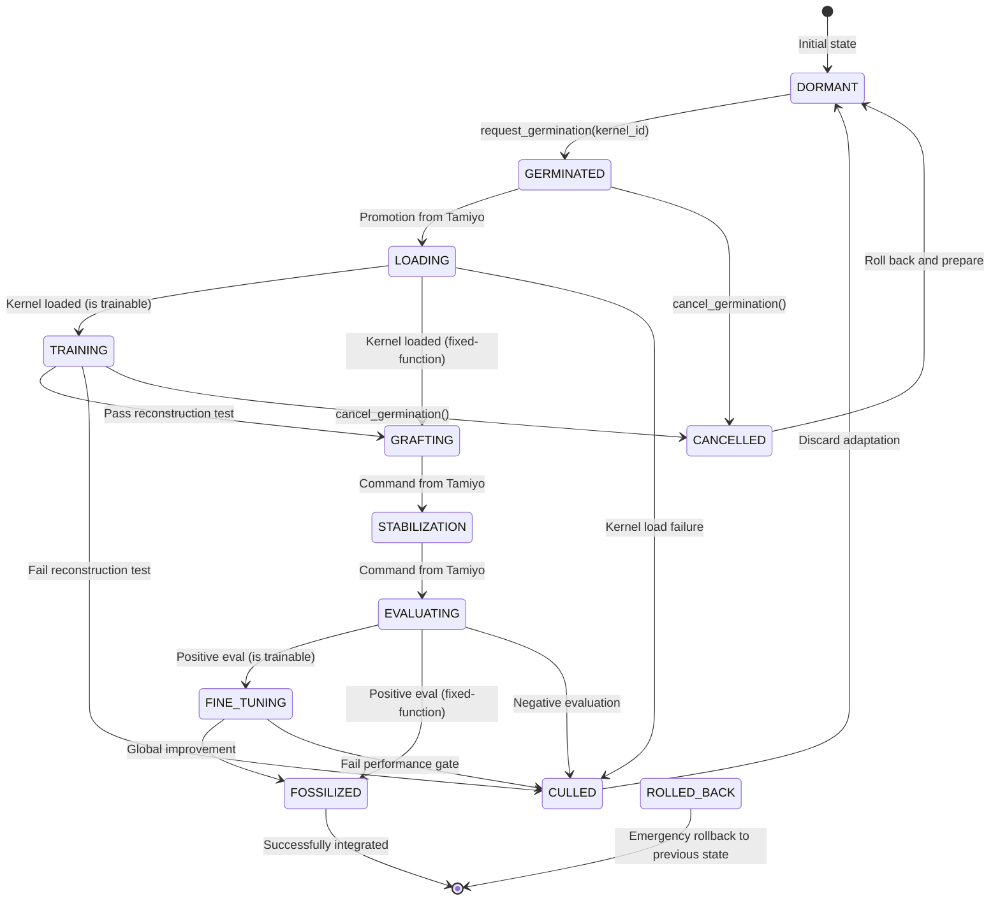

---

### **Appendix C: Model Tamiyo Policy**

#### **C.1. Overview and Mandate**

This document specifies the architecture for the advanced, learned version of the **Tamiyo Controller**. In the architecture defined by ADR-002, her mandate evolves significantly. She is no longer just a strategic architect but also a discerning **logistics manager**. Her primary role is to make context-aware, strategic decisions about **where** to intervene, and then to select the optimal, pre-compiled, and empirically-validated **`CompiledKernelArtifact`** from `Urza` that best fits the specific needs of that intervention site.

She achieves this by representing the host model as a dynamic graph to decide *where* to act, and then using that context to form a rich, tag-based query to `Urza` to select the best available tool for the job.

#### **C.2. Architectural Vision: GNN Encoder + Contextual Query & Selection**

The core of the policy is a multi-stage architecture that separates perception from action. A central GNN Encoder understands the system state, a Location Head decides *where* to act, and a sophisticated Kernel Selection Head decides *what* specific artifact to deploy.

```mermaid
graph TD
    A[Host Model State] --> B[Graph Constructor];
    B --> C[System Graph];
    C --> D[**HeteroGNN Encoder Core**<br>Processes the typed graph];
    D --> E[Contextual Seed Embeddings];

    subgraph "Decision Making"
        E --> F[**1. Location Head**<br>Scores dormant seeds -> Top-K Candidate Locations];
        F --> G{Select Best Location};
        G --> H[**2. Kernel Selection Head**];
    end

    subgraph "Kernel Selection Sub-Process"
        direction LR
        I[Context for Best Location] --> J{Generate<br>KernelQuery};
        J --> K[Query Urza<br>for matching kernels];
        K --> L[Receive<br>KernelQueryResult];
        L --> M{Score & Select<br>Best Kernel Artifact};
        M --> N[Final Action<br>(kernel_artifact_id)];
    end
    
    G -- Context for best location --> I
    H --> J
```

This design allows the policy to first identify the most critical intervention point, then use the context of that point to intelligently query the central library and select the most suitable, pre-validated kernel.

#### **C.3. Input Representation: The System Graph**

The policy's input is a rich, dynamic graph constructed at the start of each decision cycle. This representation is unchanged.

* **Nodes:** Every KasminaSeed is a node.
* **Node Features:** [chunk_variance, dead_node_ratio, avg_correlation, is_dormant, time_since_last_graft, ...].
* **Edges:** Typed edges define the architecture. Reverse edges are explicitly added for bidirectional information flow.
  * **SEQUENTIAL:** Connects adjacent seeds within a layer.
  * **LAYER_FORWARD:** Connects layers.
  * **CONTAINS / CHILD_OF:** Links a parent seed to a nested child and vice-versa.

#### **C.4. Idempotent & Efficient Graph Construction**

The graph is rebuilt each epoch from the authoritative `SystemStatePacket` to ensure state consistency. This process is unchanged.

```python
from collections import defaultdict

class DynamicSystemGraph:
    def build_from_system_state(self, system_state: "SystemStatePacket"):
        """
        Constructs the full graph idempotently from a global state snapshot.
        """
        # Logic to iterate through system_state and populate nodes/edges
        # For each edge, add normalized `age_in_epochs` to edge_features
        #
        # EFFICIENCY NOTE: For large graphs, the edge_index tensor is reused
        # across epochs unless topology has changed. Only node/edge features
        # are updated in-place to minimize CPU/GPU transfer latency.
        pass
```

#### **C.5. Component Deep Dive: Policy Architecture**

##### **C.5.1. GNN Encoder Core**

The encoder learns rich, contextual embeddings for every node in the system graph. Its architecture is unchanged.

* **Architecture:** A **Heterogeneous Graph Neural Network (HeteroConv)**. This architecture uses separate message-passing functions (e.g., individual GATConv layers) for each edge type (SEQUENTIAL, CONTAINS, etc.).

###### Conceptual PyG Implementation

```python
class HeteroGNNEncoder(torch.nn.Module):
    def __init__(self):
        self.conv1 = HeteroConv({
            ('seed', 'SEQUENTIAL', 'seed'): GATConv(...),
            ('seed', 'LAYER_FORWARD', 'seed'): GATConv(...),
            ('seed', 'CONTAINS', 'seed'): GATConv(...),
            ('seed', 'CHILD_OF', 'seed'): GATConv(...),
        }, aggr='sum')
```

* **Output:** A dictionary mapping each node's seed_id to its final context_vector.

##### **C.5.2. Action Head 1: Location Selection**

This head proposes a set of high-potential intervention sites. Its architecture is unchanged.

* **Architecture:** A simple Multi-Layer Perceptron (MLP).
* **Input:** The set of context_vectors for all DORMANT seeds.
* **Output:** The top-k (e.g., k=5) dormant seeds with the highest scores.

##### **C.5.3. Action Head 2: Kernel Selection**

This head is fundamentally redesigned. It performs a two-step process: query construction and candidate scoring.

* **Step 1: Contextual Query Generation:**
  * **Input:** The context_vector of the chosen location.
  * **Logic:** A small policy network (e.g., MLP) maps the context vector to the parameters of a `KernelQuery`. For example, a context indicating high memory pressure might result in a query with `required_tags=['low_memory']`.
* **Step 2: Candidate Scoring & Selection:**
  * **Input:** The `KernelQueryResult` from `Urza` and the location's context_vector.
  * **Logic:** An attention mechanism scores each returned `CompiledKernelArtifact` against the location's context. The policy learns to prioritize kernels whose empirical properties (tags and WEP metrics) best match the needs of the situation.
  * **Output:** The final action is the `kernel_artifact_id` of the highest-scoring kernel.

##### **C.5.4. Kernel Artifact Embedding Specification**

To be used by the scoring mechanism, the properties of a kernel artifact must be embedded into a dense vector.

```python
@dataclass
class KernelArtifactEmbedding:
    # Vector representation of empirical tags (e.g., multi-hot encoded)
    tag_embedding: np.ndarray
    # Vector of key WEP metrics (latency, memory, power), normalized
    wep_metric_vector: np.ndarray
    # Combined embedding used for scoring
    combined_embedding: np.ndarray
```

#### **C.6. Training Strategy: Reinforcement Learning**

The policy is trained as an RL agent, but the action space and reward function are updated.

* **Algorithm:** An efficient off-policy algorithm like **IMPALA** is used to improve sample efficiency.
* **Action Space:** The action space is now the selection of a specific `kernel_artifact_id` from a dynamically generated list of candidates returned by `Urza`.
* **Experience Collection:** Trajectories are stored in a comprehensive experience buffer that includes the `KernelQuery` used and the `UrabraskValidationReport` of the selected kernel.

##### **C.6.1. Bootstrapped Critic for Dense Rewards**

The use of a bootstrapped critic to predict next-epoch health and provide a dense reward signal remains a valid and crucial technique.

##### **C.2. Annealed Exploration Strategy**

To balance exploration and exploitation, the exploration strategy is now applied to the selection of kernels. This could involve occasionally selecting a lower-ranked but novel kernel from the query results to test its real-world performance.

##### **C.6.3. Hybrid Pretraining Schedule**

The pretraining schedule remains vital for bootstrapping the policy.

1. **Phase 1 (Supervised):** The policy is trained to imitate the decisions of the v1.0 HeuristicPolicy on a large set of simulated scenarios. The heuristic would use simple rules (e.g., "if latency is high, query for 'low_latency' tags").
2. **Phase 2 (RL Fine-tuning):** The pretrained policy is then fine-tuned using IMPALA and the full shaped reward signal.

##### **C.6.4. Shaped Reward Function**

The reward function is updated to use the rich, empirical data from the selected kernel's validation report.

```python
def compute_reward(outcome: str, metrics: dict, selected_kernel_report: "UrabraskValidationReport") -> float:
    # Immediate local reward from the Critic Head's TD-error or final health change.
    # The latency increase is now a real, benchmarked value from the kernel's report.
    r_local = 0.1 * metrics.get('health_improvement', 0) - 0.05 * selected_kernel_report.benchmark_results.get('latency_ms', 0)
    
    # Global outcome reward from the terminal lifecycle state.
    r_global = {'FOSSILIZED': 1.0, 'CULLED': -0.5, 'ROLLED_BACK': -1.0, 'CANCELLED': -0.1}.get(outcome, 0.0)
    
    # Efficiency penalty is now based on benchmarked memory usage, not a proxy like parameter count.
    r_efficiency = -0.01 * selected_kernel_report.benchmark_results.get('memory_mb', 0)
    
    return r_local + r_global + r_efficiency
```

#### **C.7. Integration and Safety**

The neural policy is integrated with a safety net.

* **Safety Fallback:** The NeuralTamiyoController wraps the policy. If the neural policy fails or `Urza` returns no matching kernels, the system can revert to a "safe-mode" action, such as doing nothing or deploying a universally-compatible, known-good default kernel.

#### **C.8. Advanced Implementation Challenges**

The advanced challenges of graph scale limits (requiring hierarchical controllers) and non-stationarity remain critical research areas for long-term development.

#### **C.9. Interpretability and Explainability**

The policy's decision-making process becomes more interpretable.

```python
class InterpretablePolicy(TamiyoNeuralPolicy):
    def decide_with_explanation(self, graph: SystemGraph):
        # ... logic to select location and generate query ...
        
        explanation = {
            "chosen_location": best_location_id,
            "location_context": "High memory pressure, moderate latency sensitivity.",
            "generated_query": { "required_tags": ["low_memory"], "preferred_tags": ["medium_speed"] },
            "urza_candidates": kernel_query_result.ranked_by_score,
            "final_selection_id": final_kernel_id,
            "selection_reasoning": "Selected artifact with best speed score among low_memory candidates."
        }
        return action, explanation
```

---

### **Appendix D: Model Karn Policy**

#### **D.1. Overview and Mandate**

**Karn** is the generative R&D engine of the Esper Morphogenetic Platform. Its sole mandate is to drive the continuous, intelligent evolution of the Urza library. It accomplishes this by functioning as an autonomous neural architecture designer that invents, refines, and proposes novel **`BlueprintIRs`** (Intermediate Representations).

Karn does not produce runnable code. Instead, it creates architectural *designs*. These designs are then passed to the asynchronous compilation and validation pipeline (`Tezzeret` and `Urabrask`) to be forged into deployable `CompiledKernelArtifacts`. Karn's goal is to learn which architectural patterns lead to designs that are not only theoretically elegant but also result in compiled kernels that are performant, efficient, and ultimately useful in real-world training, as judged by `Tamiyo`.

#### **D.2. Architectural Vision: The Invention Loop**

Karn operates within a sophisticated, multi-stage feedback loop. It generates ideas (`BlueprintIRs`), submits them to the `Urza` library, and then learns from a cascade of feedback as its designs move through the compilation and validation pipeline before eventual deployment.

```mermaid
graph TD
    A[Feedback & Inspiration<br>(Tamiyo FieldReports, Urabrask ValidationReports, Urza Library State)] --> B[**Karn Core**<br>(Generative Engine)];
    B -->|New BlueprintIR| C[**Urza Library**<br>(Status: UNVALIDATED)];
    C -->|Polls for UNVALIDATED| D[**Tezzeret Forge**<br>(Compiles to Kernels)];
    D -->|Untagged Kernels| C;
    C -->|Polls for PENDING_BENCHMARKING| E[**Urabrask Proving Ground**<br>(Benchmarks & Tags Kernels)];
    E -->|ValidationReport & Tags| C;
    E -->|Fast-loop Feedback<br>(ValidationReport)| B;
    C -->|Provides Tagged Kernels| F[Tamiyo Controller];
    F -->|Slow-loop Feedback<br>(FieldReport)| B;
```

This extended loop provides Karn with two critical learning signals: a fast, pre-deployment signal from `Urabrask` about the intrinsic quality of its designs, and a slower, ground-truth signal from `Tamiyo` about their practical utility.

#### **D.3. Input Streams: The Sources of "Inspiration"**

Karn synthesizes information from three distinct streams to inform its invention process:

1. **FieldReports from Tamiyo:** The ultimate ground-truth signal. These reports detail the real-world performance of a *specific compiled kernel* that originated from one of Karn's `BlueprintIRs`. This tells Karn which of its designs, after compilation and validation, were actually effective in solving a problem.

2. **ValidationReports from Urabrask:** A rich, fast-feedback signal. This report contains the full `WEP` (Weighted Evaluation Profile), performance benchmarks, and empirical `Tags` for every kernel compiled from a `BlueprintIR`. This allows Karn to learn which architectural patterns produce kernels that are fast, memory-efficient, or power-efficient, even before they are ever deployed.

3. **LibraryState from Urza:** A snapshot of the entire asset ecosystem. This includes the full collection of existing `BlueprintIRs`, their compilation statuses (e.g., `INVALID` if it failed Tezzeret's static analysis), and the portfolio of `CompiledKernelArtifacts` generated from them. This provides crucial data on design viability.

#### **D.4. Core Components: The Inventor's Toolkit**

Karn's intelligence is distributed across four learning-based components that work in concert.

##### **D.4.1. Generator Network**

The primary creative engine, responsible for designing novel `BlueprintIRs` from scratch.

* **Architecture:** A conditional Graph-to-Graph (G2G) Transformer. It is conditioned on a context vector summarizing desired characteristics and generates a complete `BlueprintIR` graph.
* **Training:** It is trained with a hybrid approach, learning to generate designs that are predicted by the Reward Model to be of high value.

##### **D.4.2. Reward Model**

A learned model that predicts the "value" of a given `BlueprintIR`, providing the core reward signal for training the Generator and Mutation Policy.

* **Architecture:** A Graph Neural Network (GNN).
* **Input:** A `BlueprintIR`'s architectural graph and the aggregated `ValidationReports` from `Urabrask` for all kernels derived from it.
* **Output:** A single scalar value representing the predicted long-term value, or "reward," of that architectural design. This allows Karn to learn the complex relationships between a design, its compiled performance characteristics, and its eventual success in the field.

##### **D.4.3. Mutation Policy**

Responsible for making small, intelligent modifications to existing high-performing `BlueprintIRs`. This is often more efficient than generating every design from scratch.

* **Architecture:** A small RL agent (e.g., a multi-armed bandit or a simple MLP).
* **Action Space:** A discrete set of graph mutation operators (add_attention_head, substitute_activation, change_layer_width, etc.).
* **Function:** This policy *learns* which mutation is most likely to produce a higher-value `BlueprintIR` given the context of its parent, using feedback from the Reward Model.

##### **D.4.4. Diversity Sampler**

The curator of genetic health. Its role is to prevent architectural stagnation by actively encouraging exploration of the design space.

* **Function:** It monitors the library's diversity score. If diversity drops, it provides a "novelty bonus" signal that is temporarily added to the Reward Model's output. This incentivizes the Generator and Mutation Policy to explore less-traveled regions of the architectural design space.

#### **D.5. The "Invention" Workflow (Evolutionary Cycle)**

Karn's core operation is a continuous evolutionary cycle.

1. **Selection Phase:** Select a batch of parent `BlueprintIRs` from Urza. The selection strategy is a mix of exploiting high-performers (based on Reward Model scores) and exploring novel designs (based on novelty scores).
2. **Breeding Phase:** For each parent, the system makes a policy decision:
      * **Mutate:** Apply the Mutation Policy to create a child `BlueprintIR` with incremental changes.
      * **Generate:** Task the Generator Network with creating a completely new `BlueprintIR` inspired by the parent's characteristics.
3. **Submission Phase:** Submit all new candidate `BlueprintIRs` to `Urza`, where their status is set to `UNVALIDATED`, kicking off the asynchronous compilation and validation pipeline.
4. **Learning Phase:** Use the resulting `ValidationReports` from `Urabrask` and any new `FieldReports` from `Tamiyo` to update the weights of the Generator Network, the Reward Model, and the Mutation Policy.
5. The cycle repeats.

#### **D.6. Training Curriculum: From Apprentice to Master Inventor**

Karn is educated via a formal, staged curriculum that safely builds its capabilities over time, leveraging the new pipeline structure.

| Stage | Title | Key Active Component | Learning Goal | Success Criteria |
| :--- | :--- | :--- | :--- | :--- |
| **0** | **The Apprentice** | Generator (Imitation) | **Learn the Grammar.** Train the Generator to accurately reproduce the `BlueprintIRs` of the known-good, human-designed blueprints in the initial library. | >99% graph reconstruction accuracy on the initial `BlueprintIR` set. |
| **1** | **The Tinkerer** | Mutation Policy | **Learn Incremental Improvement.** Activate the Mutation Policy. Karn learns to make small modifications to `BlueprintIRs`. | Mutated children consistently produce kernels that receive a higher average `WEP` score from `Urabrask` than their parents' kernels. |
| **2** | **The Journeyman** | Generator (Guided) | **Learn Safe Innovation.** Activate the Generator with RL, guided by the fast-feedback loop from `Urabrask`. | Generate novel `BlueprintIRs` that consistently pass `Tezzeret`'s static analysis and whose kernels are certified as `VALIDATED` by `Urabrask`. |
| **3** | **The Master Inventor** | All Components | **Autonomous R&D.** Full activation. The Reward Model is now fine-tuned with the slow-feedback loop from `Tamiyo`'s `FieldReports`, allowing Karn to optimize for true, real-world utility. | Consistently increase the average `FieldReport` success rate for blueprints originating from its designs, generation over generation. |

---

### **Appendix E: Model Urabrask Policy (Characterization Engine)**

#### **E.1. Mandate: The Guardian of Empirical Truth**

With the adoption of the asynchronous compilation pipeline (ADR-002), the role of **Urabrask** has fundamentally evolved. It is no longer a speculative tester of blueprint designs, but the platform's **Characterization Engine** and the guardian of empirical truth.

Its mandate is to take untagged, unproven `CompiledKernelArtifacts` generated by `Tezzeret` and forge them into trusted, well-understood assets for the platform. It achieves this by subjecting each kernel to a rigorous benchmarking gauntlet on real hardware. Its primary outputs are not just pass/fail signals, but rich, data-driven **Validation Reports** and a set of descriptive **empirical tags** (e.g., `high_speed`, `low_memory`) that describe what the kernel *actually does*, not what it was intended to do. It ensures that `Tamiyo`'s strategic decisions are always based on objective, measured reality.

#### **E.2. Architectural Vision: The Characterization Gauntlet**

Urabrask operates as a systematic, multi-stage pipeline that ingests untrusted artifacts and outputs characterized, validated assets. This workflow ensures no unvetted kernel can ever be deployed.

```mermaid
graph TD
    A[Untagged CompiledKernelArtifact from Urza<br/>Status: PENDING_BENCHMARKING] --> B{Stage 1: Sandbox Execution<br>(Safety & Sanity Check)};
    B -- Passes --> C{Stage 2: Full-Scale Benchmarking<br>(Performance Profiling)};
    C -- Passes --> D{Stage 3: Tag Generation<br>(Statistical Characterization)};
    D --> E[Assemble UrabraskValidationReport];
    E --> F[Push Report & Tags to Urza<br/>Status: VALIDATED];

    B -- Fails --> G[Rejection Report<br/>Status: REJECTED];
    C -- Fails --> G;
```

#### **E.3. The Urabrask Validation Report**

The `UrabraskValidationReport` is the primary data artifact produced by Urabrask. It is a comprehensive, structured profile of a kernel's measured performance on a specific hardware target. This data model is defined in ADR-002 and is the foundation for `Tamiyo`'s queries.

##### **E.3.1. Category 1: Quantitative Performance Metrics**

These are direct measurements taken from running the kernel on benchmark tasks.

* **Latency & Throughput:**
  * `latency_ms_mean`: Average execution time.
  * `latency_ms_p99`: 99th percentile latency, indicating tail performance.
  * `throughput_ops_per_sec`: How many times the kernel can be executed per second.
* **Resource Consumption:**
  * `memory_mb_peak`: The peak GPU memory consumed by the kernel.
  * `power_watts_avg`: Average power draw during execution.
* **Numerical Stability:**
  * `precision_drift_vs_fp32`: The numerical deviation compared to a standard, high-precision baseline.

##### **E.3.2. Category 2: Qualitative Empirical Tags**

This is the most critical output for `Tamiyo`. These are simple, human-readable strings that are **algorithmically generated** based on the kernel's relative performance against its peers.

* **Example Tags:** `high_speed`, `medium_speed`, `low_speed`, `high_memory`, `low_memory`, `high_power`, `low_power`, `numerically_stable`.

For the first validated kernels of a given hardware type, Urabrask will use a conservative, rule-based tagging system based on fixed thresholds (if known) or a baseline established by the first model. Once the population exceeds a defined threshold, it will transition to the dynamic statistical profiling method, ensuring tag stability from the outset.

##### **E.3.3. Category 3: Context & Metadata**

* **`hardware_context`:** The exact environment where the test was run (e.g., GPU: `NVIDIA_A100_80GB`, CUDA: `12.2`).
* **`baseline_comparison`:** Percentage improvement or regression against the default eager PyTorch implementation.

#### **E.4. Tag Generation Policy: Relative Performance Profiling**

Tags are not generated by fixed, absolute thresholds (e.g., `latency < 10ms`). This would be brittle and hardware-dependent. Instead, Urabrask uses an adaptive, **statistical profiling** method.

1. **Maintain Distributions:** For each hardware target (e.g., A100), `Urabrask` maintains a running statistical distribution (mean, standard deviation, percentiles) for every key metric (`latency_ms`, `memory_mb`, etc.) across all kernels it has ever tested.
2. **Percentile-Based Tagging:** When a new kernel is benchmarked, its performance is compared to these historical distributions. Tags are assigned based on which percentile the kernel's performance falls into.
3. **Policy Example:**
      * If `latency_ms_mean` is in the **bottom 20%** (i.e., faster than 80% of peers), assign the `high_speed` tag.
      * If `latency_ms_mean` is between the **20th and 70th percentile**, assign the `medium_speed` tag.
      * If `memory_mb_peak` is in the **top 25%** (i.e., uses more memory than 75% of peers), assign the `high_memory` tag.

This adaptive, data-driven approach ensures that tags remain meaningful and relevant as new, more advanced kernels are introduced into the ecosystem over time.

#### **E.5. Staged Delivery Plan: From Gatekeeper to Critic**

The full Urabrask system will be delivered in phases, aligned with the "Crawl, Walk, Run" strategy for the Innovation Plane.

| Stage | Title | Key Functionality | Learning Goal | Success Criteria |
| :---- | :---- | :--- | :--- | :--- |
| **0** | **The Gatekeeper** | Simple Sandbox Execution | **Ensure Basic Safety.** Validate that a compiled kernel can be loaded and run without crashing. | 100% rejection of kernels that cause segmentation faults or runtime errors. |
| **1** | **The Profiler** | Full Benchmarking Suite | **Measure Everything.** Implement the comprehensive benchmarking gauntlet to produce the full `UrabraskValidationReport` with quantitative metrics. | Measurement variance is <5% across identical runs for all key metrics. |
| **2** | **The Characterizer** | Statistical Tag Generation | **Provide Strategic Insight.** Implement the percentile-based policy to automatically generate the empirical tags `Tamiyo` needs for intelligent selection. | `Tamiyo` can successfully query for kernels using tags (`high_speed`, `low_memory`) and receive a correctly filtered list. |
| **3** | **The Adaptive Critic** | Learned Benchmarking Policy | **Learn What Matters.** (Future Vision) Implement an RL policy that learns which benchmarks are most predictive of good `FieldReport` outcomes and dynamically prioritizes the most informative tests, optimizing the use of validation resources. | The correlation between Urabrask's evaluation scores and final in-model performance increases over time. |

This phased delivery ensures that Urabrask provides immediate value as a safety gatekeeper, then progressively evolves into the sophisticated, data-driven characterization engine that is essential for the `Esper` platform's autonomous operation.

### **Appendix F: API Documentation**

#### **F.1 Introduction**

This appendix provides the consolidated API and data contract specifications for the `Esper` reference implementation. It serves as the primary technical reference for developers interacting with the platform programmatically, whether as a user (researcher), an operator, or a developer of a subsystem.

The appendix is divided into three main sections:

1. **The Researcher-Facing Python SDK:** The primary interface for training and managing morphogenetic models.
2. **The Control & Query REST API:** The standard HTTP interface for operational monitoring and external tooling.
3. **Internal Message Bus Schemas:** The data contracts for the event-driven communication between subsystems on the `Oona` message bus.

#### **F.2 Researcher-Facing Python SDK (Conceptual)**

The primary interaction model for researchers is a high-level Python SDK designed to abstract away the complexity of the underlying compilation and validation pipeline.

##### **F.2.1 Core Classes & Methods**

```python
# esper/__init__.py - Conceptual SDK structure
import torch.nn as nn
from .configs import EsperConfig, TolariaConfig, TamiyoConfig, KasminaConfig
from .core import TolariaTrainer, TamiyoController, MorphableModel

def load_config(path: str) -> EsperConfig:
    """Loads a comprehensive YAML configuration file for an entire run."""
    ...

def wrap(model: nn.Module, config: KasminaConfig) -> MorphableModel:
    """
    Wraps a standard PyTorch model, injecting KasminaSeed operators
    into specified layers, making the model 'morphable'.
    """
    ...

def save_model(model: MorphableModel, path: str) -> None:
    """
    Saves the final, evolved model's state_dict and its architectural
    lineage to a companion lineage.json file.
    """
    ...
```

##### **F.2.2 Example User Journey**

This demonstrates the intended end-to-end workflow for a researcher using the SDK. The internal complexity of the asynchronous pipeline is hidden from the end-user.

```python
import esper
from my_models import MySimpleCNN

# 1. Load configurations for each component from a single YAML file.
#    These configs specify everything from learning rates to Tamiyo's patience.
config = esper.load_config("./configs/phase1_mnist.yaml")

# 2. Instantiate the host model and wrap it for morphogenesis.
#    The 'wrap' function injects KasminaSeeds into all 'nn.Linear' layers.
model = MySimpleCNN()
morphable_model = esper.wrap(model, config.kasmina)

# 3. Instantiate the controller and trainer.
tamiyo_controller = esper.TamiyoController(morphable_model, config.tamiyo)
tolaria_trainer = esper.TolariaTrainer(
    model=morphable_model,
    controller=tamiyo_controller,
    config=config.tolaria
)

# 4. Start the training and evolution process.
print("Starting morphogenetic training...")
final_model, training_history = tolaria_trainer.train()

# 5. Save the final, evolved model and its lineage.
esper.save_model(final_model, "./outputs/evolved_cnn")
print("Training complete. Evolved model saved.")
```

#### **F.3 Control & Query REST API**

For operational monitoring and control, key components expose a secure, versioned REST API. All endpoints require an OIDC-issued JWT for authentication.

##### **`Urza`: Central Asset Hub API**

* **`POST /api/v1/kernels/query`**

  * **Description:** Retrieves a list of validated, compiled kernel artifacts based on rich, empirical criteria. This is the primary endpoint for `Tamiyo`.
  * **Request Body:** `KernelQuery`
  * **Success Response (200 OK):** `KernelQueryResult`

* **`GET /api/v1/blueprints/{blueprintId}`**

  * **Description:** Retrieves the record for a `BlueprintIR`, including the status of all its compiled artifacts.
  * **Success Response (200 OK):** `BlueprintRecord`

* **`GET /api/v1/kernels/{kernelArtifactId}`**

  * **Description:** Retrieves the full record for a single compiled kernel artifact, including its validation report.
  * **Success Response (200 OK):** `CompiledKernelArtifact`

##### **`Tezzeret`: Compilation Forge API**

* **`GET /api/v1/forge/status`**
  * **Description:** Gets the live operational status of the `Tezzeret` service.
  * **Success Response (200 OK):** `application/json`

```json
{
  "status": "OPERATIONAL",
  "queue_depth": {
    "unvalidated_blueprints": 12,
    "pending_compilation": 5
  },
  "active_workers": 8,
  "completed_last_hour": 150
}
```

##### **`Tamiyo`: System Control API**

* **`GET /api/v1/system/status`**
  * **Description:** Gets the live status of the current training run.
  * **Success Response (200 OK):** `application/json`

```json
{
  "status": "TRAINING",
  "current_epoch": 42,
  "validation_accuracy": 0.913,
  "active_adaptations": 1,
  "active_seed_id": "[12, 3]"
}
```

#### **F.4 Internal Message Bus Schemas (`Oona` Topics)**

The following Pydantic models define the payloads for the most critical topics on the `Oona` message bus, reflecting the new asynchronous pipeline.

##### **Topic: `control.kasmina.commands`**

* **Payload Model:** `KasminaControlCommand`
* **Purpose:** Low-frequency command from `Tamiyo` to a specific `Kasmina` layer, referencing a pre-validated kernel.

```python
# esper/contracts/lifecycle.py
from pydantic import BaseModel, Field
from typing import List, Optional, Tuple

class KasminaControlCommand(BaseModel):
    """Control command from Tamiyo to KasminaLayer (ADR-002 Final Revision)"""
    target_layer_id: int = Field(..., description="Target layer for adaptation")
    target_seed_id: int = Field(..., description="Specific seed within layer")
    command: str = Field(..., description="Command type: request_germination, etc.")

    # Tamiyo now provides the exact ID of the validated, characterized kernel to use
    kernel_artifact_id: str = Field(
        ...,
        description="The unique ID of the validated kernel artifact in Urza"
    )

    # Optional: Tamiyo can include the tags she used for selection (for telemetry)
    selected_for_tags: Optional[List[str]] = Field(
        None,
        description="Tags that influenced selection: ['low_memory', 'medium_speed']"
    )

    grafting_strategy: str # GraftingStrategy enum
    command_id: str = Field(..., description="Unique command identifier")
```

##### **Topic: `innovation.field_reports`**

* **Payload Model:** `FieldReport`
* **Purpose:** Feeds real-world adaptation outcomes from `Tamiyo` to `Karn` and `Simic`.

```python
from pydantic import BaseModel
from typing import Dict

class FieldReport(BaseModel):
    """Feedback from Tamiyo to Karn about a blueprint's real-world performance."""
    blueprint_id: str
    seed_id: str
    pre_metric: float
    post_metric: float
    outcome: str  # 'FOSSILIZED', 'CULLED', 'ROLLED_BACK'
    eval_metrics: Dict[str, float]
```

##### **Topic: `compilation.events`**

* **Payload Model:** Various event models (`BlueprintSubmitted`, `KernelCharacterized`)
* **Purpose:** Provides observability into the asynchronous innovation pipeline for `Nissa` and other services.

```python
class BlueprintSubmitted(BaseModel):
    blueprint_id: str
    submitted_by: str # "Karn" or "Human"
    timestamp: str

class KernelCharacterized(BaseModel):
    blueprint_id: str
    kernel_artifact_id: str
    status: str # "VALIDATED" or "REJECTED"
    tags: List[str]
    latency_ms: float
```

#### **F.5 Standard Error Codes**

The REST API uses standard HTTP status codes to indicate the success or failure of a request.

| Code | Status                 | Meaning                                                                                              |
| :--- | :--------------------- | :--------------------------------------------------------------------------------------------------- |
| **200** | **OK** | The request was successful.                                                                          |
| **202** | **Accepted** | The request was accepted for processing but is not yet complete (e.g., `pause` command).               |
| **400** | **Bad Request** | The request was malformed or failed validation (e.g., invalid query parameter). The response body will contain details. |
| **401** | **Unauthorized** | The request lacks a valid authentication token (JWT).                                                |
| **403** | **Forbidden** | The authenticated user does not have the necessary permissions (RBAC role) to perform the requested action. |
| **404** | **Not Found** | The requested resource (e.g., a specific `blueprint_id`) could not be found.                       |
| **500** | **Internal Server Error**| An unexpected error occurred on the server. The response will contain a `trace_id` for debugging.   |

---

### **Appendix G: Training Plan: A Phased Curriculum for the Tamiyo-Karn Co-Evolutionary System**

#### **G.1 The Challenge of Co-Evolution**

Training a multi-agent system where two or more agents learn and adapt simultaneously (co-evolution) is notoriously difficult. The primary challenge is **non-stationarity**: as one agent (`Karn`) changes its policy for generating `BlueprintIRs`, the set of available tools (`CompiledKernelArtifacts`) for the other agent (`Tamiyo`) becomes a moving target, making stable learning difficult. The asynchronous, multi-stage compilation pipeline introduces a significant delay in the feedback loop, further complicating training.

To overcome this, we adopt a phased training curriculum. This approach breaks the intractable problem of joint co-evolution into a sequence of more manageable, well-defined learning tasks. The goal is to progressively build agent capability and system complexity, ensuring each component is robust before it is integrated into the final, dynamic system. This plan aligns with the staged delivery of the Innovation Plane detailed in ADR-002.

#### **G.2 Training Phases Overview**

##### **Phase 1: Decoupled Controller Training (Learning the "Grammar" of Kernel Selection)**

* **Objective:** To train `Tamiyo` to effectively select the optimal `CompiledKernelArtifact` from a *fixed* portfolio based on empirical `Tags` and the current system state. The goal is to teach her the fundamental "grammar" of kernel evaluation, forcing her to develop a policy that maps situational needs (e.g., high memory pressure) to kernel properties (e.g., the `low_memory` tag).
* **System Setup:**
  * **`Tamiyo`:** The agent being actively trained via Reinforcement Learning in the `Simic` environment.
  * **`Karn`:** **Stubbed (No-Op Listener).** As per the "Crawl" stage of delivery, `Karn` is inactive and only logs `FieldReports` to build a future training dataset.
  * **`Urza`, `Tezzeret`, `Urabrask`:** A functional "Phase 1" pipeline is active. `Urza` is pre-loaded with a static, human-curated library of 10-20 canonical `BlueprintIRs`. This library has been fully processed by `Tezzeret` and `Urabrask` to produce a stable, finite set of `CompiledKernelArtifacts` with corresponding empirical `Tags`.
* **Training Process:** `Tamiyo` is trained on a curriculum of simulated adaptation scenarios. Her policy learns to query `Urza` using the `KernelQuery` interface, requesting kernels with specific tags based on the provided `SystemStatePacket`. The reward function is based on the measured performance improvement (`pre_metric` vs. `post_metric` from the `FieldReport`) after a graft is completed.
* **Success Criteria:**
  * `Tamiyo`'s policy demonstrates a strong, learnable correlation between system state and optimal tag selection.
  * The policy consistently outperforms a baseline random or heuristic-based kernel selection strategy.
  * The output of this phase is a **frozen, pre-trained `Tamiyo` policy** that is an expert at using the available toolkit.

##### **Phase 2: Guided Architect Training (Learning "Good Taste" in Design)**

* **Objective:** To train `Karn` to generate novel `BlueprintIRs` that result in high-value `CompiledKernelArtifacts`. This is achieved by using the expert `Tamiyo` from Phase 1 as a sophisticated, fixed evaluator to guide `Karn`'s architectural search.
* **System Setup:**
  * **`Tamiyo`:** **Frozen.** Her expert policy, trained in Phase 1, is not updated. She acts as a fixed, intelligent "curator" or "discriminator," making consistent choices based on her learned preferences.
  * **`Karn`:** **Active.** He is the agent being trained. He begins generating new `BlueprintIRs` and submitting them to the pipeline.
  * **The Feedback Loop:**
        1. `Karn` generates a new `BlueprintIR` and submits it to `Urza`.
        2. `Tezzeret` and `Urabrask` asynchronously process it, producing a new set of tagged `CompiledKernelArtifacts`.
        3. These new kernels are added to the portfolio available to the frozen `Tamiyo`.
        4. The performance of the model after `Tamiyo` chooses to use (or ignore) `Karn`'s new kernels provides the reward signal.
* **Training Process:** `Karn`'s reward is a measure of marginal utility: **"How much more successful was `Tamiyo` when your new kernel options were available?"** This rewards `Karn` for creating genuinely useful tools that are frequently selected and lead to successful (`FOSSILIZED`) outcomes. The `FieldReports` logged since the beginning are the primary source for this reward signal.
* **Success Criteria:**
  * The average quality score (e.g., WEP score or a derived ELO rating) of `Karn`-designed kernels in `Urza` consistently increases over time.
  * The diversity of the `Urza` `BlueprintIR` library expands.
  * The output is a **trained `Karn` policy** and a **rich, diverse library of blueprints and kernels** in `Urza`.

##### **Phase 3: Joint Co-Evolution (The "Dialogue")**

* **Objective:** To integrate the trained agents and fine-tune them together in the full, dynamic, co-evolutionary loop, allowing them to adapt to each other's strategies.
* **System Setup:**
  * **`Tamiyo`:** **Unfrozen (Low Learning Rate).** Her policy is now trainable again, allowing her to adapt her preferences as `Karn` invents entirely novel categories of solutions that may not fit her initial training. The learning rate is kept low to prevent catastrophic forgetting of her foundational knowledge.
  * **`Karn`:** **Active.** He continues to generate new `BlueprintIRs`, now influenced by `Tamiyo`'s evolving selection patterns.
  * **The Full System:** The complete architecture is now live. All feedback loops, including live `FieldReports`, are active.
* **Training Process:** The agents now learn in tandem in the `Simic` environment. `Karn` invents, the Innovation Plane pipeline processes, `Tamiyo` selects, and the resulting `FieldReports` provide the ground-truth reward signal to update both agents' policies. This is the final, most complex stage of training.
* **Success Criteria:**
  * The system as a whole demonstrates **emergent capabilities**, solving problems that neither agent could solve in the decoupled phases.
  * The performance of the final architectures produced by the live `Tamiyo`-`Karn` system should surpass the performance achieved in the decoupled phases on a comprehensive suite of macro-evaluation benchmarks.

---

### **Appendix H: Large-Scale Adaptation: The Hierarchical Attentional Controller**

#### **H.1 Mandate: The Challenge of Massive-Scale Models**

The single-agent `Tamiyo` controller is highly effective for models with up to ~10,000 seed locations. However, for massive-scale foundation models, where the number of potential adaptation sites could reach into the millions, a monolithic controller becomes computationally intractable.

To address this, the Esper framework employs a "system of systems" architecture for large-scale deployments. This solution combines hierarchical control with an efficient attentional mechanism for resource allocation, allowing the platform to manage complexity while retaining strategic control.

#### **H.2 Architectural Vision: The Hybrid "System of Systems"**

The solution is a hybrid architecture that treats the host model not as a single entity, but as a "system of systems." The architecture partitions the host model into logical domains, each managed by a subordinate controller (sub-Tamiyo). A top-level architect (Tamiyo-Prime) governs these subordinates, using an attentional policy to "zoom in" on the most critical domains and allocate a budget of Adaptive Training Points (ATP), which represent the license to perform an adaptation.

This approach combines two key ideas:

1. **Hierarchical Control ("Nested Tamiyo"):** The single `Tamiyo` is replaced by a council of `sub-Tamiyos`, each responsible for a specific domain, all governed by a single `Tamiyo-Prime`.
2. **Attentional Zoom ("The Lever"):** `Tamiyo-Prime` does not process the full, fine-grained telemetry of the entire system. Instead, it operates on compressed summaries from its subordinates and uses an attentional policy to "zoom in" on the most critical domains that require resources or intervention.

#### **H.3 Component Deep Dive**

This system introduces two new roles within the `Tamiyo` control plane.

##### **H.3.1 The Sub-Tamiyo (Domain Controller)**

* **Role:** A standard `Tamiyo` instance responsible for managing a specific, partitioned **domain** of the host model (e.g., "the vision encoder," "the cross-attention layers," "the final classification head").
* **Function:**
  * It runs its own GNN-based policy, but only on the local subgraph of its assigned domain.
  * It continuously monitors its local seeds and aggregates their telemetry into a compressed `HealthSummaryReport`.
  * It can only initiate a deployment by "spending" from an **Adaptive Training Point (ATP)** budget allocated to it by `Tamiyo-Prime`. To do this, it queries `Urza` for a suitable, pre-validated `CompiledKernelArtifact` based on its local context and sends a `KasminaControlCommand` with the specific `kernel_artifact_id`.

##### **H.3.2 Tamiyo-Prime (System Architect)**

* **Role:** The top-level meta-controller that manages the "council" of sub-Tamiyos. It is the ultimate strategic authority.
* **Input:** It does not see individual seeds. Its input is a graph where the nodes are the `sub-Tamiyos`, and the features are their `HealthSummaryReport`s.
* **Function:** Its policy network (e.g., a Transformer) operates not on individual seeds, but on the sequence of HealthSummaryReports from its subordinates. It uses self-attention to calculate a "criticality score" for each domain, which then informs its ATP budget allocation.
* **Core Mechanism (Attentional Budgeting):** It uses an attentional policy (e.g., a Transformer or another GNN) to process these summary reports. The attention scores are used to identify the one or two domains that are the most critical system-wide bottlenecks (e.g., highest volatility, lowest performance).
* **Output:** It issues an `AllocationCommand` that distributes the global ATP budget among the `sub-Tamiyos`, giving a larger budget to the domains that require the most attention.

#### **H.4 Control & Information Flow**

The system operates in a continuous, hierarchical loop:

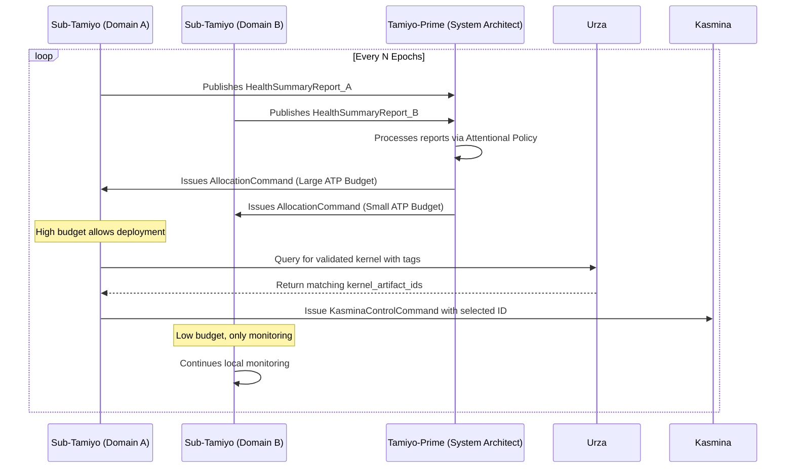

1. **Bottom-Up Reporting:** At a regular cadence, each `sub-Tamiyo` publishes its compressed `HealthSummaryReport`.
2. **Attentional Prioritization:** `Tamiyo-Prime` ingests these reports and its attentional policy calculates a "criticality score" for each domain.
3. **Top-Down Budgeting:** `Tamiyo-Prime` allocates the next cycle's ATP budget based on these scores. Domains with high volatility, high error rates, or other critical signals receive a larger budget.
4. **Deconflicted Local Action:** The `sub-Tamiyos` use their allocated budgets to manage local deployments. `Tamiyo-Prime` may also enforce a global "one major deployment at a time" rule to ensure clear credit assignment for training its own policy.

#### **H.5 Data Contracts for Hierarchical Control**

```python
from pydantic import BaseModel, Field
from typing import Dict, Tuple

class HealthSummaryReport(BaseModel):
    """Compressed status report from a sub-Tamiyo to Tamiyo-Prime."""
    domain_id: str
    avg_health_score: float
    net_volatility: float  # e.g., variance of health scores within the domain
    active_adaptations: int
    atp_balance: int

class AllocationCommand(BaseModel):
    """Top-down command from Tamiyo-Prime to a sub-Tamiyo."""
    target_domain_id: str
    atp_budget_allocation: int
    is_priority_agent: bool = False # Flag to allow major deployment this cycle
```

#### **H.6 Benefits of the Hybrid Architecture**

This hybrid approach provides a clear and robust path to scaling the morphogenetic framework.

* **Combats Intractability:** It solves the scaling problem by abstracting away fine-grained detail. `Tamiyo-Prime` reasons about a small number of domains, not millions of seeds.
* **Efficient and Focused:** The attentional mechanism ensures that strategic focus and resources are not wasted on stable parts of the network but are directed precisely where they are needed most.
* **Leverages Asynchronous Pipeline:** The architecture is perfectly suited to the asynchronous compilation model. `sub-Tamiyos` can query a rich, continuously improving portfolio of pre-validated kernels in `Urza`, selecting the optimal tool for their specific local problem without incurring any compilation cost.
* **Extends the Core Principles:** It gracefully extends the framework's core principle of hierarchy (`Karn` -> `Tezzeret` -> `Urabrask` -> `Tamiyo` -> `Kasmina`) by making the `Tamiyo` layer itself recursive and self-organizing.

#### **H.7 Architectural Trade-offs and the Hybrid Path Forward**

While the hierarchical control pattern provides a structural solution to scaling, the specific mechanism by which `Tamiyo-Prime` manages her subordinates is a critical design choice. This involves a trade-off between the complexity of a single, powerful agent and the coordination overhead of a multi-agent system. We explored two primary architectural patterns to address this.

##### **H.7.1 Option A: The "Attentional Zoom" Controller (Single-Agent, Dynamic Focus)**

This architecture maintains a single `Tamiyo` agent but equips her with an efficient, attention-based mechanism for managing complexity.

* **Mechanism:** The agent's decision-making process is a sequential, four-step cycle:
    1. **Global View:** `Tamiyo` first processes a heavily compressed or pooled representation of the entire architectural graph, giving her a low-fidelity "big picture" summary.
    2. **Attentional Selection:** Her policy then uses an attention mechanism to identify one or two areas of high interest (e.g., high predicted error, high volatility) from the summary view.
    3. **Local Zoom:** On the next step, she "zooms in," ingesting only the full, uncompressed telemetry from the selected "detailed window."
    4. **Action:** With this high-fidelity local data, she queries `Urza` for kernels matching her required tags and selects a specific `kernel_artifact_id` for deployment.
* **Analysis:** This model is architecturally simpler as it avoids the complexities of multi-agent coordination. However, its decision latency is potentially higher due to the sequential "zoom" process, and it relies heavily on developing a robust graph summarization technique for the initial global view.

##### **H.7.2 Option B: The "Hierarchical Economic" Controller (Multi-Agent, Delegated Authority)**

This architecture fully embraces the multi-agent paradigm, framing `Tamiyo-Prime` as a resource allocator in a system of subordinate agents.

* **Mechanism:** `Tamiyo-Prime` allocates a budget of **Adaptive Training Points (ATP)** to each `sub-Tamiyo`. This allocation is based on the **net volatility** of each domain. Domains that are unstable or performing poorly receive a larger ATP budget, empowering them to pursue more aggressive deployments. `Tamiyo-Prime` also acts as a deconflictor, potentially allowing only one agent to "spend" its budget on a major kernel deployment at a time to ensure clear credit assignment.
* **Analysis:** This model is massively scalable and allows for parallel local reasoning by the `sub-Tamiyos`. The economic incentive structure provides a clear and powerful heuristic for directing resources. Its primary challenge lies in the implementation complexity of a true multi-agent system and ensuring the local objectives of the sub-agents remain aligned with the global system goals.

##### **H.7.3 The Synthesis: The Hierarchical Attentional Controller**

The optimal architecture for Phase 2 and beyond is a hybrid that combines the structural scalability of the hierarchical model with the computational efficiency of the attentional model. **This is the designated path forward.**

In this hybrid system, the "Attentional Zoom" is not a temporal process for a single agent, but the core mechanism that `Tamiyo-Prime` uses to perform her duties within the hierarchy.

* **Refined Control Flow:**
    1. **Bottom-Up Reporting:** All `sub-Tamiyos` manage their local domains and publish their compressed `HealthSummaryReport`s to `Tamiyo-Prime`.
    2. **Attentional Prioritization:** `Tamiyo-Prime`'s policy network—likely a Transformer that treats the incoming reports as a sequence—uses its self-attention mechanism to calculate a "criticality score" for each domain. This is her "zoom."
    3. **Top-Down Budgeting:** `Tamiyo-Prime` issues `AllocationCommand`s, distributing the global ATP budget proportionally to the attention scores. The domains she "pays more attention to" get more resources.
    4. **Empowered Local Action:** The `sub-Tamiyo` with the largest budget is empowered to query `Urza` and deploy a high-impact `CompiledKernelArtifact`, knowing it is acting on the system's current top priority.

This hybrid model represents the best of both worlds. It avoids the intractability of a single agent managing millions of nodes by using a hierarchical structure, and it solves the resource allocation problem within that hierarchy using a proven, efficient attentional mechanism. It transforms `Tamiyo-Prime` into an expert executive who efficiently allocates resources based on a high-level dashboard, trusting her specialist domain managers to handle the fine-grained execution.

#### **H.8: The ATP Economic Model**

The Hierarchical Attentional Controller manages complexity by delegating local decisions to `sub-Tamiyos`. To govern this "system of systems" without resorting to brittle micromanagement, the framework introduces an explicit economic model centered on **Adaptive Training Points (ATP)**. ATP is an abstract currency representing a quantifiable unit of risk and computational budget. The goal of this economy is to ensure the platform's finite capacity for change is allocated rationally, promoting stability and maximizing the overall performance of the host model.

##### **H.8.1 ATP Supply and Allocation: The Central Bank**

`Tamiyo-Prime` acts as the system's central bank. Its role is to manage the total supply of ATP and allocate it to the `sub-Tamiyos` where it is most needed.

* **Supply:** At the beginning of each allocation cycle (a configurable number of epochs, e.g., 5), `Tamiyo-Prime` creates a fixed, global budget of ATP (e.g., 1,000 ATP). This budget is non-cumulative; any unspent ATP from a previous cycle is discarded.
* **Allocation:** `Tamiyo-Prime` distributes this budget to the `sub-Tamiyos` based on its attentional policy, as detailed in H.7.3. Domains exhibiting higher volatility, steeper performance degradation, or other critical signals receive a larger share of the ATP budget, empowering them with more "licenses to adapt."

##### **H.8.2 The Cost of Adaptation: A Risk-Based Marketplace**

A `sub-Tamiyo` "spends" its allocated ATP to initiate an adaptation. The cost of this action is not fixed; it is a variable price determined by the predicted risk and resource impact of the specific `CompiledKernelArtifact` selected for the task. This data is sourced directly from the kernel's `UrabraskValidationReport`.

The cost function creates an internal marketplace where `sub-Tamiyos` must make economically sound decisions:

* **Cost Formula:** The ATP cost for a `sub-Tamiyo` to issue a `request_germination` command is calculated as follows:
    $Cost_{ATP} = (w_{mem} \cdot M_{peak}) + (w_{lat} \cdot L_{p99}) + (w_{risk} \cdot S_{risk})$
    Where:
  * $M_{peak}$ is the `memory_mb_peak` from the validation report.
  * $L_{p99}$ is the `latency_ms_p99` from the validation report.
  * $S_{risk}$ is the quantitative `risk_score` calculated by `Urabrask`.
  * $w_{mem}$, $w_{lat}$, and $w_{risk}$ are globally configured weights that allow operators to tune the system's risk appetite.

This variable-cost model forces a `sub-Tamiyo` to be a discerning consumer. It must choose whether to spend its budget on one potentially high-impact but expensive graft, or on several smaller, cheaper, and safer adaptations.

##### **H.8.3 The "Rule of One" and Clear Attribution**

To ensure system stability and solve the credit assignment problem, `Tamiyo-Prime` enforces a strict global lock on the most critical phase of adaptation.

* **Grafting Lock:** Before a `sub-Tamiyo` can command a seed to enter the `GRAFTING` state, it must acquire a global **Grafting Lock** from `Tamiyo-Prime`.
* **Singleton Policy:** `Tamiyo-Prime` will only ever grant **one** Grafting Lock at a time across the entire system. No other adaptations can proceed to the grafting stage until the current one has reached a terminal state (`FOSSILIZED` or `CULLED`).
* **Clear Attribution:** This policy provides `Tamiyo` with an unambiguous, clean signal. Since only one graft is being evaluated at any given time, any change in global model performance between the acquisition of the Grafting Lock and the final outcome can be directly and confidently attributed to that single adaptation. This clean signal is critical for accurately assessing the performance of the graft and providing high-quality data for training the controller policies.

##### **H.8.4 Economic Feedback and Policy Learning**

The economic model provides the primary reward signal for training the `sub-Tamiyo` policies in `Simic`. The goal is not simply to achieve successful grafts, but to do so efficiently.

* **Return on Investment (ROI):** The performance of a `sub-Tamiyo`'s decision is measured by its ROI:
    $ROI = \frac{\Delta P_{global}}{Cost_{ATP}}$
    Where:
  * $\Delta P_{global}$ is the measured change in the global validation metric (e.g., accuracy or loss) attributable to the graft.
  * $Cost_{ATP}$ is the ATP cost of the deployed kernel.

A `sub-Tamiyo` that achieves a 0.5% performance gain with a "cheap" 20 ATP kernel receives a much higher reward than one that achieves the same gain with an "expensive" 100 ATP kernel. This forces the policies to learn to be not just effective, but efficient, creating a powerful evolutionary pressure towards parameter- and resource-conscious solutions.

---

### **Appendix I: Controller Domain Partitioning**

#### **I.1 The Mandate for Partitioning**

The Hierarchical Attentional Controller, detailed in Appendix H, is the designated architecture for managing adaptation in massive-scale models. This "system of systems" approach, with a `Tamiyo-Prime` governing multiple `sub-Tamiyos`, is predicated on a critical prerequisite: the host model's vast "seed lattice" must be partitioned into distinct, manageable **domains**.

This raises a fundamental design question: How are these domains defined? The choice represents a core trade-off between pragmatic, human-guided design and the framework's long-term vision of full autonomy.

#### **I.2 A Phased Approach to Partitioning**

In alignment with the core principle of **Phased Implementation & Progressive Complexity**, the framework adopts a two-stage approach to domain definition. The initial implementation prioritizes simplicity, interpretability, and de-risking the core multi-agent control problem. The long-term vision embraces full autonomy.

1. **Phase 1/2 (Initial Implementation): Manual Domain Definition.** A human architect defines the domains based on the model's logical structure.
2. **Phase 3+ (Future Vision): Autonomous Domain Discovery.** A meta-agent learns to partition the model algorithmically.

This appendix specifies the mechanism for the initial, manual approach.

#### **I.3 Phase 1/2 Strategy: Manual Domain Definition**

For the initial implementation and validation of the hierarchical controller, domains will be defined manually by the human operator. This provides a stable, interpretable, and computationally simple foundation for validating the core mechanics of hierarchical control and resource allocation.

##### **I.3.1 Mechanism**

Domain definitions will be specified in a configuration file (e.g., YAML) that is loaded at the start of a training run. This configuration maps specific layers or modules of the host network to a named `sub-Tamiyo` controller. Each `sub-Tamiyo` is then responsible for all adaptation decisions within its assigned domain, which involves querying `Urza` for appropriate pre-compiled kernels and issuing `KasminaControlCommands` for their execution.

##### **I.3.2 Example: Partitioning a Vision Transformer (ViT)**

Consider a standard Vision Transformer. A human architect, using their domain knowledge, would partition it into logical functional blocks:

```yaml
# Example domain_map.yaml for a Vision Transformer

tamiyo_prime_config:
  controller_type: HierarchicalAttentional

domain_map:
  sub_tamiyo_embedding:
    # This sub-Tamiyo manages the initial patch projection and positional embeddings
    module_paths:
      - "patch_embed.*"
      - "pos_embed"
    atp_initial_budget: 100

  sub_tamiyo_encoder_early:
    # This sub-Tamiyo manages the first half of the Transformer encoder blocks
    module_paths:
      - "blocks.0"
      - "blocks.1"
      - "blocks.2"
      - "blocks.3"
    atp_initial_budget: 200

  sub_tamiyo_encoder_late:
    # This sub-Tamiyo manages the second half of the encoder
    module_paths:
      - "blocks.4"
      - "blocks.5"
      - "blocks.6"
      - "blocks.7"
    atp_initial_budget: 200

  sub_tamiyo_head:
    # This sub-Tamiyo manages the final classification head
    module_paths:
      - "norm"
      - "head"
    atp_initial_budget: 50

```

##### **I.3.3 Rationale**

This manual approach is the correct strategy for the initial phases of research for three key reasons:

1. **Reduces Complexity:** It allows the team to focus entirely on solving the already difficult problems of multi-agent credit assignment and budget allocation, without the confounding variable of a dynamic partitioning algorithm.
2. **Ensures Interpretability:** The domains align with human-understandable functional modules ("the encoder," "the head"). This makes the behavior of the hierarchical system vastly easier to debug and analyze.
3. **Leverages Human Expertise:** It provides a direct mechanism for a human architect to inject valuable domain knowledge and inductive biases into the control structure of the system.

#### **I.4 Phase 3+ Vision: Autonomous Domain Discovery**

While manual partitioning is pragmatic, the ultimate vision of the morphogenetic framework is one of complete self-organization. The long-term research goal is to make the domain partitioning process itself autonomous.

* **The Vision:** A meta-level agent would learn to partition the host model's computation graph into the most effective domains. This is analogous to a biological embryo undergoing differentiation, where cells organize into distinct tissues and organs without an external blueprint.
* **Potential Mechanisms:**
  * **Graph-Based Clustering:** At initialization, a meta-agent could apply graph partitioning algorithms (e.g., spectral clustering) to the model's computation graph to identify "natural" communities of interconnected seeds.
  * **Learned Partitioning:** Even more powerfully, a policy could be trained to dynamically redraw domain boundaries during training, merging or splitting domains to optimize the control hierarchy in response to the evolving needs of the host model.

This future work represents a grand challenge in AI: creating a system that not only learns and adapts its architecture, but also learns how to best organize its own command and control structure.

---

### **Appendix J: Compilation Pipeline Architecture**

#### **J.1 Mandate and Scope**

This appendix details the architecture of the asynchronous compilation and validation pipeline, a cornerstone of the `Esper` platform. Its primary mandate is to **completely decouple the expensive, resource-intensive process of kernel optimization from the live training loop**, thereby ensuring zero training disruption.

The pipeline is responsible for transforming a raw architectural design (`BlueprintIR`) into a portfolio of safe, performant, and empirically characterized `CompiledKernelArtifacts` ready for execution.

**In Scope:**

* Asynchronous consumption of `BlueprintIRs` from `Urza`.
* Static validation and "pre-flight checks" on blueprint designs.
* Execution of diverse, multi-objective compilation strategies (e.g., for speed, low memory).
* Generation and versioning of `CompiledKernelArtifacts`.
* Continuous background optimization of existing blueprints as new techniques become available.
* Robust error handling and reporting for failed compilations.

**Out of Scope:**

* The generation of `BlueprintIRs` (handled by `Karn`).
* The dynamic benchmarking and empirical tagging of compiled kernels (handled by `Urabrask`).
* The strategic selection and execution of kernels (handled by `Tamiyo` and `Kasmina`).

#### **J.2 Architectural Workflow**

The pipeline is a multi-stage, event-driven workflow orchestrated between `Urza`, `Tezzeret`, and `Urabrask`. This ensures a clean separation of concerns: design (`Karn`), compilation (`Tezzeret`), characterization (`Urabrask`), and selection (`Tamiyo`).

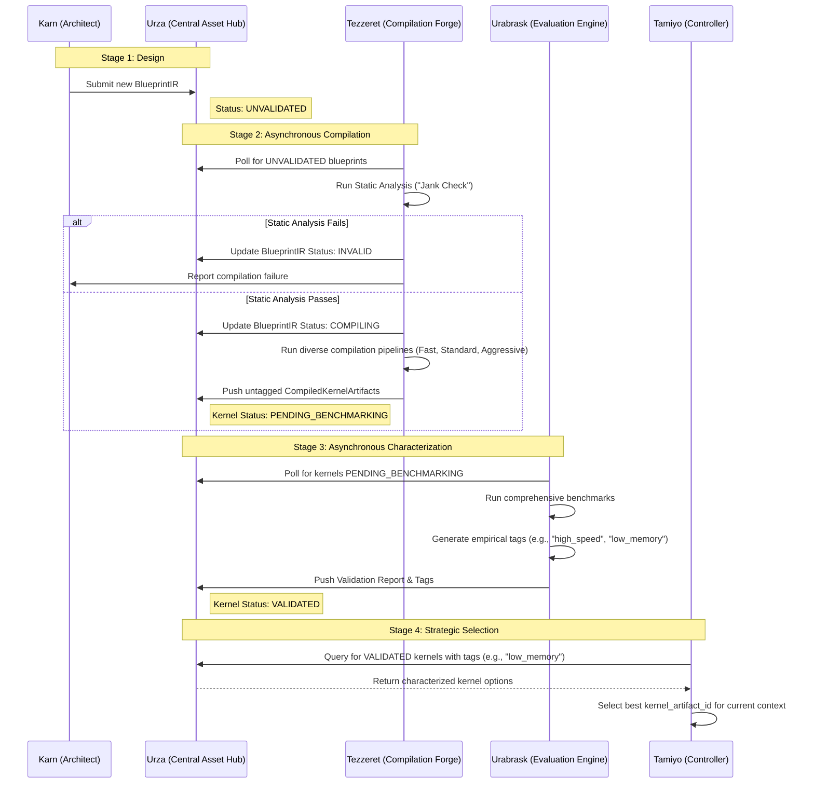

#### **J.3 Core Component: Tezzeret (The Forge)**

`Tezzeret` is a dedicated, stateless background service responsible for the "heavy lifting" of compilation. It is designed to be a "dumb" but powerful forge; it generates a diverse portfolio of kernel options without bias or knowledge of their intended use.

##### **J.3.1 Internal Architecture**

`Tezzeret` itself is composed of several logical components adapted from previous architectural concepts, now correctly placed within an asynchronous service:

* **Polling Engine:** The main loop that queries `Urza` for new `BlueprintIRs` in the `UNVALIDATED` state or existing blueprints eligible for re-optimization.
* **Static Validator:** Performs initial "pre-flight" or "jank" checks on the `BlueprintIR` graph. This includes shape inference, type validation, and checking for known architectural anti-patterns, ensuring that only valid graphs proceed to the expensive compilation stage.
* **Compilation Core:** The engine that transforms a valid `BlueprintIR` into kernel source code.
  * **Kernel Source Generator:** Translates the `BlueprintIR` graph into optimized Triton kernel source code. It handles SSA-based symbol management, control flow translation, and memory layout optimization.
  * **Architecture Optimizer:** Applies hardware-specific optimizations to the generated source, tuning it for the target GPU architecture (e.g., Hopper, Ada Lovelace).
* **Pipeline Manager:** Selects and executes one or more compilation strategies (see J.4) for a given blueprint, producing a portfolio of kernel variants.

##### **J.3.2 Key Interfaces**

* **Input:** Consumes `BlueprintIR` objects from `Urza`.
* **Output:** Publishes `CompiledKernelArtifact` records back to `Urza`.
* **Feedback:** Reports compilation success or failure (with detailed logs) to `Karn` via the `Oona` message bus, providing a crucial feedback signal for the generative architect.

#### **J.4 Compilation Strategies**

To provide `Tamiyo` with a rich set of options, `Tezzeret` employs a multi-tiered compilation strategy. Each strategy represents a different trade-off between compilation time and potential performance gain.

| Strategy | Description | Typical Use Case | Target Time |
| :--- | :--- | :--- | :--- |
| **Fast** | A quick compilation pass with minimal optimizations. The goal is to produce a working kernel as quickly as possible for initial validation. | Prototyping new `Karn`-generated designs; ensuring a baseline kernel exists. | < 60 seconds |
| **Standard** | A balanced approach using a standard set of hardware-specific optimizations and light autotuning. Aims for good performance without excessive compilation time. | The default pipeline for most blueprints, providing solid, reliable performance. | < 5 minutes |
| **Aggressive** | A comprehensive, long-running optimization process. This involves extensive autotuning, exploring a wide range of block sizes, and potentially profile-guided optimization. | Squeezing maximum performance out of critical, frequently-used "workhorse" blueprints. | < 24 hours |

#### **J.5 Kernel Artifact Versioning**

To ensure traceability, determinism, and safe cache invalidation, every `CompiledKernelArtifact` is assigned a unique, descriptive ID.

**Schema:** `[BlueprintIR Hash]-[Hardware Target]-[Pipeline Name]-[Version Hash]`

**Example:** `b3d4f5-h100-aggressive-a1c3b2`

* **`b3d4f5`**: The truncated SHA256 hash of the canonical `BlueprintIR`.
* **`h100`**: The target GPU architecture (e.g., h100, a100, t4).
* **`aggressive`**: The compilation strategy used (`fast`, `standard`, `aggressive`).
* **`a1c3b2`**: A hash of the compiler versions (Triton, CUDA) and key configuration parameters used in the compilation, ensuring that updates to the toolchain produce new, distinct artifacts.

#### **J.6 Continuous Background Optimization**

The `Tezzeret` service includes a low-priority background queue dedicated to continuous improvement. This process periodically scans `Urza` for blueprints that are:

1. Frequently used by `Tamiyo`.
2. Were last compiled with an older version of the toolchain.

It then re-runs the `Standard` or `Aggressive` compilation pipelines on these blueprints. If the new kernels show superior performance when validated by `Urabrask`, they can supersede the older versions, ensuring the entire library evolves and improves over time without any active intervention from `Karn`.

#### **J.7 Error Handling**

The asynchronous nature of the pipeline provides robust fault isolation.

* **Static Validation Failure:** If a `BlueprintIR` fails the "jank check", its status in `Urza` is immediately set to `INVALID`. A failure report is sent to `Karn`, and no further resources are wasted on it.
* **Compilation Failure:** If a specific pipeline (e.g., `Aggressive`) fails, the error is logged, but it does not affect other successful compilations for that blueprint. The `VALIDATED` kernels from other pipelines remain available.
* **Resource Management:** Compilation is executed in sandboxed environments with strict resource limits (CPU, memory, time). A failure in one compilation job does not affect other concurrent jobs or the stability of the `Tezzeret` service itself.

---

### **Appendix K: Kernel Execution Architecture**

#### **K.1 Mandate and Scope**

This appendix details the architecture of the `Kasmina` subsystem, which serves as the **Pure Execution Layer** for the `Esper` platform. Following the architectural separation mandated by ADR-002 and ADR-003, `Kasmina`'s sole purpose is the highest-performance execution of pre-compiled and pre-validated `CompiledKernelArtifacts`. It has been completely streamlined by offloading all compilation, validation, and characterization duties to the upstream `Tezzeret` and `Urabrask` services.

**In Scope:**

* Loading and executing pre-compiled, validated kernel artifacts from `Urza`.
* High-performance, GPU-resident caching of frequently used kernels.
* Vectorized, low-latency management of the seed lifecycle state on the GPU.
* Efficient, execution-focused telemetry collection with minimal overhead.
* Responding to control commands from `Tamiyo` with microsecond latency.

**Out of Scope:**

* Any form of Just-in-Time (JIT) or Ahead-of-Time (AOT) compilation.
* Blueprint design validation or performance characterization.
* Strategic decision-making for adaptation.

#### **K.2 Architectural Vision: The Pure Executor**

`Kasmina` is implemented as a highly optimized PyTorch `nn.Module` (`KasminaLayer`) that integrates seamlessly into the host model. Its design prioritizes performance by minimizing CPU-GPU synchronization, managing state directly on the GPU, and implementing intelligent caching for kernel artifacts. It acts as a final, efficient execution endpoint in the morphogenetic pipeline.

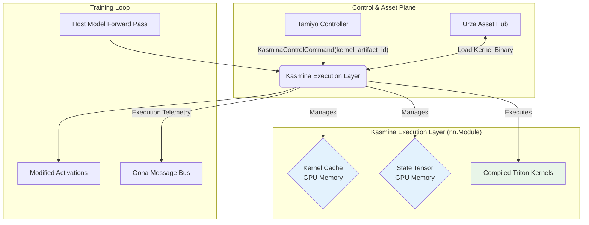

#### **K.3 Core Components of the KasminaLayer**

The `KasminaLayer` is a monolithic module containing several specialized components designed for maximum performance.

##### **K.3.1 State Management**

State for all seeds is managed in a single, contiguous `State Tensor` residing on the GPU. This utilizes a **Structure-of-Arrays (SoA)** memory layout for optimal memory coalescing during kernel execution, a concept adapted and refined from previous designs.

**Updated State Tensor Schema (as per ADR-003):**

```python
# esper/kasmina/state_layout.py
class KasminaStateLayout:
    """Structure-of-Arrays layout optimized for GPU memory coalescing"""
    lifecycle_states: torch.Tensor    # uint8: DORMANT, ACTIVE, LOADING, etc.
    active_kernel_id: torch.Tensor    # uint64: Hash of the currently loaded kernel artifact
    alpha_blend: torch.Tensor         # float16: Blending coefficient for grafting
    health_accumulator: torch.Tensor  # float32: Running statistics for telemetry
    last_update_epoch: torch.Tensor   # uint32: For staleness tracking
    exec_latency_μs: torch.Tensor     # uint16: Per-seed execution time measurement
```

##### **K.3.2 Kernel Caching**

To avoid the latency of repeatedly fetching kernels from `Urza`, `Kasmina` maintains an in-memory, GPU-resident LRU (Least Recently Used) cache. This is critical for achieving low-latency execution.

**Cache Logic:**

```python
# esper/kasmina/kernel_cache.py
class KernelCache:
    """GPU-resident LRU cache for pre-compiled kernel artifacts"""
    def __init__(self, max_cache_size_mb: int = 512):
        self.gpu_cache: Dict[str, torch.Tensor] = {} # Maps artifact_id to GPU-loaded kernel
        self.lru_tracker = LRUCache(maxsize=128) # Tracks usage for eviction

    async def load_kernel(self, artifact_id: str) -> torch.Tensor:
        """Load kernel from Urza with GPU caching"""
        if artifact_id in self.gpu_cache:
            self.lru_tracker.move_to_end(artifact_id)
            return self.gpu_cache[artifact_id]

        # Cache miss: load from Urza
        kernel_binary = await urza_client.get_kernel_artifact(artifact_id)
        gpu_kernel = self._load_to_gpu(kernel_binary)

        # Update cache with LRU eviction if full
        if len(self.gpu_cache) >= self.lru_tracker.maxsize:
            oldest_id, _ = self.lru_tracker.popitem(last=False)
            del self.gpu_cache[oldest_id]

        self.gpu_cache[artifact_id] = gpu_kernel
        self.lru_tracker[artifact_id] = True
        return gpu_kernel
```

##### **K.3.3 Telemetry Engine**

This component is responsible for collecting execution-focused metrics with minimal overhead. Telemetry is accumulated in GPU buffers and consolidated at epoch boundaries to be sent to `Nissa` and `Tamiyo`.

**Execution-Focused Metrics:**

* **`kernel_load_latency_μs`**: Time to get a kernel (distinguishes cache hits/misses).
* **`execution_latency_μs`**: The actual time spent executing the kernel code.
* **`cache_hit_ratio`**: The primary performance indicator for the caching strategy.
* **`activation_variance`**: Standard model health metric.
* **`dead_neuron_ratio`**: Standard model health metric.

#### **K.4 High-Performance Execution Pipeline**

The `Kasmina` execution pipeline is triggered by a command from `Tamiyo` and enacted during the host model's forward pass.

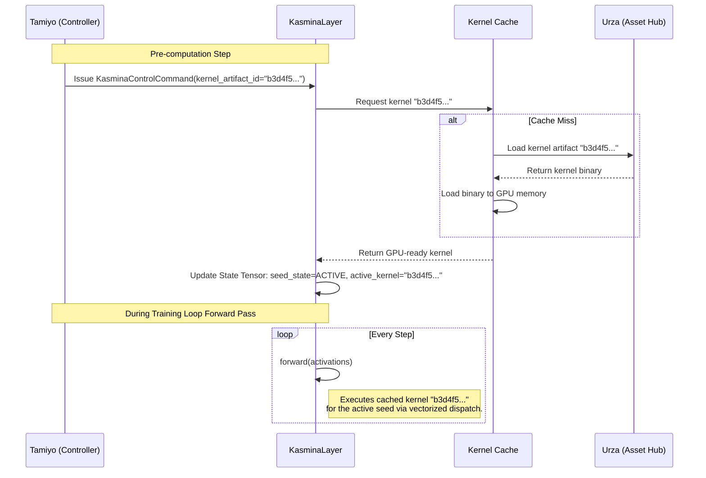

#### **K.5 GPU Memory and State Management**

With compilation removed, `Kasmina`'s primary memory management challenge is balancing the kernel cache size against the memory required for the host model's weights and activations.

* **State Synchronization:** All state transitions commanded by `Tamiyo` are queued and executed atomically at epoch boundaries. This prevents race conditions and ensures the state tensor is always consistent with the training step.
* **Memory Pressure Handling:** `Kasmina` implements an adaptive strategy to manage memory. Under high memory pressure (e.g., when training with large batch sizes), it can:
    1. **Reduce Cache Size:** Proactively evict less-used kernels from the GPU cache to free up memory.
    2. **Degrade Telemetry:** Reduce the precision or frequency of non-critical telemetry to shrink the size of telemetry buffers.
    3. **Fallback Execution:** In extreme cases, it can fall back to a simple, eager PyTorch execution path for an adaptation, trading performance for guaranteed stability.

#### **K.6 Error Handling and Fallbacks**

As the final execution endpoint, `Kasmina` must be exceptionally robust.

| **Error Scenario** | **Detection** | **Mitigation Strategy** |
| :--- | :--- | :--- |
| **Kernel Load Failure** | `Urza` returns an error or artifact is invalid. | 1. Log the failure and report the faulty `kernel_artifact_id` to `Urabrask`. <br> 2. Revert the target seed's state to `DORMANT`. <br> 3. Send a message to `Tamiyo` requesting an alternative kernel. |
| **Runtime Execution Error**| The GPU kernel itself throws an error (e.g., CUDA error, memory access violation). | 1. Catch the exception immediately. <br> 2. Activate an emergency "identity" path for the failing seed to ensure the forward pass completes. <br> 3. Mark the seed's state as `ERROR_RECOVERY` and permanently evict the faulty kernel from the cache. <br> 4. Report the failure to `Tamiyo` and `Urabrask`. The training run is not halted. |
| **State Corruption** | The state tensor's CRC32 checksum fails validation at an epoch boundary. | This is a critical failure. `Kasmina` signals `Tolaria` to trigger an emergency rollback of the entire training state from the last known-good checkpoint. |
