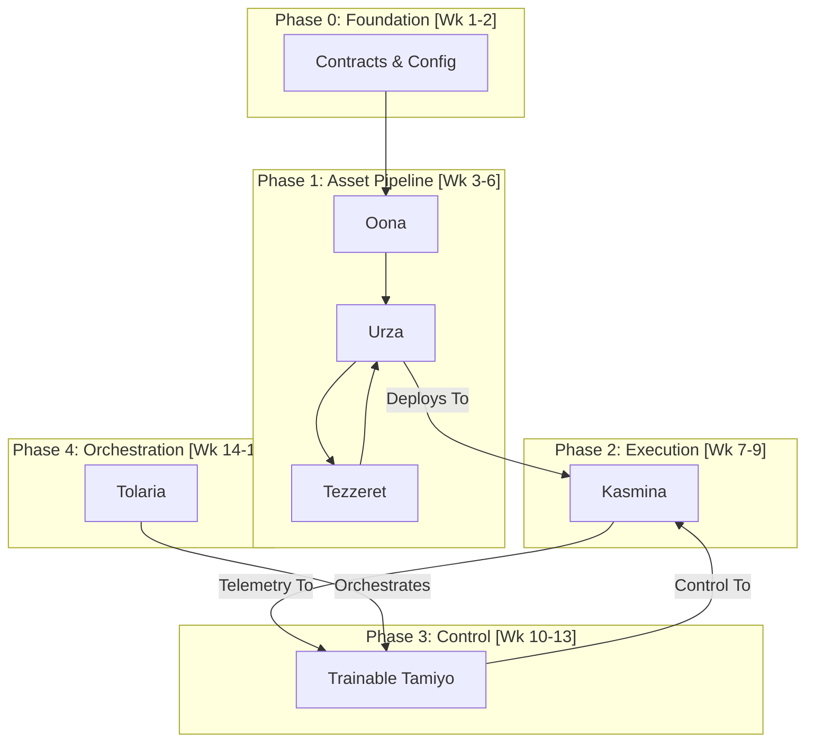

# **EIntegrated Implementation Plan: Esper-Core MVP**

This plan synthesizes the best of both approaches. It follows the strategically sound dependency order of the Gemini plan (`Urza`/`Tezzeret` -\> `Kasmina` -\> `Tamiyo` -\> `Tolaria`) while adopting the detailed, phased structure and explicit validation criteria from the Claude plan.

**Core Philosophy:** We will build and validate the core data pipeline first. The ability to produce, store, and execute real compiled artifacts is the central nervous system of Esper. We will ensure this is working robustly before integrating the higher-level orchestration and control loops.

## **Phase 0: Foundation Layer (Indicative Timeline: Weeks 1-2)**

**Objective:** Establish a stable, version-controlled foundation for all subsequent development, ensuring all components speak the same language.

**Implementation Steps:**

1. **Repository & CI/CD:**
      * Initialize Git repository with a clear branching strategy.
      * Configure a CI pipeline (e.g., GitHub Actions) for automated linting, formatting, and unit testing.
2. **Core Data Contracts (Shared Library: `esper_contracts`):**
      * Implement all Pydantic models (e.g., `Blueprint`, `CompiledKernelArtifact`, `KasminaControlCommand`).
      * Define all shared enumerations (`BlueprintStatus`, `KernelStatus`, `SeedLifecycleState`).
      * *Validation:* A comprehensive suite of unit tests for all data models, ensuring serialization/deserialization is flawless.
3. **Configuration System:**
      * Implement a central, YAML-based configuration loader.
      * Create Pydantic models for component-specific configs (`TolariaConfig`, `TamiyoConfig`, etc.).
      * *Validation:* Unit tests that confirm configs are loaded, validated, and default values are applied correctly.
4. **Containerization (`docker-compose.yml`):**
      * Define service stubs for all six components, ensuring the entire stack can be brought up, even if services do nothing initially.

**✅ Deliverable:** A fully configured project environment where all foundational code (contracts, configs) is written, tested, and shared across all future components.

-----

## **Phase 1: The Core Asset Pipeline (Indicative Timeline: Weeks 3-6)**

**Objective:** Build the asynchronous "factory" that transforms a manually created architectural design into a real, compiled kernel ready for use.

**Implementation Steps:**

1. **Communication Infrastructure (`Oona`):**
      * Deploy Redis using the official Docker image.
      * Create a simple Python wrapper class (`OonaClient`) for pub/sub interactions using Redis Streams.
      * Define core topics in the `esper_contracts` library.
      * *Validation:* Integration test with multiple producers and consumers to validate message delivery.
2. **Storage & Asset Hub (`Urza`):**
      * Deploy PostgreSQL and MinIO containers.
      * Implement the `Urza` FastAPI service with a SQLite backend for metadata (for simplicity in this phase) and a local filesystem backend for artifacts.
      * Implement API endpoints for:
          * Manually uploading a `BlueprintIR` (replaces `Karn`).
          * Internal polling by `Tezzeret` for work.
          * Internal artifact submission from `Tezzeret`.
      * **Pre-populate the library:** Manually design and upload 5-10 `BlueprintIRs` (e.g., residual blocks, attention heads).
      * *Validation:* API tests confirming blueprints can be uploaded and queried.
3. **Compilation Forge (`Tezzeret`):**
      * Implement `Tezzeret` as a standalone service that polls `Urza`.
      * Implement the **`Fast` compilation pipeline** using `torch.compile`.
      * **Critical Workaround (No `Urabrask`):** Implement a simple validation stub. If `torch.compile` succeeds without error, `Tezzeret` will automatically mark the resulting kernel as `VALIDATED` in `Urza`.

**✅ Deliverable:** A functional, asynchronous pipeline. A developer can POST a `blueprint.json` to the `Urza` API and, within a minute, see a versioned, compiled kernel artifact appear in `Urza`'s storage, marked as `VALIDATED` and ready for download.

-----

## **Phase 2: The Execution Engine (Indicative Timeline: Weeks 7-9)**

**Objective:** Prove that a host model can load and execute a real, compiled artifact produced by the Phase 1 pipeline.

**Implementation Steps:**

1. **Implement `KasminaLayer`:**
      * Create the core `nn.Module` with its GPU-optimized state tensor (`SoA` layout).
      * Implement the GPU-resident LRU `KernelCache`.
      * Implement the `Urza` client logic to download a kernel by its unique ID.
2. **Implement `esper.wrap()` Utility:**
      * Create the function to automatically inject `KasminaLayer` into a target model's layers.
3. **Standalone Integration Test:**
      * This is the critical test for this phase. A single script will:
        1. Start the Phase 1 stack (`Oona`, `Urza`, `Tezzeret`).
        2. Use an API call to ensure a specific blueprint is compiled.
        3. Instantiate a simple host model.
        4. Wrap the model with `esper.wrap()`.
        5. **Hardcode a command** to the `KasminaLayer` to load the known `kernel_artifact_id`.
        6. Run a forward pass and verify the output shape and lack of errors.

**✅ Deliverable:** A test script that provides definitive proof of the `Tezzeret -> Urza -> Kasmina` pipeline. This validates the core execution mechanic of the entire system.

-----

## **Phase 3: The Controller & Offline Training Loop (Indicative Timeline: Weeks 10-13)**

**Objective:** Implement the trainable `Tamiyo` agent and the developer-driven workflow for improving its policy over time.

**Implementation Steps:**

1. **Implement `Tamiyo` Service and Policy Model:**
      * Build the `Tamiyo` service application.
      * Implement the GNN policy model architecture as specified in the HLD.
      * **Bootstrap Policy v0.1:** The initial loaded policy will be a simple heuristic (e.g., "if variance \> threshold, act").
2. **Implement Data Collection & Offline Training:**
      * **Replay Buffer:** `Tamiyo` must robustly log all `(state, action, reward)` tuples to a persistent location (e.g., MinIO).
      * **Offline Trainer (`train_tamiyo.py`):** Create the standalone script that acts as the "manual `Simic`". A developer runs this script to load the replay buffer and train the GNN policy, saving the new versioned weights.
3. **Connect Telemetry and Control:**
      * `Kasmina` publishes `HealthSignal` telemetry to `Oona`.
      * `Tamiyo` subscribes to this telemetry. When its policy (initially the heuristic) fires, it queries `Urza` for available kernels and publishes a `KasminaControlCommand` to `Oona`.
      * `Kasmina` subscribes to its control channel and executes the command.

**✅ Deliverable:** A `Tamiyo` service with a loadable, trainable policy. An end-to-end telemetry/control loop is demonstrated. A developer can run `train_tamiyo.py` to produce an improved policy from collected data.

-----

## **Phase 4: Full System Orchestration (Indicative Timeline: Weeks 14-16)**

**Objective:** Assemble all components into a cohesive system, orchestrated by `Tolaria`, demonstrating a full, autonomous adaptation cycle within a training run.

**Implementation Steps:**

1. **Implement `Tolaria` Orchestrator:**
      * Build the `TolariaTrainer` class with the master training loop, optimizer management, and checkpointing.
      * Implement the **`EndOfEpoch` hook** to call `tamiyo.step()` and handle the returned `AdaptationSignal`.
      * Ensure `Tolaria`'s configuration specifies which version of the `Tamiyo` policy to load for a given run, ensuring reproducibility.
2. **Final Integration & SDK:**
      * Create the main `train.py` entrypoint that loads all configs and starts the `TolariaTrainer`.
      * Refine the high-level Python SDK (`esper.load_config`, `esper.wrap`, etc.) for a clean user experience.
3. **End-to-End System Validation:**
      * Run a full training experiment on a benchmark like CIFAR-10.
      * The run must demonstrate at least one full, successful morphogenetic lifecycle event: from `Tamiyo` detecting a bottleneck, to `Kasmina` loading and grafting a kernel from `Urza`, to the adaptation becoming `FOSSILIZED`.

**✅ Deliverable:** A fully functional Esper-Core MVP. A single command (`python train.py --config ...`) can launch a training run that demonstrates targeted, autonomous architectural adaptation with zero compilation-related training disruption.

-----

## **Critical Workarounds & Implementation Notes**

* **Without `Urabrask`:** The system must operate on trust. `Tezzeret` will mark any kernel that compiles without error as `VALIDATED`. `Tamiyo`'s selection logic will be simpler, as it cannot query by empirical tags (`low_memory`, `high_speed`). It will have to select based on blueprint type and perhaps the compilation pipeline name.
* **Without `Karn`:** `Urza`'s library is static and manually populated by developers. The system cannot invent new solutions, only apply pre-designed ones.
* **Without `Simic`:** The `train_tamiyo.py` script is the explicit, manual replacement. The "intelligence" of the system can only improve as fast as a developer collects data and re-runs this script.

## **Roadmap Summary**

