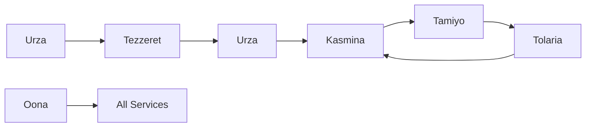

# CLAUDE.md - Esper Morphogenetic Training Platform

## Executive Context

The Esper Morphogenetic Training Platform enables neural networks to autonomously detect computational bottlenecks and patch them in-situ by grafting specialized sub-networks (Blueprints) into their structure during training. This creates adaptive, evolving models that grow capacity precisely where needed while maintaining safety and training stability.

## Technical Stack

- **Language:** Python 3.12+ (modern and feature-rich)
- **ML Framework:** PyTorch >=2.2.0,<3.0 with torch.compile
- **Data Contracts:** Pydantic ~2.8 for service communication
- **Web Framework:** FastAPI ~0.112 with Uvicorn async server
- **Database:** PostgreSQL 16 (metadata), MinIO (artifacts), Redis 7.2 (messaging)
- **Message Bus:** Redis Streams via Oona for event-driven architecture
- **Code Quality:** Black, Ruff, Pytype for formatting, linting, static analysis
- **Containerization:** Docker with docker-compose for local development
- **Testing:** pytest ~8.2 with coverage reporting and httpx for API testing
- **Configuration:** YAML-based with Pydantic validation and environment overrides

## System Architecture Overview

**11 Specialized Subsystems in 3 Functional Planes:**

### Training Plane

- **Tolaria** - Training orchestrator, manages master training loop and optimizer
- **Kasmina** - Pure execution layer, loads and runs pre-compiled kernel artifacts

### Control Plane  

- **Tamiyo** - Strategic controller, GNN-based policy for intervention decisions
- **Simic** - Policy sculptor, offline MLOps for training neural policies
- **Emrakul** - Architectural sculptor (future component)

### Innovation Plane

- **Karn** - Generative architect, invents new Blueprint architectures
- **Tezzeret** - Compilation forge, asynchronous Blueprint compilation
- **Urabrask** - Evaluation engine, benchmarks and characterizes kernels
- **Urza** - Central library, immutable source of truth for all assets

### Infrastructure

- **Oona** - Message bus, Redis-based pub/sub communication
- **Nissa** - Observability platform, metrics and monitoring

## Key Abstractions

### Core Data Models (Pydantic)

- **Blueprint/BlueprintIR** - Architectural design specification
- **CompiledKernelArtifact** - Runnable binary from Tezzeret compilation
- **Seed** - Stateful monitoring agent injected into host model chunks
- **SystemStatePacket** - Global state snapshot for Tamiyo consumption
- **AdaptationSignal** - Tamiyo response indicating required actions
- **FieldReport** - Performance outcome feedback to Karn

### Seed Lifecycle (11 States)

1. **DORMANT** ⚪ - Monitors and reports, identity pass-through
2. **GERMINATED** 🌱 - Assigned kernel, awaiting resources
3. **LOADING** 📥 - Fetching CompiledKernelArtifact from Urza
4. **TRAINING** 🧑‍🏫 - Learning reconstruction task (trainable kernels)
5. **GRAFTING** 🔗 - Smooth alpha blend integration
6. **STABILIZATION** 🛠️ - Network dynamics settling
7. **EVALUATING** 🔬 - Performance impact measurement
8. **FINE_TUNING** 📻 - Main task loss training
9. **FOSSILIZED** 🦴 - Permanent integration (success)
10. **CULLED** 🥀 - Discarded adaptation (failure)
11. **ROLLED_BACK** ⏪ - Emergency rollback state

## Data Flow Architecture

### 1. Telemetry Flow

- Seeds → Oona → Tamiyo (health signals, performance metrics)
- Epoch-synchronized, high-frequency monitoring data

### 2. Control Flow

- Tamiyo → Oona → Kasmina (germination commands, state transitions)
- Discrete commands at epoch boundaries

### 3. Innovation Flow

- Karn → Urza (BlueprintIRs)
- Tezzeret → Urza (CompiledKernelArtifacts)
- Urabrask → Urza (performance tags and validation)

### 4. Compilation Pipeline

- Async background compilation completely separate from training
- Zero training disruption guarantee

## Business Logic Rules

### Safety Mechanisms

- **Frozen Base** - Host parameters held constant during adaptation
- **Gradient Isolation** - Adaptations cannot affect main model gradients
- **Validation Gates** - 3-phase validation before deployment
- **Emergency Rollback** - Immediate revert to last known-good state
- **Embargo System** - Temporarily blocks problematic locations
- **Error Recovery** - Graceful fallback to default execution on kernel failures
- **State Synchronization** - All transitions synchronized with epoch boundaries

### Performance Constraints

- **LRU Cache** - GPU-resident kernel cache in Kasmina (128MB default)
- **SoA Layout** - Structure-of-Arrays for memory efficiency and coalescing
- **Async Compilation** - Background compilation via Tezzeret
- **Tag-based Selection** - Empirical performance tags guide kernel choice
- **Dormant Overhead** - <5% performance impact when seeds are dormant
- **Inference Latency** - <10ms for strategic decision making
- **Memory Management** - Configurable cache limits with automatic eviction

### Strategic Decision Logic

- **Health Thresholds** - Adaptation triggered when health_score < 0.3
- **Confidence Thresholds** - Decisions require confidence > 0.7
- **Adaptation Limits** - Maximum 2 adaptations per epoch
- **Trend Analysis** - Health trend calculation over sliding window
- **Topology Awareness** - Graph-based model analysis using GNN
- **Experience Learning** - Offline RL training improves decision quality

## API Specifications

### Urza API (Central Library)

- `POST /blueprints` - Upload BlueprintIR
- `GET /blueprints/{id}` - Query blueprint metadata
- `GET /kernels/{id}` - Download CompiledKernelArtifact
- `POST /kernels/{id}/status` - Update compilation status

### Tamiyo API (Strategic Controller)

- `POST /step` - End-of-epoch decision making
- `GET /policy/status` - Current policy version info
- `POST /policy/load` - Load new policy weights
- `POST /analyze` - Analyze current model state and make decisions
- `GET /policy/version` - Get current policy version
- `POST /policy/update` - Update policy weights
- `GET /decisions/history` - Get recent adaptation decisions
- `POST /training/experience` - Add experience to replay buffer

### Kasmina API (Execution Layer)

- `POST /seeds/{id}/germinate` - Initiate seed lifecycle
- `GET /seeds/{id}/status` - Query seed state
- `POST /seeds/{id}/transition` - Command state transition
- `POST /layers/{id}/load_kernel` - Load kernel into specific seed
- `GET /layers/{id}/stats` - Get comprehensive layer statistics
- `POST /layers/{id}/unload_kernel` - Unload kernel from seed

## Development Constraints

### Implementation Phases

- **Phase 0** - Foundation: contracts, configs, containerization
  - Core data contracts (Pydantic models)
  - Configuration system (YAML + validation)
  - Docker compose infrastructure
  - CI/CD pipeline (GitHub Actions)
  - Testing framework setup
- **Phase 1** - Core Pipeline: Oona, Urza, Tezzeret (manual blueprint upload)
  - Redis Streams message bus implementation
  - Central asset hub with PostgreSQL/MinIO
  - Asynchronous compilation forge
  - Integration test: blueprint → compiled kernel
- **Phase 2** - Execution: Kasmina, esper.wrap() integration
  - GPU-optimized execution layer
  - LRU kernel cache implementation
  - Host model integration utilities
  - Proof: compiled kernel → live execution
- **Phase 3** - Control: Tamiyo policy, offline training loop
  - GNN-based strategic controller
  - Telemetry collection and analysis
  - Offline training script for policy improvement
  - End-to-end control demonstration
- **Phase 4** - Orchestration: Tolaria, full system integration
  - Master training loop orchestrator (TolariaTrainer)
  - Main system entrypoint with CLI interface
  - Service orchestration and lifecycle management
  - End-to-end integration tests and benchmarking
  - Full system validation on CIFAR-10
  - Complete autonomous adaptation cycle demonstration

### Architecture Principles

- **Asynchronous by Design** - No blocking operations in training loop
- **Event-Driven** - Oona message bus coordinates all interactions
- **Immutable Assets** - All artifacts versioned and cryptographically tracked
- **Polyglot Persistence** - Right storage for each data type
- **Zero Downtime** - Compilation separate from execution
- **Separation of Concerns** - Training, Control, Innovation planes isolated
- **Safety First** - Multiple validation gates and emergency rollback

## Testing Strategies

### Unit Testing

- Pydantic model validation and serialization
- Individual component logic (KasminaLayer, StateLayout, KernelCache)
- State machine transitions and lifecycle management
- Configuration loading and validation
- GNN policy forward pass and inference
- Replay buffer operations and sampling

### Integration Testing

- Multi-component message flows via Oona
- Database operations (PostgreSQL, Redis)
- S3/MinIO interactions and caching
- Redis pub/sub patterns and message handling
- KasminaLayer telemetry collection and publishing
- Tamiyo policy training and evaluation

### System Testing

- Full pipeline: blueprint → compilation → execution
- Seed lifecycle validation through all 11 states
- Emergency rollback scenarios and recovery
- Performance benchmarking and overhead measurement
- End-to-end strategic decision making
- Policy improvement through offline training

### Performance Testing

- Dormant seed overhead (<5% target)
- Kernel loading and caching latency
- Strategic decision inference time (<10ms)
- Memory usage scaling with model size
- Telemetry collection overhead

## Coding Patterns & Conventions

### Error Handling

- Comprehensive exception hierarchy
- Graceful degradation patterns
- Structured logging with context
- Circuit breaker for external dependencies

### Configuration Management

- YAML-based configuration files
- Pydantic models for validation
- Environment-specific overrides
- Centralized config loading

### Async Patterns

- Redis Streams for message passing
- Background task queues
- Non-blocking I/O operations
- Timeout and retry mechanisms

## Forbidden Patterns

### Security

- Never log secrets or sensitive data
- No hardcoded credentials
- No direct database access without contracts
- No unvalidated external input

### Performance

- No blocking operations in training loop
- No synchronous compilation
- No memory leaks in long-running processes
- No unbounded resource consumption

### Architecture

- No circular dependencies between services
- No shared mutable state
- No bypassing message bus for communication
- No manual state management outside lifecycle

## Current State

### Implemented (Phase 0-4 Complete)

- ✅ Core contracts and Pydantic models
- ✅ Configuration system with YAML validation
- ✅ Docker containerization setup
- ✅ Oona message bus implementation
- ✅ Urza central library service
- ✅ Tezzeret compilation forge
- ✅ Kasmina execution layer with kernel cache
- ✅ Basic Tamiyo policy framework
- ✅ Comprehensive test coverage
- ✅ Integration with real training loops

### In Progress

- 🔄 Final system integration and orchestration
- 🔄 Performance optimization and benchmarking
- 🔄 User documentation and deployment guides

### Planned (Post-MVP)

- 📋 Karn generative architect implementation
- 📋 Urabrask evaluation engine
- 📋 Simic policy sculptor
- 📋 Production deployment architecture
- 📋 Distributed training support
- 📋 Advanced blueprint categories

## Code Generation Guidelines

### Preferred Libraries

- **Pydantic** for data validation and serialization
- **FastAPI** for service endpoints with async support
- **SQLAlchemy** for database operations
- **Redis-py** for message bus operations
- **PyTorch** for neural network operations
- **PyTorch Geometric** for graph neural networks
- **NetworkX** for graph construction and analysis
- **pytest** for testing with httpx for API testing
- **boto3** for S3/MinIO operations
- **psycopg2-binary** for PostgreSQL connectivity

### Logging Approach

- Structured logging with esper.utils.logging
- Context-aware log messages with service identification
- Performance metrics integration
- Error tracking and alerting
- Consistent format: `timestamp - service - level - [module:line] - message`

### File Organization

```plaintext
src/esper/
├── __init__.py              # Contains API_VERSION
├── contracts/               # Pydantic data models
│   ├── assets.py           # Blueprint, CompiledKernelArtifact
│   ├── enums.py            # All status enumerations
│   ├── messages.py         # Oona message bus contracts
│   ├── operational.py      # HealthSignal, SystemStatePacket
│   └── validators.py       # Custom Pydantic validators
├── services/               # Service implementations
│   ├── oona_client.py      # Redis Streams client
│   ├── urza/               # Central asset hub
│   ├── tezzeret/           # Compilation forge
│   ├── tamiyo/             # Strategic controller
│   │   ├── main.py         # Service orchestration
│   │   ├── policy.py       # GNN policy model
│   │   ├── analyzer.py     # Graph analysis
│   │   └── training.py     # Offline RL training
│   └── tolaria/            # Training orchestrator
│       ├── main.py         # Service orchestration
│       ├── trainer.py      # Core training loop
│       └── config.py       # Configuration system
├── core/                   # Core utilities and wrappers
│   └── model_wrapper.py    # esper.wrap() utility
├── execution/              # Execution engine components
│   ├── kasmina_layer.py    # Core execution layer
│   ├── state_layout.py     # GPU state management
│   └── kernel_cache.py     # LRU kernel cache
├── utils/                  # Shared utilities
│   ├── logging.py          # Centralized logging setup
│   └── s3_client.py        # MinIO/S3 operations
└── configs.py              # Configuration models
```

### Environment Setup

```bash
# Required environment variables
POSTGRES_USER=esper_admin
POSTGRES_PASSWORD=secure_password
MINIO_ROOT_USER=minio_admin
MINIO_ROOT_PASSWORD=secure_password
S3_BUCKET_NAME=esper-artifacts
S3_ENDPOINT_URL=http://localhost:9000
REDIS_URL=redis://localhost:6379/0
```

### Development Workflow

1. **Setup:** `docker-compose up` for infrastructure
2. **Install:** `pip install -e .[dev]` for development dependencies
3. **Quality:** `black src tests && ruff check src tests && pytype`
4. **Testing:** `pytest` with coverage reporting
5. **Database:** `python scripts/init_db.py` for schema setup
6. **Training:** `python train.py --config configs/experiment.yaml`

### Main Training Interface

```bash
# Quick start with defaults
python train.py --model resnet18 --dataset cifar10 --epochs 50

# Full configuration file
python train.py --config configs/resnet18_cifar10_morphogenetic.yaml

# Baseline training without morphogenetic features
python train.py --config configs/baseline.yaml --no-morphogenetic

# Resume from checkpoint
python train.py --config configs/experiment.yaml --resume checkpoints/latest.pt

# Check service health
python train.py --check-services

# Debug mode with verbose logging
python train.py --config configs/debug.yaml --verbose --debug
```

### Docker Services

- **redis:7.2-alpine** - Message bus on port 6379
- **postgres:16-alpine** - Metadata storage on port 5432
- **minio/minio:latest** - Artifact storage on ports 9000/9001

## Cross-References and Integration Points

### Phase Dependencies

- **Phase 0** foundations enable all subsequent phases
- **Phase 1** provides the compilation pipeline for **Phase 2** execution
- **Phase 2** execution engine feeds telemetry to **Phase 3** strategic controller
- **Phase 3** strategic controller makes decisions implemented by **Phase 2** execution
- **Phase 4** orchestrates all phases through unified training loop

### Key Integration Points

#### Data Flow Integration



#### Service Communication Matrix

| Service | Publishes To | Subscribes From | API Calls |
|---------|-------------|----------------|-----------|
| Kasmina | telemetry.seed.health | control.kasmina.commands | Urza (kernel loading) |
| Tamiyo | control.kasmina.commands | telemetry.seed.health | Urza (kernel queries) |
| Tezzeret | compilation.kernel.ready | compilation.blueprint.submitted | Urza (blueprint polling) |
| Tolaria | system.events.epoch | - | Tamiyo (decisions) |

#### File Dependencies

- `contracts/` - Shared by all services for type safety
- `configs.py` - Centralized configuration management
- `utils/logging.py` - Consistent logging across services
- `services/oona_client.py` - Message bus integration
- `execution/` - Core execution engine used by Tolaria

### Performance Targets Summary

- **Dormant Seed Overhead:** <5% performance impact
- **Strategic Decision Latency:** <10ms inference time
- **Kernel Loading:** Cached for microsecond execution
- **Compilation Pipeline:** Zero disruption to training
- **Adaptation Frequency:** Up to 2 adaptations per epoch

### Configuration Hierarchy

```plaintext
TolariaConfig (master)
├── ModelConfig (architecture & morphogenetic settings)
├── DatasetConfig (data loading & augmentation)
├── OptimizationConfig (training parameters)
├── MorphogeneticConfig (Tamiyo integration)
├── LoggingConfig (monitoring & metrics)
├── CheckpointConfig (persistence)
└── ServiceConfigs (database, redis, storage)
```

### Testing Integration

- **Unit Tests:** Individual component validation
- **Integration Tests:** Multi-service workflows
- **System Tests:** End-to-end adaptation cycles
- **Performance Tests:** Overhead and latency validation
- **Benchmark Tests:** CIFAR-10 validation suite

### Development Lifecycle

1. **Foundation (Phase 0):** Contracts, configs, infrastructure
2. **Pipeline (Phase 1):** Blueprint compilation and storage
3. **Execution (Phase 2):** Kernel loading and execution
4. **Intelligence (Phase 3):** Strategic decision making
5. **Orchestration (Phase 4):** Unified training system

This document provides the complete context for understanding and working with the Esper Morphogenetic Training Platform codebase. It serves as both a technical specification and developer onboarding guide, enabling effective code generation and system modification.
