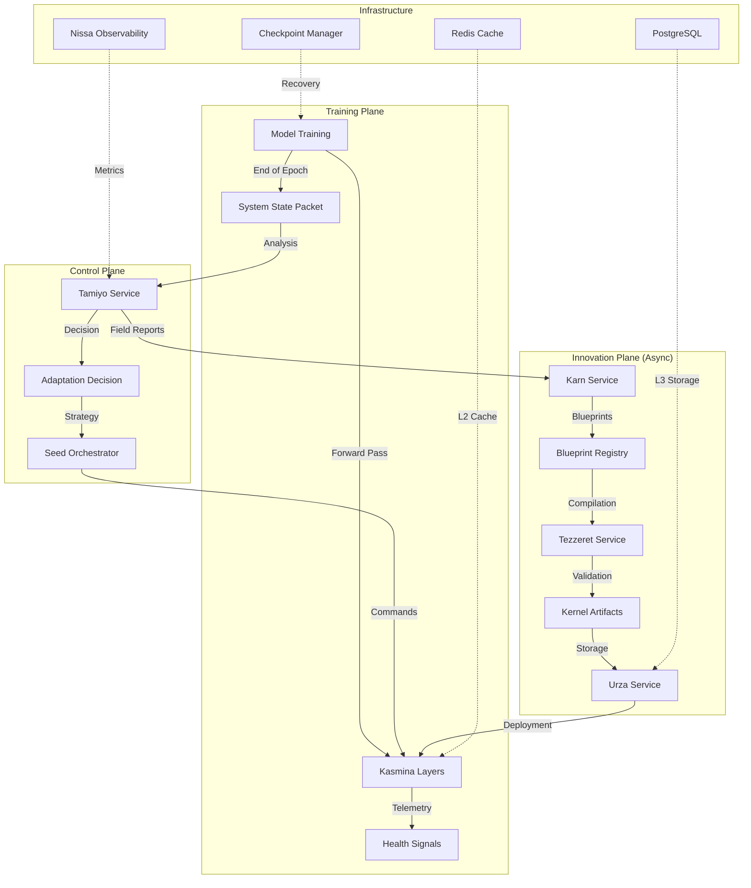

# Esper System Flow Diagram

## High-Level Flow



## Detailed Component Interactions

### Stage 1: Training Initialization Flow
```
User -> Tolaria Service -> Model Wrapper -> Kasmina Layers
                                         -> Seed Initialization
                                         -> Telemetry Setup
```

### Stage 2: Forward Pass Execution
```
Input Tensor -> Kasmina Layer -> Chunk Division
                              -> Seed 0: Execute Kernel/Default
                              -> Seed 1: Execute Kernel/Default  
                              -> Seed 2: Execute Kernel/Default
                              -> Seed 3: Execute Kernel/Default
                              -> Concatenate Results
                              -> Output Tensor
                              -> Publish Health Signals
```

### Stage 3: Adaptation Decision Flow
```
System State Packet -> Tamiyo Analysis -> Plateau Detection
                                      -> Seed Performance Check
                                      -> Strategy Selection
                                      -> Confidence Scoring
                                      -> Adaptation Decision
```

### Stage 4: Kernel Selection & Loading
```
Adaptation Decision -> Query Urza (tags) -> Filter Compatible Kernels
                                        -> Rank by Performance
                                        -> Select Optimal Kernel
                                        -> Load into Seed
                                        -> Update Lifecycle State
```

### Stage 5: Compilation Pipeline (Async)
```
Blueprint -> Tezzeret Worker -> Parse BlueprintIR
                            -> Create PyTorch Module
                            -> Compile to TorchScript
                            -> Optimize for Device
                            -> Validate Correctness
                            -> Generate Metadata
                            -> Store in Urza
```

### Stage 6: Multi-Tier Cache Flow
```
Kernel Request -> L1 Cache (Memory) -> HIT: Return immediately
                                   -> MISS: Check L2
                                   
                -> L2 Cache (Redis) -> HIT: Promote to L1
                                   -> MISS: Check L3
                                   
                -> L3 Store (PostgreSQL) -> HIT: Promote to L2+L1
                                        -> MISS: Fetch from Urza
```

## Key Data Structures

### SystemStatePacket
```python
{
    "epoch": 10,
    "global_step": 10000,
    "loss": 0.234,
    "accuracy": 0.921,
    "layer_metrics": {
        "layer1": {
            "gradient_norm": 0.15,
            "activation_variance": 0.82,
            "seed_health": [0.9, 0.85, 0.7, 0.92]
        }
    }
}
```

### AdaptationDecision
```python
{
    "adaptation_type": "add_seed",
    "target_component": "model.layer1",
    "parameters": {
        "kernel_id": "kernel_abc123",
        "seed_idx": 2,
        "alpha_blend": 0.3
    },
    "confidence": 0.87,
    "expected_impact": 0.15
}
```

### KernelMetadata
```python
{
    "kernel_id": "kernel_abc123",
    "blueprint_id": "blueprint_xyz789",
    "input_shape": [128],
    "output_shape": [256],
    "compilation_time": 0.152,
    "performance_score": 0.92,
    "tags": ["linear", "optimized", "validated"]
}
```

## Performance Characteristics

### Latency Targets
- Forward Pass: <5ms overhead per layer
- Adaptation Decision: <100ms
- Kernel Loading: <50ms from cache
- Compilation: <5s per blueprint
- Checkpoint Recovery: <30s

### Throughput Targets
- Training: >1000 samples/second
- Telemetry: >10,000 messages/second
- Compilation: >10 kernels/minute
- Cache Operations: >100,000 ops/second

## Error Recovery Flows

### Kernel Execution Failure
```
Kernel Error -> Error Handler -> Log Error
                              -> Mark Seed ERROR_RECOVERY
                              -> Fallback to Default Transform
                              -> Publish Error Telemetry
                              -> Continue Training
```

### Compilation Failure
```
Compilation Error -> Worker Error Handler -> Log Detailed Error
                                         -> Mark Blueprint FAILED
                                         -> Notify Urza
                                         -> Retry with Different Config
                                         -> Alert Monitoring
```

### System Instability
```
Instability Detected -> Tamiyo Emergency -> Force Rollback Signal
                                        -> Tolaria Rollback
                                        -> Restore Checkpoint
                                        -> Reset All Seeds
                                        -> Resume Training
```

## Monitoring & Observability

### Key Metrics Exposed
- `esper_training_loss` - Current training loss
- `esper_adaptation_count` - Total adaptations performed
- `esper_kernel_cache_hits` - Cache hit rate
- `esper_seed_active_count` - Active seeds per layer
- `esper_compilation_latency` - Kernel compilation time

### Health Checks
- `/health` - Overall system health
- `/metrics` - Prometheus metrics
- `/api/v1/status` - Detailed component status
- `/api/v1/adaptations` - Recent adaptation history

## Security Considerations

### Access Control
- Service-to-service authentication via JWT
- Role-based access for API endpoints
- Encrypted communication channels
- Audit logging for all modifications

### Data Protection
- Kernel binaries encrypted at rest
- Checkpoints use AES-256 encryption
- Telemetry data anonymized
- PII excluded from logs

This diagram provides a comprehensive view of the Esper system's data flow, component interactions, and operational characteristics.