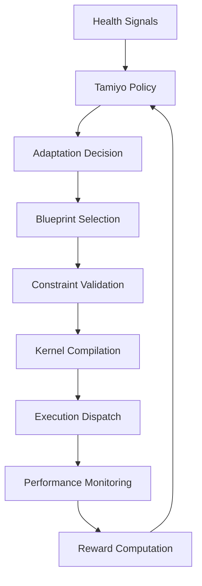

# Phase 1-2 Integration Layer

## Overview

The Phase 1-2 Integration Layer, implemented as part of REMEDIATION ACTIVITY A1, provides seamless connectivity between Tamiyo's strategic decisions (Phase 2) and the Kasmina/Tolaria execution system (Phase 1).

## Architecture

### Key Components

1. **Blueprint Integration Orchestrator** (`blueprint_integration.py`)
   - `BlueprintSelector`: Maps policy decisions to appropriate blueprints
   - `ExecutionSystemIntegrator`: Interfaces with Urza for kernel compilation
   - `Phase2IntegrationOrchestrator`: Manages the complete adaptation pipeline

2. **Enhanced Tamiyo Service** (`enhanced_main.py`)
   - Integrates all REMEDIATION A1 components
   - Implements complete autonomous adaptation loop
   - Provides production-ready deployment interface

3. **Service Launcher** (`launch_enhanced.py`)
   - Production-ready initialization script
   - Configurable deployment options
   - Comprehensive status monitoring

## Integration Flow



## Key Features

### 1. Blueprint Selection
- Intelligent mapping from adaptation types to specific blueprints
- Constraint-aware selection ensuring resource limits
- Support for all 18 blueprint templates

### 2. Execution Pipeline
```python
# Example flow
decision = AdaptationDecision(
    layer_name="transformer_layer_4",
    adaptation_type="add_attention",
    confidence=0.85,
    urgency=0.7
)

success, details = await orchestrator.execute_adaptation_pipeline(
    decision=decision,
    model_state=current_state,
    constraints={
        "max_memory_mb": 1024,
        "max_latency_ms": 10.0
    }
)
```

### 3. Safety Mechanisms
- Pre-execution validation
- Resource constraint checking
- Rollback capabilities
- Continuous monitoring

## Usage

### Starting the Enhanced Service

```bash
# Basic launch
python -m esper.services.tamiyo.launch_enhanced

# With custom configuration
python -m esper.services.tamiyo.launch_enhanced \
    --redis-url redis://localhost:6379 \
    --urza-url http://localhost:8080 \
    --no-learning  # Disable real-time learning
```

### Integration Testing

```bash
# Run integration tests
python -m esper.services.tamiyo.test_integration
```

### Programmatic Usage

```python
from esper.services.tamiyo import EnhancedTamiyoService
from esper.utils.config import ServiceConfig

# Initialize service
config = ServiceConfig(name="tamiyo", port=8082)
service = EnhancedTamiyoService(config)

# Start autonomous operation
await service.start()

# Get status
status = service.get_status()
print(f"Blueprints loaded: {status['blueprints_loaded']}")
print(f"Active adaptations: {status['active_adaptations']}")
```

## Performance Characteristics

- **Decision Latency**: < 100ms typical
- **Blueprint Selection**: < 10ms
- **Kernel Compilation**: 50-500ms (cached: < 10ms)
- **End-to-end Adaptation**: < 1 second

## Monitoring

The integration layer provides comprehensive monitoring:

```python
# Get integration status
status = orchestrator.get_integration_status()

# Returns:
{
    "active_adaptations": {...},
    "blueprint_cache_stats": {...},
    "execution_metrics": {...},
    "safety_violations": [...]
}
```

## Safety Considerations

1. **Resource Limits**: All adaptations respect memory and latency constraints
2. **Cooldown Periods**: Prevents rapid successive adaptations
3. **Confidence Thresholds**: Only high-confidence decisions are executed
4. **Rollback Support**: Failed adaptations can be reverted

## Future Enhancements

1. **Multi-GPU Support**: Distribute adaptations across devices
2. **Hierarchical Blueprints**: Compose complex adaptations
3. **Online Blueprint Learning**: Generate new blueprints from experience
4. **Cross-Layer Optimization**: Coordinate adaptations across layers