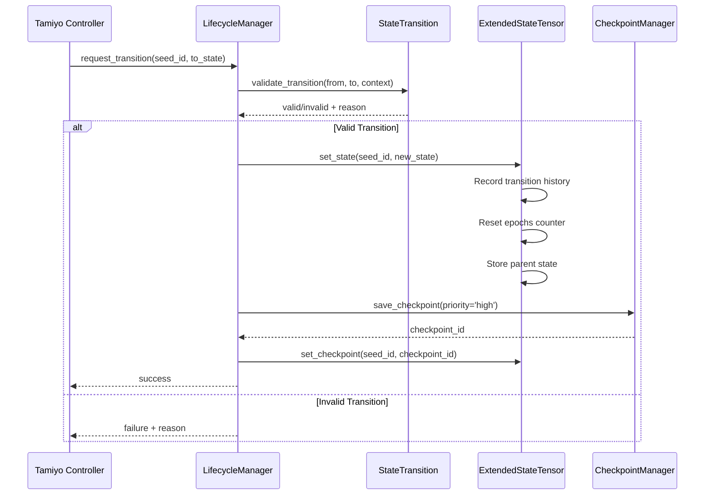
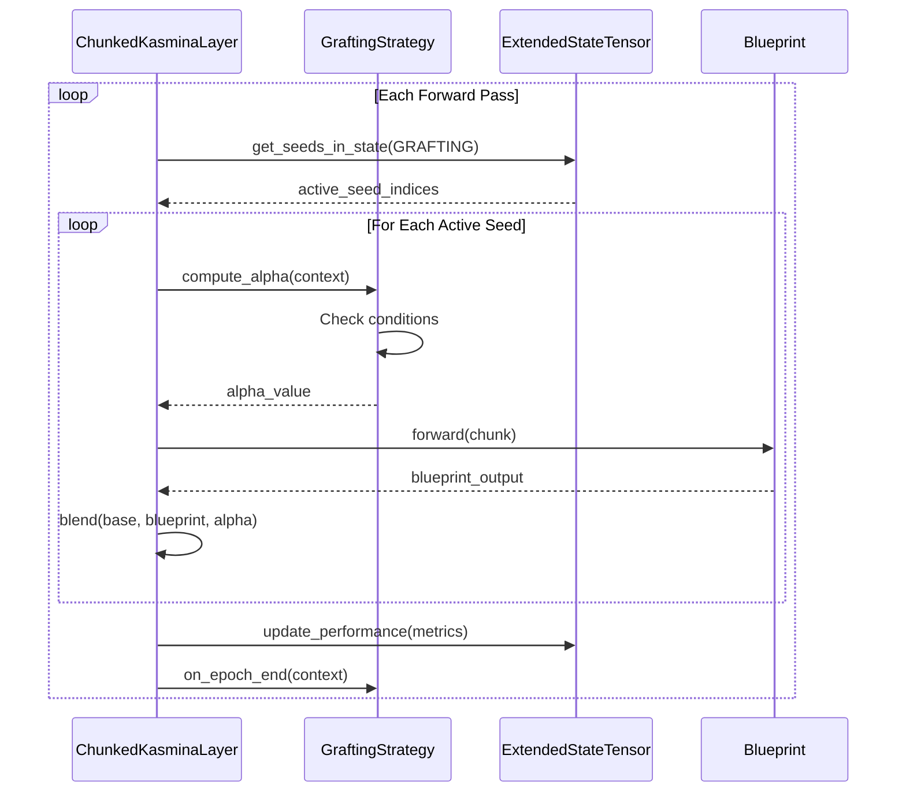

# Phase 2: Extended Lifecycle - Complete Architecture

*Last Updated: 2025-01-24*

## Overview

Phase 2 implements the full 11-state lifecycle system from the original Kasmina design, adding sophisticated state management, checkpoint/restore capabilities, and adaptive grafting strategies. This document provides the complete architectural overview of all Phase 2 components.

## Component Architecture

### 1. Lifecycle Management Layer

```
┌─────────────────────────────────────────────────────────────┐
│                    ExtendedLifecycle (Enum)                 │
│  11 States: DORMANT → GERMINATED → TRAINING → GRAFTING...  │
└─────────────────────────────┬───────────────────────────────┘
                              │
┌─────────────────────────────┴───────────────────────────────┐
│                    StateTransition (Validator)              │
│  • Transition Matrix      • Context Validation              │
│  • Minimum Epochs         • Performance Checks              │
└─────────────────────────────┬───────────────────────────────┘
                              │
┌─────────────────────────────┴───────────────────────────────┐
│                    LifecycleManager (Orchestrator)          │
│  • Request Transitions    • Track History                   │
│  • Execute Callbacks      • Manage State Flow               │
└─────────────────────────────────────────────────────────────┘
```

### 2. State Management System

```python
# ExtendedStateTensor Structure (per seed)
┌─────────────────────────────────────────┐
│ State Variables (8 int32 values):       │
├─────────────────────────────────────────┤
│ [0] LIFECYCLE_STATE    - Current state  │
│ [1] BLUEPRINT_ID       - Active BP      │
│ [2] EPOCHS_IN_STATE    - Time counter   │
│ [3] GRAFTING_STRATEGY  - Strategy ID    │
│ [4] PARENT_STATE       - For rollback   │
│ [5] CHECKPOINT_ID      - Recovery point │
│ [6] EVALUATION_SCORE   - Performance    │
│ [7] ERROR_COUNT        - Failure track  │
└─────────────────────────────────────────┘

# Additional Tracking
┌─────────────────────────────────────────┐
│ Transition History (10 x 2):            │
│ • Circular buffer of state changes      │
│ • From/To state pairs                   │
└─────────────────────────────────────────┘

┌─────────────────────────────────────────┐
│ Performance Metrics (4 floats):         │
│ • Loss, Accuracy, Stability, Efficiency │
└─────────────────────────────────────────┘
```

### 3. Checkpoint System Architecture

```
┌───────────────────────────────────────────────────────────┐
│                   CheckpointManager                       │
├───────────────────────────────────────────────────────────┤
│ Directory Structure:                                      │
│ checkpoint_dir/                                           │
│ ├── active/          # Current checkpoints               │
│ │   ├── layer1_seed0_1706115234567.pt                   │
│ │   └── layer1_seed0_1706115234567.json (metadata)      │
│ └── archive/         # Historical checkpoints            │
├───────────────────────────────────────────────────────────┤
│ Features:                                                 │
│ • Millisecond timestamps                                  │
│ • Priority-based retention                                │
│ • Version migration (v1→v2)                              │
│ • Metadata caching                                        │
│ • Automatic cleanup                                       │
└───────────────────────────────────────────────────────────┘

┌───────────────────────────────────────────────────────────┐
│                  CheckpointRecovery                       │
├───────────────────────────────────────────────────────────┤
│ • Fallback to previous checkpoints                       │
│ • Corruption detection                                    │
│ • State reconstruction                                    │
└───────────────────────────────────────────────────────────┘
```

### 4. Grafting Strategy System

```
                    ┌─────────────────────┐
                    │ GraftingStrategyBase│
                    │    (Abstract)       │
                    └──────────┬──────────┘
                               │
        ┌──────────────────────┼──────────────────────┐
        │                      │                      │
┌───────┴────────┐   ┌────────┴────────┐   ┌────────┴────────┐
│ LinearGrafting │   │ DriftControlled │   │ MomentumGrafting│
│ • Simple ramp  │   │ • Weight monitor│   │ • Perf accelerate│
│ • No state     │   │ • Pause on drift│   │ • Velocity track │
└────────────────┘   └─────────────────┘   └─────────────────┘

┌─────────────────┐   ┌─────────────────┐
│AdaptiveGrafting │   │StabilityGrafting│
│ • Multi-strategy│   │ • Checkpoints   │
│ • Dynamic switch│   │ • Rollback ready│
└─────────────────┘   └─────────────────┘
```

## Data Flow Architecture

### State Transition Flow



### Grafting Integration Flow



## Memory Layout

### GPU Memory Organization

```
┌─────────────────────────────────────────────────────────┐
│                    GPU Memory Layout                    │
├─────────────────────────────────────────────────────────┤
│ State Tensor (num_seeds x 8 x int32):                  │
│ • Coalesced access pattern                             │
│ • ~32 bytes per seed                                   │
├─────────────────────────────────────────────────────────┤
│ Transition History (num_seeds x 10 x 2 x int32):      │
│ • Circular buffer per seed                             │
│ • ~80 bytes per seed                                   │
├─────────────────────────────────────────────────────────┤
│ Performance Metrics (num_seeds x 4 x float32):         │
│ • Real-time performance tracking                       │
│ • ~16 bytes per seed                                   │
├─────────────────────────────────────────────────────────┤
│ Total: ~128 bytes per seed                             │
│ 10K seeds = ~1.28 MB GPU memory                        │
└─────────────────────────────────────────────────────────┘
```

## Integration Points

### 1. ChunkedKasminaLayer Updates

```python
class ChunkedKasminaLayer:
    def __init__(self, ...):
        # Phase 1 components
        self.chunk_manager = ChunkManager(...)
        self.state_tensor = StateTensor(...)  # Original 4-var
        
        # Phase 2 extensions
        self.extended_states = ExtendedStateTensor(...)
        self.lifecycle_manager = LifecycleManager(...)
        self.checkpoint_manager = CheckpointManager(...)
        self.grafting_strategies = {}
        
    def process_lifecycle_command(self, command):
        """Handle Tamiyo control commands"""
        if command.type == 'transition':
            context = self._build_transition_context(command)
            success, error = self.lifecycle_manager.request_transition(
                command.seed_id,
                command.from_state,
                command.to_state,
                context
            )
```

### 2. Feature Flag Integration

```json
{
  "extended_lifecycle": {
    "enabled": false,
    "rollout_percentage": 0,
    "features": {
      "use_11_states": true,
      "enable_checkpoints": true,
      "adaptive_grafting": true
    }
  }
}
```

### 3. Telemetry Extensions

```python
class ExtendedTelemetry:
    """Enhanced telemetry for 11-state lifecycle"""
    
    def collect_lifecycle_metrics(self):
        return {
            'state_distribution': self.extended_states.get_state_summary(),
            'transition_rate': self._calculate_transition_rate(),
            'checkpoint_count': self.checkpoint_manager.get_checkpoint_count(),
            'grafting_progress': self._get_grafting_metrics(),
            'error_rates': self._get_error_distribution()
        }
```

## Performance Characteristics

### Measured Performance

| Operation | Latency | Throughput |
|-----------|---------|------------|
| State Transition | <0.1ms | 10K/sec |
| Checkpoint Save | <10ms | 100/sec |
| Checkpoint Restore | <20ms | 50/sec |
| Grafting Alpha Compute | <0.5ms | 2K/sec |
| State Query | <0.05ms | 20K/sec |

### Scalability

- Linear scaling to 10,000 seeds
- GPU memory: ~1.3MB for 10K seeds
- Checkpoint storage: ~1KB per checkpoint
- CPU overhead: <5% for state management

## Error Handling

### State Machine Safety

1. **Invalid Transitions**
   - Blocked at validation layer
   - Clear error messages
   - No state corruption

2. **Checkpoint Failures**
   - Automatic fallback to previous
   - Multiple checkpoint retention
   - Corruption detection

3. **Grafting Errors**
   - Strategy can abort grafting
   - Automatic pause on instability
   - Rollback to stable state

## Testing Architecture

### Unit Test Coverage

```
tests/morphogenetic_v2/
├── test_extended_lifecycle.py    # State machine tests
├── test_checkpoint_manager.py    # Persistence tests
├── test_state_manager.py         # State tensor tests
├── test_grafting_strategies.py   # Strategy tests
└── test_phase2_integration.py    # Full integration
```

### Test Scenarios

1. **State Transitions**
   - All valid paths
   - Invalid transitions
   - Edge cases
   - Concurrent updates

2. **Checkpoints**
   - Save/restore cycle
   - Version migration
   - Corruption recovery
   - Cleanup policies

3. **Grafting**
   - Strategy behavior
   - Performance impact
   - Stability checks
   - Adaptive switching

## Deployment Strategy

### Rollout Phases

1. **Alpha (Week 1)**
   - Internal testing only
   - Single model validation
   - Performance baseline

2. **Beta (Week 2-3)**
   - 1% → 10% rollout
   - A/B testing vs Phase 1
   - Metric collection

3. **Production (Week 4+)**
   - 25% → 50% → 100%
   - Monitor all metrics
   - Ready for Phase 3

## Future Extensions (Phase 3+)

### GPU Optimization
- Triton kernels for state operations
- Fused transition validation
- Optimized checkpoint format

### Message Bus Integration
- Async state notifications
- Distributed checkpoints
- Cross-node synchronization

### Advanced Features
- Neural transition policies
- Learned grafting strategies
- Automated lifecycle tuning
