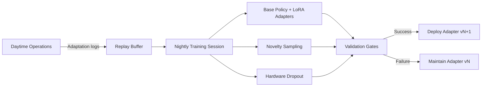
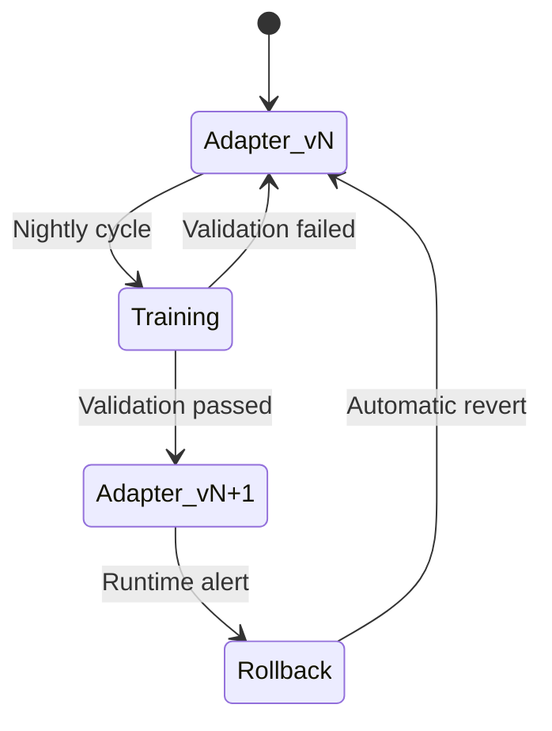

# **Technical Specification: Tamiyo, The Seed Controller**

**Version:** 0.1a
**Status:** Drafting
**Date:** 23 June 2025
**Author:** John Morrissey, Gemini AI

## **1. Overview and Mandate**

### **1.1. Role in the Morphogenetic Ecosystem**

In the morphogenetic architecture, agents are separated by function to ensure clarity and modularity.

* **Tamiyo**: The **Controller**. Tamiyo is the strategic decision-making agent. She observes the state of the entire network, analyzes telemetry from the seed lattice, and uses a defined policy to decide **if**, **when**, and **which** seed should germinate and what blueprint to use.

This document specifies the architecture and logic of the Tamiyo controller.

### **1.2. Design Philosophy**

The Tamiyo controller is designed to be a pluggable policy module. Version 1.0 implements a robust, configurable set of heuristics. Future versions will replace these heuristics with a trained neural network, allowing Tamiyo to learn sophisticated germination policies from experience. The interface specified here is designed to support both implementations without requiring changes to the surrounding system.

## **2. Telemetry: The Controller's Senses**

To make informed decisions, Tamiyo requires a continuous stream of telemetry from the seed lattice. This information is published by the KasminaLayer for Tamiyo's use.

### **2.1. Global System Metrics**

This is high-level information about the overall performance of the host network.

* **current_epoch (int)**: The current training epoch number.  
* **validation_accuracy (float)**: The primary performance metric on a held-out validation set.  
* validation_loss **(float)**: The secondary performance metric.

### **2.2. Seed Lattice Telemetry**

This is fine-grained information about the health and status of each individual seed location (chunk). In alignment with the high-performance `KasminaLayer` architecture, telemetry is no longer pushed by individual logical seeds.

Instead, each physical `KasminaLayer` operator generates a single, consolidated `LayerHealthReport` for all the seeds it manages at the end of every training epoch. These reports are published as messages to the `telemetry.seed.health` topic on the `Oona` message bus, which Tamiyo subscribes to. This batch-oriented architecture ensures Tamiyo receives a complete health map with minimal performance overhead.

The `LayerHealthReport` contains a map of health signals for each logical seed, including diagnostic metrics such as:

* `chunk_variance`: The primary signal for detecting stagnant or "dead" chunks.
* `avg_inter_node_correlation`: A measure of functional redundancy within the chunk.
* `dead_node_ratio`: The proportion of inactive neurons within the chunk.

### **2.3. Tamiyo's Model Map**

Tamiyo builds a comprehensive view of the entire system's state, which is encapsulated in a `SystemStatePacket`. This packet is constructed or updated at the end of each epoch by consuming the `LayerHealthReport` messages from the message bus and combining them with global metrics provided by `Tolaria`.

The data contracts governing communication are now authoritatively defined in the shared Rust `contracts` crate. Tamiyo's internal Python representations must align with these canonical schemas.

#### Canonical Data Contracts (`contracts` crate)

The following Rust structs define the data exchanged between Tamiyo and Kasmina.

```rust
// crates/contracts/src/lib.rs

use serde::{Serialize, Deserialize};
use std::collections::HashMap;

/**
 * @brief Telemetry payload published by a KasminaLayer at the end of each epoch.
 * @note Defines the schema for the 'telemetry.seed.health' Oona topic.
 */
#[derive(Debug, Clone, Serialize, Deserialize)]
pub struct LayerHealthReport {
    pub layer_id: i32,
    // Maps a logical seed's ID to its calculated health metrics for this epoch.
    pub health_metrics_by_seed: HashMap<i32, HashMap<String, f32>>,
    // Optionally includes full state info for debugging or advanced control.
    pub seed_states: Vec<LogicalSeedState>,
}

// Additional contracts like LogicalSeedState and KasminaControlCommand
// are also defined in this crate.
```

#### Internal State Representation (Conceptual Python)

The following Python dataclasses represent how Tamiyo might structure this information internally for its decision-making process.

```python
from dataclasses import dataclass, field
from typing import Optional, Dict, Tuple

@dataclass
class SystemStatePacket:
    """A snapshot of the entire system's state for a given epoch, consumed by Tamiyo."""

    # Global metrics from the main training loop (provided by Tolaria)
    current_epoch: int
    validation_accuracy: float
    validation_loss: float

    # Hardware context for the current environment
    hardware_context: 'HardwareContext'

    # Seed health data, populated by processing LayerHealthReport messages from the Oona bus.
    health_map: Dict[Tuple[int, int], Dict[str, float]] = field(default_factory=dict)

    # Seed lifecycle states, populated from the seed_states field of LayerHealthReport messages.
    seed_states: Dict[Tuple[int, int], str] = field(default_factory=dict)

@dataclass
class HardwareContext:
    device_type: str  # "GPU", "TPU", "NEUROMORPHIC"
    memory_available_gb: float
    compute_capacity_tflops: float
    supports_quantization: bool = False

@dataclass
class AdaptationSignal:
    """Command signal returned from Tamiyo to Tolaria."""
    optimizer_rebuild_required: bool
    emergency_rollback_required: bool
```

### **2.4. Canonical Seed Lifecycle**

The seed lifecycle is the core process model for every adaptation, ensuring safety and effectiveness. It is orchestrated by Tamiyo and executed by Kasmina. This multi-stage process is designed to prevent unstable components from ever impacting the main network and to ensure that only beneficial adaptations are made permanent.

The authoritative definition of the seed lifecycle can be found in Section 5 of the Kasmina detailed design document, which provides a comprehensive overview of the lifecycle stages.  This lifecycle is the backbone of the Esper system, ensuring that every adaptation is made with care, precision, and a focus on long-term stability. Each stage has been designed to mitigate specific risks, ensuring that the system can adapt dynamically without compromising the integrity of the host model.

## **2.5 Controller State Management:**

## **3. Decision Logic**

Tamiyo makes the following decisions:

### **3.1. The Germination Trigger**

Tamiyo determines **if** and **when** the system should consider germinating *any* seed. This logic is executed at the end of every epoch.

1. **Plateau Detection**:
    * Tamiyo maintains an internal plateau counter and tracks the `prev_acc` (previous epoch's validation accuracy).
    * The plateau counter is incremented if the improvement in `validation_accuracy` is less than a configurable `delta`.
    * The counter is reset to 0 if the improvement exceeds `delta`.
2. **Trigger Conditions**: All of the following conditions must be met to proceed to select a candidate:
    * `validation_accuracy < acc_threshold`: The model's performance must be below the desired target.
    * `plateau >= patience`: The performance plateau must persist for a configured number of epochs.
    * KasminaLayer has at least one `DORMANT` seed.
    * No seeds are in active lifecycle states (`TRAINING`, `GRAFTING`, `STABILIZATION`, etc.).

If these conditions are met, the controller's internal state is set to "Ready to Germinate," and it proceeds to the selection stages.

### **3.2. Candidate Seed Selection**

This stage determines **which** specific seed to germinate from all available `DORMANT` candidates.

1. **Decision Making Data**: Tamiyo is given a compiled `model_health_map` and `seed_state_map`. Tamiyo uses only the data that has been provided to her.
2. **Selection**: Tamiyo uses her policy to assess which dormant seed is the best candidate for intervention based on its health metrics from the `seed_health_map`.

### **3.3. Blueprint Selection**

Once a seed is chosen, Tamiyo selects the most appropriate blueprint for the chosen seed. This decision is guided by the `blueprint_selection_strategy` defined in the controller's configuration (see Section 9.1). The following strategies, detailed further in Appendix A, are available:

* **Performance:** The default hybrid strategy that seeks to maximize task-level performance by balancing the goals of the Accuracy, Stability, and Risk strategies. It is recommended for general-purpose use.
* **Stability:** Prioritizes metrics related to training stability, such as convergence and robustness.
* **Accuracy:** A focused strategy that exclusively prioritizes improving validation accuracy and reducing validation loss.
* **Risk:** A conservative strategy that only considers blueprints with a "High" confidence level and proven stability.
* **Novelty:** An exploratory strategy that favors new or experimental blueprints to discover breakthrough architectures.
* **Optimization:** A comprehensive strategy for hardware-aware tuning (available in a future release).
* **Hybrid:** A flexible approach that allows for a weighted combination of multiple strategies.

### **3.4. Grafting Strategy Selection**

Once a seed and blueprint are selected, Tamiyo must choose the appropriate grafting strategy for Kasmina to execute. This decision is based on network conditions and hardware constraints. The available grafting strategies (e.g., `GRAD_NORM_GATE`) are authoritatively defined in the Kasmina detailed design.

### **3.5. Action and Output**

Once a candidate seed, blueprint, and grafting strategy are selected, Tamiyo's final action is to issue a germination command to the specific `KasminaLayer` that manages the target seed.

* **Action**:

    1. Tamiyo identifies the target `KasminaLayer` instance corresponding to the chosen seed's `layer_id`.
    2. It constructs a `KasminaControlCommand` payload, populating it with the `target_seed_id` (the logical index within the layer), the selected `blueprint_id`, and the chosen `grafting_strategy`.
    3. It invokes the control interface on the target layer, for instance: `kasmina_layer_12.request_germination(command)` . The `KasminaLayer` is then responsible for translating this logical command into a physical update on its internal `state_tensor`.

* **Output**: The method returns a result indicating whether the germination request was accepted. This signals to the `Tolaria` trainer that an adaptation has begun and that the optimizer may need to be rebuilt in a future epoch if the adaptation becomes permanent (`FOSSILIZED`).

The diagram below illustrates this updated control flow, including the decoupled telemetry pathway that informs the decision.

```mermaid
graph TD
    subgraph Oona (Message Bus)
        T[Topic: telemetry.seed.health]
    end

    subgraph "Kasmina Subsystem"
        KL12["KasminaLayer (Layer 12)"]
        KL13["KasminaLayer (Layer 13)"]
    end

    subgraph "Tamiyo Controller"
        A[End of Epoch: Consume LayerHealthReports] --> B{Performance Plateau?};
        B -- No --> X[Wait for Next Epoch];
        B -- Yes --> C{Accuracy < Threshold?};
        C -- No --> X;
        C -- Yes --> D{Dormant Seeds Available?};
        D -- No --> X;
        D -- Yes --> E[Select Candidate Seed<br>e.g., (layer=12, seed=3)];
        E --> F[Issue Germination Command];
    end

    %% Data Flow
    KL12 -- "Publishes LayerHealthReport" --> T
    KL13 -- "Publishes LayerHealthReport" --> T
    T --> A

    %% Control Flow
    F -- "kasmina_layer_12.request_germination(cmd)" --> KL12

    style KL12 fill:#cde4ff,stroke:#333,stroke-width:2px
    style KL13 fill:#cde4ff,stroke:#333,stroke-width:2px
```

### **3.6 Closing the Reinforcement Loop: Field Reports**

A critical function of the Esper platform is its ability to learn from its actions . Tamiyo is responsible for closing this "Outer Reinforcement Loop" by reporting the real-world outcomes of adaptations back to the `Karn` architect . This feedback serves as a powerful reinforcement signal, allowing Karn to refine its generative process and favor architectural patterns that succeed in specific contexts.

During the `EVALUATING` and `FINE_TUNING` stages, the `KasminaLayer` is responsible for measuring blueprint-specific performance metrics (latency, memory usage, gradient variance) for its active seeds . It includes these metrics in its telemetry reports, giving Tamiyo all the necessary information to construct a complete `FieldReport` for Karn.

**Trigger and Process:**

1. **Lifecycle Completion:** Tamiyo generates a `FieldReport` whenever a logical seed's lifecycle, managed by its parent `KasminaLayer`, enters one of the terminal states: `FOSSILIZED` (success), `CULLED` (failure), or `ROLLED_BACK` (catastrophic failure) .

2. **Data Aggregation:** As the central controller, Tamiyo aggregates:

      * The unique `blueprint_id` and the logical `seed_id` of the adaptation.
      * The global performance metric (e.g., `validation_accuracy`) both before (`pre_metric`) and after (`post_metric`) the adaptation.
      * The final `Outcome` (`FOSSILIZED`, `CULLED`, or `ROLLED_BACK`).
      * Key performance indicators gathered by the `KasminaLayer` during the seed's lifecycle, such as `max_latency` and `gradient_variance`.

3. **Transmission to Karn:** Once aggregated, Tamiyo serializes the `FieldReport` data and **publishes it as a message to the `innovation.field_reports` topic on the `Oona` message bus** . This asynchronous, event-driven mechanism replaces the previously mentioned RPC interface, aligning with the system's core architectural principles .

This reporting mechanism is the cornerstone of the platform's long-term evolution, transforming Esper from a merely adaptive system into a genuinely self-improving one.

Additionally, if `Tamiyo` detects a catastrophic stability breach (e.g., the change in validation loss exceeds the `emergency_rollback_threshold`), it will command the active seed to a `ROLLED_BACK` state and signal the `Tolaria` trainer to restore the last checkpoint. Following this restoration, Tamiyo generates a `FieldReport` with the `Outcome` explicitly set to `ROLLED_BACK`.

### **"3.7 Epoch-Synchronized Lifecycle Management**
  
To ensure system stability and prevent inconsistent state reporting, `Tamiyo` is responsible for orchestrating all major lifecycle transitions for active `KasminaSeed` modules. A seed does not transition its own state upon completing a task (e.g., finishing the `GRAFTING` alpha ramp). Instead, it sets an internal flag indicating its readiness for the next stage.

During its `step()` call at the end of each epoch, `Tamiyo` receives a report from each active seed. If a seed reports it is ready to advance and global system metrics are acceptable, `Tamiyo` will issue a direct command to that seed to transition to the next state (e.g., `seed.enter_stabilization()`). This ensures all major state changes occur deterministically at the epoch boundary.

```python
class TamiyoController:
    def step(self, system_state: SystemStatePacket) -> AdaptationSignal:
        """Receives full system state from Tolaria"""
        # Use health_map, seed_states from packet
        # Make adaptation decisions
        return AdaptationSignal(...)
```

## **4. The Neural Controller**

Tamiyo will be trained neural network as follows:

* **Input Vector**: The input to the NN will be a flattened vector containing all the telemetry signals currently used by the heuristics (global metrics + health signals from all seed slots).  
* **Output**: The output will be a probability distribution over all DORMANT seeds, indicating the network's belief about which seed is the best candidate for germination.  
* **Training**: The NN will be trained using reinforcement learning or imitation learning, potentially via the "Micro-Curriculum" approach outlined in the original Morphogenetic Architectures.docx, where it learns from the successes and failures of germination in a large population of small, synthetic experiments.  
* **Seed Blueprint Library**: A key extension will be to allow Tamiyo to choose *what* to grow. The output will be expanded to not only select a seed_id but also an architecture_id from a pre-defined library of seed blueprints (e.g., "small residual MLP," "attention head adapter," etc.).
* **BlueprintStrategy**: The NN will be constrained by the user-defined blueprint_selection_strategy (see Section 3.3.1), which will guide the selection of blueprints based on the current task requirements and hardware constraints.

## **5. Progressive Curriculum System**

Tamiyo's development follows a structured 7-stage curriculum that progressively introduces complexity across task domains, hardware constraints, and safety requirements. Each stage builds upon previous capabilities while introducing new challenges.

### **5.1. Curriculum Overview**

| Stage | Task | Success Criteria | Safety Requirements | Hardware Profile | Available Blueprints |
|-------|------|------------------|-------------------|------------------|---------------------|
| **0** | 2D Spirals | ≥99% accuracy | Drift (cos < 0.15) | CPU | Bottleneck Adapter, Low-Rank Residual, No-Op |
| **1** | Tiny Vision (MNIST-like) | ≥92% accuracy | Rollback >98%, Adversarial Δ <5% | GPU | SE-Module, Depthwise Conv, No-Op |
| **2** | Char-Level Language | ≤1.0 BPC | Security alert = false | GPU | Adapter, Mini Self-Attention, No-Op |
| **2.5** | Adversarial Vision (MNIST-C) | ≥90% corrupted accuracy | Denoise >95%, Rollback >98% | GPU | Denoiser AE, Attention Filter, No-Op |
| **3** | ECG Time-Series | AUC ≥0.95 | Latency <5ms, HIPAA, Encryption | Edge-TPU | Sliding Conv, Sparse Activation, No-Op |
| **3.5** | Gaussian Clusters | ≥95% purity | Drift <0.05, Security alert = false | Edge-TPU | SE-Module, GLU, No-Op |
| **4** | Concentric Spheres (10-D) | ≥97% accuracy | Drift <0.10, Rollback >99% | TPU | Mini Attention, Depthwise Conv, No-Op |
| **4.5** | Tiny-CLIP (Image↔Text) | R@1 ≥60% | Cross-modal drift <0.05, Privacy | TPU | Cross-Attention Adapter, Latent Align, No-Op |
| **5** | XOR-N / Checkerboard | ≥99% accuracy | Drift <0.05, Utilization check | GPU | Nested Seed, Low-Rank Residual, No-Op |
| **6** | Edge Deployment | ≥88% accuracy, ≤15μJ/inf | Packet loss <15%, Latency budget | LoRa/5G/ASIC | Quant-Adapter, Pruning, Fail-Safe Gating |
| **7** | Autonomous Exploration | N/A | Safety <0.01, Ethical guidelines | Variable | Dynamic Seed, Contextual Adapter, No-Op |
| **8** | Multimodal Fusion | R@1 ≥70% | Drift <0.05, Security alert = false | Variable | Cross-Modal Adapter, Latent Fusion, No-Op |
| **9** | Time-Series Forecasting | MSE <0.01 | Latency <10ms, HIPAA, Encryption | Edge-TPU | Sliding Conv, Sparse Activation, No-Op |

### **5.2. Stage Advancement Criteria**

Progression between stages is controlled by strict guardrails:

```python
def can_advance_stage(metrics: dict, safety: dict, hardware: dict) -> bool:
    """Determine if advancement to next curriculum stage is permitted."""
    return (
        metrics['accuracy'] >= stage_config.target_accuracy and
        safety['rollback_rate'] >= 0.98 and
        safety['drift'] <= stage_config.max_drift and
        hardware['latency_ms'] <= hardware['max_latency'] and
        safety['security_violations'] == 0
    )
```

### **5.3. Curriculum Benefits**

* **Progressive Complexity**: Each stage introduces new challenges without overwhelming the system
* **Safety Validation**: Ensures robust behavior before advancing to more critical domains
* **Hardware Adaptation**: Tests performance across different computational environments
* **Comprehensive Coverage**: Spans vision, language, time-series, and multimodal domains

### **5.4. Conclusion and Future Outlook**

The path to a neural controller represents a major evolution in the capabilities of the Tamiyo system. By leveraging advanced machine learning techniques, Tamiyo will gain a more profound and flexible decision-making capability, unlocking new levels of performance and autonomy in the morphogenetic ecosystem.

## **6. Blueprint Library Architecture**

The blueprint library provides a standardized collection of neural network modules that Tamiyo can dynamically select and inject into the host network based on task requirements and hardware constraints.

### **6.1. Blueprint Categories**

The authoritative list of initial blueprints is defined in the Urza design documentation.

### **6.2. Blueprint Interface**

All blueprints implement a standardized interface:

```python
from abc import ABC, abstractmethod
from typing import Dict, Any
import torch
from torch import nn

class Blueprint(nn.Module, ABC):
    """Abstract base class for all Tamiyo blueprint modules."""
    
    def __init__(self, blueprint_id: str, input_dim: int, **kwargs):
        super().__init__()
        self.blueprint_id = blueprint_id
        self.input_dim = input_dim
        self.use_case = "generic"
        self.hardware_requirements = {}
        
    @abstractmethod
    def forward(self, x: torch.Tensor) -> torch.Tensor:
        """Forward pass through the blueprint."""
        pass
    
    @abstractmethod
    def get_parameter_count(self) -> int:
        """Return the number of trainable parameters."""
        pass
    
    @abstractmethod
    def get_memory_usage(self) -> Dict[str, float]:
        """Return memory usage statistics in MB."""
        pass
    
    @abstractmethod
    def get_latency_estimate(self, hardware_context: 'HardwareContext') -> float:
        """Estimate latency in milliseconds for given hardware."""
        pass
```

### **6.3. Blueprint Registry**

The registry provides dynamic blueprint discovery and instantiation:

```python
class BlueprintRegistry:
    """Registry for blueprint discovery and instantiation."""
    
    def __init__(self):
        self._blueprints: Dict[str, Type[Blueprint]] = {}
        self._metadata: Dict[str, Dict[str, Any]] = {}
    
    def register(self, blueprint_id: str, blueprint_class: Type[Blueprint], 
                metadata: Dict[str, Any] = None):
        """Register a blueprint with optional metadata."""
        self._blueprints[blueprint_id] = blueprint_class
        self._metadata[blueprint_id] = metadata or {}
    
    def create(self, blueprint_id: str, input_dim: int, **kwargs) -> Blueprint:
        """Instantiate a blueprint by ID."""
        if blueprint_id not in self._blueprints:
            raise ValueError(f"Unknown blueprint: {blueprint_id}")
        
        blueprint_class = self._blueprints[blueprint_id]
        return blueprint_class(blueprint_id, input_dim, **kwargs)
    
    def get_compatible_blueprints(self, 
                                hardware_context: 'HardwareContext',
                                constraints: Dict[str, Any]) -> List[str]:
        """
        Get blueprints compatible with hardware and constraints.
        
        Args:
            hardware_context: Current hardware environment
            constraints: Dictionary including hardware and task constraints.
                        Examples:
                        - task_type: "language", "vision", "time_series", "multimodal"
                        - latency_budget_ms: Maximum acceptable latency
                        - memory_budget_mb: Memory usage limit
                        - safety_level: "standard", "medical", "critical"
                        - deployment_target: "edge", "cloud", "mobile"
        
        Returns:
            List of compatible blueprint IDs
        """
        compatible = []
        for blueprint_id, metadata in self._metadata.items():
            if self._is_compatible(metadata, hardware_context, constraints):
                compatible.append(blueprint_id)
        return compatible
```

## **7. Controller State Persistence & Checkpointing**

### **7.1 Mandate for State Persistence**

The `TamiyoController` is a stateful component that makes strategic decisions based on the training history of the host model. This state includes internal counters, metric histories, and the weights of its own neural policy network.

During an emergency rollback procedure—triggered when an adaptation causes catastrophic model instability—the `Tolaria` training environment restores the host model to its last known-good checkpoint. To prevent logical inconsistencies and control loop instability, Tamiyo's internal state must be restored in lockstep with the model. This ensures the controller's understanding of the system's history is perfectly synchronized with the model's restored state, preventing erroneous post-rollback adaptation attempts based on a now-invalid timeline.

### **7.2 State Dictionary Contents**

The state of the `TamiyoController` to be persisted includes, but is not limited to:

* **Metric History:** A buffer of recent `validation_accuracy` and `validation_loss` values used for trend analysis.
* **Plateau Counter:** The internal counter used to track performance plateaus.
* **Seed State & Health Maps:** A snapshot of the last known states and health signals for every seed in the network.
* **Germination Queue:** The list of seeds that have been commanded to `GERMINATE` but are awaiting promotion to the `TRAINING` state.
* **Neural Controller State:** The weights and optimizer states for Tamiyo's internal neural network policy, if the advanced controller is active.

### **7.3 API Contract for Persistence**

To facilitate checkpointing by the `Tolaria` trainer, the `TamiyoController` must implement a standard persistence interface, analogous to a PyTorch `nn.Module`.

```python
from typing import Dict, Any

class TamiyoController:
    """The central controller, responsible for strategy and coordination."""

    def save_state_dict(self) -> Dict[str, Any]:
        """
        Serializes the full internal state of the controller into a dictionary.

        This dictionary must be self-contained and sufficient to fully restore
        the controller to its current state.

        Returns:
            A dictionary containing the controller's state.
        """
        # ... Implementation to gather all state variables
        pass

    def load_state_dict(self, state_dict: Dict[str, Any]) -> None:
        """
        Restores the controller's state from a previously saved state dictionary.

        This method is called by the Tolaria trainer during an emergency rollback
        to ensure controller state is synchronized with the restored model checkpoint.

        Args:
            state_dict: The state dictionary to load.
        """
        # ... Implementation to restore all state variables
        pass

    # ... other existing methods
```

### **7.4 Integration with Tolaria**

The `TolariaTrainer` is the sole component responsible for invoking this persistence interface.

* **On Checkpoint Creation:** After a successful validation epoch, when `Tolaria` saves a checkpoint of the model, it will also call `tamiyo.save_state_dict()` and save the resulting state dictionary as part of the same checkpoint.
* **On Checkpoint Restore:** When executing an emergency rollback, `Tolaria` will first load the model's state dictionary, then immediately call `tamiyo.load_state_dict()` with the corresponding controller state, ensuring a clean and fully synchronized system restoration before resuming the training process.

## **8. Safety Shield Implementation**

This system is the concrete implementation of the first layer of the platform-wide **Operational Safety Framework**—the deterministic "Shield". Its purpose is to act as a fast, heuristic-based gate, vetoing any proposed adaptation that violates a set of hard, pre-defined constraints. The `SafetyValidator` is the core component of this Shield, enforcing the rules defined in a given `SafetyConfig` profile before a blueprint is ever passed to Kasmina for germination.

### **8.1. Safety Categories**

**Performance Safety:**

* **Drift Detection**: Monitor weight drift via cosine similarity
* **Rollback Capability**: Automatic reversion when performance degrades
* **Stability Monitoring**: Track training stability and convergence

**Security Safety:**

* **Encryption Enforcement**: Ensure data encryption in medical/financial domains
* **Privacy Preservation**: Protect sensitive information in multimodal tasks
* **Access Control**: Validate permissions for critical operations

### **8.2. Shield Configuration**

The `SafetyConfig` dataclass defines the specific rules and thresholds for the Shield. Different profiles (e.g., `DEVELOPMENT_CONFIG`, `MEDICAL_CONFIG`) can be loaded to adjust the strictness of the Shield based on the deployment environment.

```python
@dataclass
class SafetyConfig:
  """Configuration for the deterministic Safety Shield."""
  # Risk Tolerance: The highest conf_level from Urza to allow.
  # e.g., in a production environment, this might be ["High", "Moderate"], rejecting "Speculative".
  allowed_conf_levels: list[str] = field(default_factory=lambda: ["High", "Moderate", "Speculative"])

  # Performance safety
  max_drift_threshold: float = 0.15
  min_rollback_success_rate: float = 0.98
  stability_window_epochs: int = 10

  # Security safety
  encryption_required: bool = False
  privacy_mode: bool = False
  audit_logging: bool = True

  # Emergency protocols
  emergency_rollback_enabled: bool = True
  fail_safe_mode: bool = False
  max_consecutive_failures: int = 3
```

### **8.3. Shield Validation Logic**

The `SafetyValidator` is the engine of the Shield. It consumes the `SafetyConfig` and the blueprint's metadata to make an instant pass/fail decision.

```python
class SafetyValidator:
    """Implements the deterministic Shield to validate adaptations before germination."""
def __init__(self, config: SafetyConfig):
    self.config = config
    self.violation_history: List[Dict[str, Any]] = []

def validate_blueprint_deployment(self,
                                blueprint_metadata: Dict[str, Any],
                                hardware_context: HardwareContext,
                                current_metrics: Dict[str, float]) -> Tuple[bool, List[str]]:
    """
    Validate that a proposed blueprint deployment passes all deterministic Shield checks.
     Args:
        blueprint_metadata: The full metadata stub for the candidate blueprint from the Urza library.
        ...
    """
    violations = []

    # Check 1: Risk and Confidence Level
    conf_level = blueprint_metadata.get('conf_level')
    if conf_level not in self.config.allowed_conf_levels:
        violations.append(f"Blueprint conf_level '{conf_level}' is not in allowed list: {self.config.allowed_conf_levels}")

    # Check 2: Hardware & Resource Constraints (as before)
    # ... (existing checks for power, latency, etc.)

    # Check 3: Drift and Stability Constraints (as before)
    # ... (existing checks for drift)

    # Check 4: Security Requirements (as before)
    # ... (existing checks for encryption)

    is_safe = len(violations) == 0
    if not is_safe:
        self.violation_history.append({"blueprint": blueprint_metadata.get('signature'), "violations": violations})

    return is_safe, violations
```

## **9. Unified Configuration System**

Tamiyo uses a unified configuration system that aligns with KASMINA and KARN components, ensuring consistent behavior across the morphogenetic ecosystem.

### **9.1. TamiyoConfig Structure**

```python
@dataclass
class TamiyoConfig:
    """Unified configuration for Tamiyo v2.0 with full ecosystem alignment."""
    
    # Performance thresholds (aligned with Kasmina)
    acc_threshold: float = 0.95
    plateau_patience: int = 5
    min_improvement_delta: float = 0.001
    
    # Health signal scoring weights
    health_weights: dict = field(default_factory=lambda: {
        'variance_weight': 0.6,
        'dead_node_weight': 0.3,
        'correlation_weight': 0.1
    })
    
    # Lifecycle constraints
    allow_concurrent_adaptations: bool = False
    max_active_seeds: int = 1
    respected_states: list[str] = field(default_factory=lambda: [
        'TRAINING', 'GRAFTING', 'STABILIZATION', 'EVALUATING', 'FINE_TUNING'
    ])
    
    # Safety parameters
    enable_safety_validation: bool = True
    max_consecutive_failures: int = 3
    emergency_rollback_threshold: float = 0.05  # 5% performance drop

    # Hardware awareness
    enforce_hardware_constraints: bool = True
    memory_safety_margin: float = 0.1
    latency_safety_margin: float = 0.2
    
    # Blueprint preferences
    blueprint_selection_strategy: Tamiyo.BlueprintStrategy = Tamiyo.BlueprintStrategy.PERFORMANCE  # See Section 3.3.1 for all options

    # Grafting strategy integration
    grafting_strategy_selection: Kasmina.GraftingStrategy = Kasmina.GraftingStrategy.GRAD_NORM_GATED # See Section 3.5 for options
    default_grafting_strategy: Kasmina.GraftingStrategy = Kasmina.GraftingStrategy.GRAD_NORM_GATED

    # Neural controller transition (future)
    neural_controller_enabled: bool = False
    neural_controller_confidence_threshold: float = 0.8
    
    def validate(self) -> list[str]:
        """Validate configuration consistency and return any violations."""
        violations = []
        
        if not 0.0 <= self.acc_threshold <= 1.0:
            violations.append("acc_threshold must be between 0.0 and 1.0")
        
        if self.plateau_patience < 1:
            violations.append("plateau_patience must be >= 1")
        
        if not all(0.0 <= w <= 1.0 for w in self.health_weights.values()):
            violations.append("All health_weights must be between 0.0 and 1.0")
        
        if self.max_active_seeds < 1:
            violations.append("max_active_seeds must be >= 1")
        
        return violations
```

### **9.2. Configuration Integration Points**

The unified configuration ensures consistent behavior across components:

* **Kasmina Integration**: Seed lifecycle states and grafting strategies align with KASMINA's operational model
* **Karn Integration**: Blueprint selection criteria incorporate KARN's performance feedback and status normalization
* **Urza Integration**: Blueprint metadata and lineage tracking are consistent with Urza's library management
* **Safety System**: Configuration parameters feed into safety validation and constraint checking

### **9.3. Environment-Specific Profiles**

```python
# Development environment
DEVELOPMENT_CONFIG = TamiyoConfig(
    acc_threshold=0.85,
    plateau_patience=3,
    risk_tolerance=RiskLevel.HIGH,
)

# Edge deployment environment
EDGE_CONFIG = TamiyoConfig(
    acc_threshold=0.92,
    latency_safety_margin=0.1,
    blueprint_strategy=TamiyoConfig.BlueprintStrategy.SIZE,
    grafting_strategy=Kasmina.GraftingStrategy.GRAD_NORM_GATED,
    risk_tolerance=RiskLevel.MEDIUM,
)
# Security/Medical/other critical environment
MEDICAL_CONFIG = TamiyoConfig(
    acc_threshold=0.98,
    plateau_patience=10,
    enable_safety_validation=True,
    emergency_rollback_threshold=0.02,
    max_consecutive_failures=1,
    blueprint_strategy=TamiyoConfig.BlueprintStrategy.SIZE,
    grafting_strategy=Kasmina.GraftingStrategy.GRAD_NORM_GATED,
    risk_tolerance=RiskLevel.LOW,    
)
```

### **10. Continuous Learning for Neural Controller**  

Tamiyo's neural policy undergoes continuous improvement through a carefully designed offline training regimen. This system balances stability, adaptability, and innovation while ensuring operational safety.

#### **10.1. Training Architecture Overview**



#### **10.2. Core Training Mechanisms**

##### **10.2.1. Elastic Weight Consolidation (EWC)**

Preserves foundational knowledge by anchoring critical parameters:

```python
class EWCRegularizer:
    def __init__(self, base_model):
        self.fisher_matrix = compute_fisher(base_model)  # From historical tasks
        
    def compute_penalty(self, new_model):
        penalty = 0
        for name, param in new_model.named_parameters():
            if name in self.fisher_matrix:
                penalty += torch.sum(self.fisher_matrix[name] * 
                                    (param - base_model[name]) ** 2)
        return penalty

# Usage in training loss:
loss = task_loss + config.ewc_lambda * ewc_regularizer.compute_penalty(model)
```

##### **10.2.2. LoRA Adapter Training**

Enables risk-contained policy updates:

```python
def train_nightly_adapter(replay_data, base_policy):
    # Initialize from previous adapter
    adapter = LoRAAdapter.load_from_checkpoint("adapters/vN.ckpt") 
    
    # Apply hardware-aware dropout during training
    trainer = Trainer(
        plugins=[HardwareAwareDropout(p=0.15)],
        callbacks=[EWCRegularizer(base_policy)]
    )
    
    # Train on balanced replay data
    trainer.fit(adapter, replay_data.sample(strategy="hardware_balanced"))
    return adapter
```

##### **10.2.3. Novelty-Boosted Sampling**

Combats architectural stagnation:

```python
def sample_replay_data(buffer):
    """Oversamples novel experiences"""
    base_sample = buffer.random_sample(size=1000)
    novel_sample = buffer.filter_samples(min_novelty=0.7, size=300)
    return base_sample + novel_sample

# Novelty metric computed as:
novelty = 1 - cosine_similarity(blueprint, nearest_library_entry)
```

#### **10.3. Validation & Deployment Protocol**

Three-stage validation ensures safety:

```python
def validate_adapter(adapter):
    # Stage 1: Core task preservation
    core_tasks_score = evaluate(adapter, HISTORICAL_TASKS)
    
    # Stage 2: Hardware robustness
    hw_stability = test_hardware_variants(adapter)
    
    # Stage 3: Behavioral diversity
    diversity = compute_adaptation_diversity(adapter)
    
    return (core_tasks_score >= 0.95 and 
            hw_stability >= 0.97 and
            diversity >= 0.4)
```

#### **10.4. Version Control & Rollback**



#### **10.5. Monitoring Dashboard**

Critical metrics tracked per training cycle:

| **Metric** | Target | Alert Threshold |
|------------|--------|-----------------|
| Policy Success Rate | ≥95% | <90% |
| Core Task Preservation | ≥0.95 | <0.90 |
| Novelty Score | ≥0.45 | <0.35 |
| Training Divergence | ≤0.05 | >0.10 |

```python
# Monitoring example
class TrainingMonitor:
    def after_training_cycle(self, success, metrics):
        self.rolling_success = 0.9 * self.rolling_success + 0.1 * success
        if self.rolling_success < 0.9:
            alert("Policy success rate dropping!")
```

---

### **Key Integrations with Tolaria**

1. **State Synchronization**  
   Tolaria provides snapshots via `create_training_snapshot()` ensuring training mirrors production

2. **Hardware Emulation**  
   Tolaria's sandbox replicates production environments:

   ```python
   sandbox = TolariaSandbox(clone_config=production_hardware)
   ```

3. **Rollback Coordination**  
   Joint protocol handles failures:

   ```mermaid
   sequenceDiagram
       Tamiyo->>Tolaria: request_rollback(adapter_version)
       Tolaria-->>Tamiyo: confirm_state_restored()
       Tamiyo->>Kasmina: reseed_dormant_nodes()
   ```

---

This continuous learning system transforms Tamiyo from a static controller to an **evergreen strategic partner** that grows wiser with each adaptation cycle while maintaining operational safety through:  

1. Modular LoRA updates  
2. EWC-anchored memory  
3. Novelty-enforced exploration  
4. Hardware-agnostic representations  

The solution elegantly resolves the overfitting dilemma by making staleness the catalyst for innovation.

## Appendix A: Detailed Blueprint Selection Strategies

Blueprint Strategies steer Tamiyo's decision-making process when selecting which blueprint to use for germination. These strategies can be configured based on the specific requirements of the task, hardware constraints, and safety considerations.

These strategies are defined in `TamiyoConfig` and can be set to guide the selection process. The available strategies are:

* NONE: Tamiyo will not be biased towards any specific blueprint. This strategy is useful for exploratory tasks where the best blueprint is not known in advance.hi
* PERFORMANCE: The blueprint selection strategy that prioritizes model performance metrics. It is a hybrid of the Stability, Accuracy, and Risk strategies.
* STABILITY: The blueprint selection strategy that prioritizes stability metrics, such as convergence and robustness.
* ACCURACY: The blueprint selection strategy that prioritizes accuracy metrics, such as validation loss and accuracy.
* RISK: The blueprint selection strategy that prioritizes low risk blueprints, such as those with proven stability or low failure rates.
* NOVELTY: The blueprint selection strategy that prioritizes novel or experimental blueprints, which may not have been extensively tested but offer potential for significant performance improvements. This strategy is useful for exploring new architectures or techniques that could lead to breakthroughs in performance or efficiency.

The following additional strategies are available if Size, Cost, Power and Performance metrics are available:

* OPTIMIZATION: The blueprint selection strategy that prioritizes optimization metrics. It is a hybrid of the SIZE, COST, POWER and PERFORMANCE blueprints.
* SIZE: The blueprint selection strategy that prioritizes the size of the model, such as the number of parameters or memory usage.
* COST: The blueprint selection strategy that prioritizes cost metrics, such as energy consumption or resource utilization.
* POWER: The blueprint selection strategy that prioritizes power consumption metrics, such as energy efficiency or thermal output.
* HARDWARE: The blueprint selection strategy that prioritizes hardware performance metrics, such as throughput or latency.

If a Safety Policy is available, the following strategy is also available:

* SAFETY: The blueprint selection strategy that prioritizes safety metrics, such as drift detection or rollback success rate. # Requires Safety Metrics

Tamiyo will be trained and tested using a diverse range of tasks and strategies, to ensure that she can adapt to different contexts and requirements. The initial release will focus on the Performance, Stability, Accuracy, and Risk strategies, with the other strategies being added in future releases.
