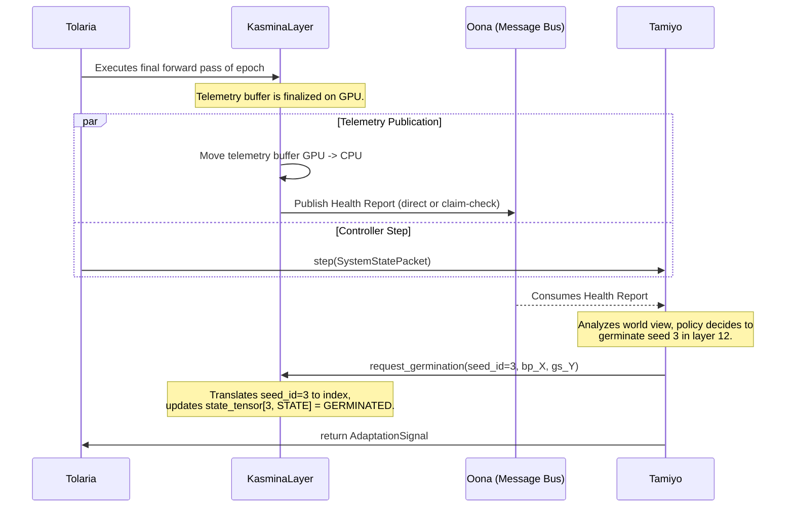
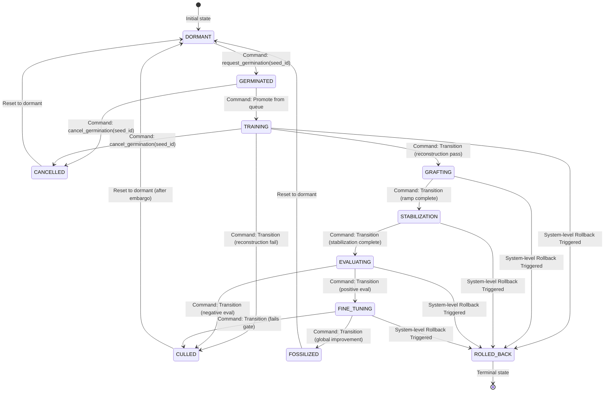

# **Detailed Design Document: Kasmina Operator Subsystem**

**Version:** 0.1a
**Status:** Drafting
**Date:** 23 June 2025
**Author:** John Morrissey, Gemini AI

## **1. Introduction**

### **1.1. Purpose & Scope**

This document provides the formal detailed design for **Kasmina**, the foundational execution layer of the Esper Morphogenetic Platform. The Kasmina subsystem consists of distributed KasminaSeed modules responsible for the low-level mechanics of monitoring neural network health, executing their own adaptation lifecycle, and safely integrating ("grafting") new computational capacity into a live host network.

This specification serves as the canonical reference for the implemented system. The scope is strictly limited to the operational mechanics of the KasminaSeed; it does not cover the strategic decision-making policies or the coordination logic, which are the exclusive domain of Tamiyo (TamiyoController).

### **1.2. Architectural Goals & Principles**

The Kasmina architecture is designed to adhere to the following core principles:

* **Surgical Precision:** Adaptations must be targeted at specific, verifiable computational bottlenecks. By isolating and modifying only the underperforming components, Kasmina avoids disrupting well-functioning parts of the network.  
* **Operational Safety:** The primary goal is to *do no harm*. All interventions are executed via a multi-stage, gated lifecycle that tests new components in isolation before they are allowed to influence the network's gradients or outputs.  
* **Modularity & Extensibility:** The system must be composed of clearly defined, pluggable components (e.g., Grafting Strategies) to facilitate experimentation and future evolution.  
* **Separation of Concerns:** Kasmina handles the *how* (the mechanics of adaptation). The strategic *what*, *when*, and *where* are the exclusive responsibilities of the Tamiyo controller. The KasminaSeed is a predictable, deterministic operator that executes commands given to it by the controller.

## **2. System Architecture**

The Kasmina subsystem is architected to solve a fundamental challenge: how to efficiently monitor and adapt a massive number of neural pathways in parallel without compromising the host model's training throughput. The solution is founded on a core principle mandated by **ADR-001**: the separation of the system's **Logical View** from its **Physical View**.

* **Logical View:** For conceptual clarity and for the strategic controller's API, the system is reasoned about as a lattice of thousands of individual, stateful `KasminaSeed` agents. Each seed is an independent entity monitoring a small "chunk" of the network. This intuitive model guides the design of the `Tamiyo` controller and the overall framework logic.
* **Physical View:** For performance, the entire collection of logical seeds within a single host layer is implemented as one monolithic, highly optimized `nn.Module`: the `KasminaLayer`. This physical component uses vectorized, GPU-native operations to manage all seeds in parallel, ensuring minimal overhead on the training loop's hot path.

This chapter details both views, starting with the intuitive logical model and then specifying its performant physical implementation.

### **2.1. The Logical Model: A Chunked Architecture**

The foundational logical principle of the Kasmina architecture is the partitioning of a layer's activation tensor into multiple, independently monitored **chunks**. This strikes an optimal balance between the surgical precision of a true per-node model and the computational efficiency required for large-scale networks.

* **Operator-Controlled Granularity:** An operator has direct control over the level of precision via the `--seeds_per_layer` parameter, which determines how many logical `KasminaSeed` agents a layer is divided into.
  * **Ultra-fine (Per-Node) Mode:** Setting `seeds_per_layer` equal to the layer's `hidden_dim` results in a chunk size of 1, providing maximum diagnostic precision for detecting "dead neurons".
  * **Coarse Mode:** Setting `seeds_per_layer` to a small number (e.g., 4 or 8) provides efficient, high-level monitoring suitable for very large networks.
* **Data Flow (Split -> Process -> Concatenate):** Logically, during a forward pass, the activation tensor of a layer is split into non-overlapping chunks. Each chunk is passed to its corresponding logical `KasminaSeed` for processing. The outputs from all seeds are then concatenated back together, re-forming the full activation tensor with perfect dimensionality preservation. This ensures that the operations of one seed are structurally isolated from all others.

### **2.2. The Physical Implementation: `KasminaLayer`**

While we reason about a system of distributed seeds, the actual implementation is a single `KasminaLayer` that replaces a standard PyTorch layer (e.g., `nn.Linear`). This component is the physical realization of the entire logical chunked architecture for a given host model layer.

* **Responsibilities:**
  * **Tensorized State Management:** It manages the state for all logical seeds within the layer using a single, integer-based `state_tensor` kept resident on the GPU. This tensor tracks the 11-stage lifecycle, active blueprint, and other metadata for every chunk in a fully vectorized format.
  * **Vectorized Forward Pass:** It executes the entire split-process-concatenate data flow using a single, custom high-performance kernel, eliminating all Python loops and object overhead from the training hot path.
  * **Blueprint Orchestration:** It maintains a registry of active, germinated blueprint modules and applies their computations to the corresponding chunks via efficient masking and gathering operations within the kernel.
  * **Telemetry Generation:** It generates a raw `telemetry_buffer` on the GPU during the forward pass, capturing health statistics for all chunks simultaneously with minimal performance impact.
  * **Control Interface:** It exposes an external API for the `Tamiyo` controller to issue commands (e.g., `request_germination`) targeted at a logical `seed_id`, which the layer then translates into a precise update on its internal `state_tensor`.

* **`state_tensor` Schema:** To manage the lifecycle and configuration for every seed, the `state_tensor` has a defined structure.
  * **Shape:** `(num_seeds, num_state_variables)`
  * **`dtype`:** `torch.int32`
  * **Columns (State Variables):**
    * `[0]`: `LIFECYCLE_STATE` (an integer enum mapping to DORMANT, TRAINING, etc.)
    * `[1]`: `BLUEPRINT_ID` (an integer key for the active blueprint)
    * `[2]`: `EPOCHS_IN_STATE` (a counter for managing timeouts and embargoes)
    * `[3]`: `GRAFTING_STRATEGY` (an integer enum for the active grafting strategy)

### **2.3. The Core Engine: High-Performance Kernel**

The core of the `KasminaLayer`'s performance comes from a custom kernel, which executes the logic for all seeds in parallel on the GPU.

* **[*Assumed Detail*] Technology:** This kernel will be implemented in **Triton**, which provides a Pythonic way to write highly efficient, hardware-specific GPU code.
* **Kernel Inputs:** The kernel takes the layer's full activation tensor, the `state_tensor`, and pointers to the weights of any active blueprint modules as input.
* **Parallel Logic:**
  * For each chunk (executed in parallel by a GPU thread block):
        1. Read the corresponding row from the `state_tensor`.
        2. **If `LIFECYCLE_STATE` is `DORMANT`:** Perform an identity operation on the chunk's activations and simultaneously calculate raw health statistics (e.g., sum, sum-of-squares for variance calculation), writing them to the `telemetry_buffer`.
        3. **If `LIFECYCLE_STATE` is `GRAFTING` or `FINE_TUNING`:** Route the chunk's activations to the appropriate blueprint's weights and apply the specified blending logic.
* **Kernel Outputs:**
    1. The final, modified activation tensor for the entire layer.
    2. The raw, populated `telemetry_buffer` tensor.

### **2.4. Visual Data Flow**

The physical data flow within a `KasminaLayer` is designed for maximum performance, replacing the logical model of splitting and concatenating tensors with a single, parallelized operation. This ensures perfect structural integrity with minimal computational overhead.

```mermaid
graph TD
    subgraph "Inputs to KasminaLayer"
        direction LR
        A[Activation Tensor<br>(batch_size, hidden_dim)]
        S[State Tensor<br>(num_seeds, state_vars)]
        W[Active Blueprint Weights<br>(from Registry)]
    end

    subgraph "KasminaLayer Processing"
        K{High-Performance Kernel<br>(e.g., Triton)<br>Single Vectorized Operation}
    end

    subgraph "Dual Outputs"
        O[Final Output Tensor<br>(batch_size, hidden_dim)]
        T[Telemetry Buffer<br>(GPU-side Raw Stats)]
    end

    A -- "Activation Data" --> K
    S -- "State & Lifecycle Info" --> K
    W -- "Grafted Module Params" --> K

    K -- "Modified Activations" --> O
    K -- "Raw Health Stats" --> T

    style K fill:#cde4ff,stroke:#333,stroke-width:2px
```

This diagram illustrates the physical data flow: the `KasminaLayer`'s kernel processes the entire activation tensor in one parallelized operation. It uses the `State Tensor` to apply chunk-specific logic (e.g., an identity function for a `DORMANT` seed or a blueprint adaptation for an `ACTIVE` one) and produces two distinct outputs: the final modified activation tensor and a raw telemetry buffer for end-of-epoch analysis. This vectorized approach is the core of Kasmina's performance.

## **3. Core Component: `KasminaLayer`**

The physical implementation of the Kasmina subsystem is the `KasminaLayer`, a single, high-performance `nn.Module`. It is designed to be a drop-in replacement for a standard PyTorch layer (e.g., `nn.Linear`). While the system's external APIs and logic reason about a distributed network of individual `KasminaSeed` agents, the `KasminaLayer` is the robust, monolithic component that efficiently executes their collective behavior. It is the engine that brings the logical "chunked architecture" to life in a vectorized, GPU-native environment.

### **3.1. `KasminaLayer` (The Physical Operator)**

The `KasminaLayer` is the core physical unit of the Kasmina architecture. A single instance of this module is inserted into the host model's graph for each layer being monitored. It is a stateful operator that manages the lifecycle and executes the logic for *all* the logical seeds within its domain.

* **Responsibilities:**
  * **Tensorized State Management:** It is the single source of truth for the state of all logical seeds it manages. It maintains a GPU-resident `state_tensor` that tracks the 11-stage lifecycle, active blueprint configuration, and other metadata for every chunk in a fully vectorized format.
  * **High-Performance Forward Pass:** It executes the entire logical split-process-concatenate data flow for all chunks using a single, custom kernel. This eliminates all Python loops and object overhead from the training hot path, ensuring minimal latency.
  * **Blueprint Orchestration:** It maintains an internal registry of active, germinated blueprint modules passed to it by the `Tamiyo` controller. It is responsible for applying the computations of these blueprints to the corresponding activation chunks via efficient masking and gathering operations within its kernel.
  * **Telemetry Generation:** It generates a single, raw `telemetry_buffer` on the GPU during the forward pass, capturing health statistics for all chunks simultaneously. This buffer is prepared for efficient, end-of-epoch transport to `Tamiyo`.
  * **Control Interface:** It exposes an external API for the `Tamiyo` controller. It receives commands targeted at a logical `seed_id` and translates them into precise, atomic updates on its internal `state_tensor`.

### **3.2. `KasminaSeed` (The Logical Agent)**

While the `KasminaLayer` is the physical implementation, the `KasminaSeed` remains the core *conceptual* unit of the architecture. It is the logical, stateful agent that is reasoned about by the `Tamiyo` controller and the system's higher-level logic. An instance of this concept exists for each chunk in a monitored layer.

* **Logical Responsibilities:**
  * **State Management:** Each logical seed is a self-contained state machine, progressing through the 11-stage lifecycle. Its internal state, which dictates its behavior in the computational graph, is physically stored and managed by its parent `KasminaLayer`.
  * **Telemetry Generation:** In its `DORMANT` state, its health metrics are calculated by the `KasminaLayer`'s kernel and aggregated into the layer's `telemetry_buffer`. The concept of a seed "pushing" a report is a logical abstraction for this efficient, layer-wide data collection.
  * **Child Network Management:** When commanded to germinate, the `KasminaLayer` instantiates the specified blueprint and associates it with the logical seed's index, managing its parameters and execution.
  * **Grafting Execution:** The `KasminaLayer` executes the `GraftingStrategy` specified by `Tamiyo`, blending the blueprint's output for the corresponding chunk smoothly and safely into the main computational graph.

* **Decoupled Interaction with Controller:** The original concept of each seed holding a direct handle to the controller is superseded by a more performant, decoupled architecture. All communication is mediated through the `KasminaLayer`'s public API (for control commands) and the `Oona` message bus (for telemetry), ensuring a clean separation of concerns.

## **4. Telemetry and Control Interface**

The interface between the Kasmina execution layer and the Tamiyo strategic controller is architected for maximum performance and a clean separation of concerns. It enables a highly responsive, event-driven control loop by decoupling high-frequency data generation on the GPU from low-frequency decision-making on the CPU, as mandated by **ADR-001**.

### **4.1. Telemetry Flow (`KasminaLayer` → `Oona` → `Tamiyo`)**

The telemetry flow is designed for extreme efficiency, ensuring that the process of observing the network has a near-zero impact on the training loop's hot path. This replaces the previous "push-per-seed" model with a more sophisticated, layer-wide transport mechanism.

* **Step 1: Continuous In-Kernel Generation:** During every forward pass of an epoch, the `KasminaLayer`'s custom Triton kernel continuously and efficiently updates a single `telemetry_buffer` on the GPU. This buffer accumulates raw health statistics (e.g., sum, sum-of-squares) for all logical seeds in parallel. This operation is effectively "free" from a performance standpoint as it occurs within the main forward pass kernel.

* **Step 2: End-of-Epoch Consolidation:** At the epoch boundary, triggered by `Tolaria`, the `KasminaLayer` performs a single, non-blocking transfer of the complete `telemetry_buffer` from the GPU to CPU host memory. The raw statistics are then quickly processed into the final multi-metric health signals.

* **Step 3: Threshold-Based Hybrid Transport:** The fully processed report is then published to the `Oona` message bus using a hybrid transport strategy to balance latency and message size:

  * **Event-Carried State Transfer (Default):** If the serialized telemetry report is below a configured size threshold (e.g., 1MB), the full data is published as the payload of a single message. This is the fastest and most common path.
  * **Claim-Check Pattern (Fallback):** For oversized payloads (e.g., during ultra-fine-grained monitoring), the data is saved to a high-speed shared cache (e.g., Redis). A small "claim check" message containing a pointer (the cache key) is published to `Oona` instead. `Tamiyo` then uses this key to retrieve the full report.

#### **4.1.1. Telemetry Content**

While the transport mechanism is new, the richness of the data is preserved. The telemetry report provides `Tamiyo` with a comprehensive health map of the network.

* **Core Health Metrics:** The signal for each logical seed is a dictionary of diagnostic metrics, allowing `Tamiyo` to understand the *nature* of a bottleneck. This includes:
  * `chunk_variance`: Indicates a "stuck" or "dead" chunk.
  * `dead_node_ratio`: Measures the proportion of inactive neurons within the chunk.
  * `avg_inter_node_correlation`: Suggests functional redundancy.
* **Blueprint Performance Metrics for Field Reports:** During the `EVALUATING` and `FINE_TUNING` lifecycle stages, the `KasminaLayer` is responsible for capturing blueprint-specific performance metrics for the active seeds. These metrics, such as `max_latency`, `avg_memory`, and `gradient_variance`, are included in the telemetry report. This provides `Tamiyo` with the necessary data to construct a complete `FieldReport` for the `Karn` architect, ensuring the outer reinforcement loop is closed with rich, real-world performance data.

### **4.2. Control Flow (`Tamiyo` → `KasminaLayer`)**

The control pathway is now fully decoupled. `Tamiyo` issues commands to the appropriate `KasminaLayer` instance, which then executes the change on its internal state.

* **Logical Targeting, Physical Execution:** `Tamiyo` operates on the logical view of the system, making decisions for a specific seed identified by its logical coordinates (e.g., `(layer_idx=12, seed_idx=3)`). It then calls the corresponding `KasminaLayer` (e.g., `kasmina_layer_12`), passing the logical `seed_id`. The `KasminaLayer` is responsible for translating this logical ID into a physical index into its `state_tensor` and updating the state on the GPU.

* **`KasminaLayer` API:** The `KasminaLayer` exposes a clean control surface:

  * `request_germination(seed_id, blueprint_id, grafting_strategy)`: This is the method `Tamiyo` calls on a specific `KasminaLayer` to initiate an adaptation for one of its logical seeds. `Tamiyo` provides the full specification: *what* to grow (`blueprint_id`) and *how* to integrate it (`grafting_strategy`). The layer updates the corresponding row in its `state_tensor` to `GERMINATED`.
  * `cancel_germination(seed_id)`: This method allows `Tamiyo` to intelligently retract a previous request. The `KasminaLayer` updates the state for the specified `seed_id` to `CANCELLED`.

This asynchronous, decoupled interaction is visualized below.



This sequence diagram illustrates the decoupled telemetry and control flow. The `KasminaLayer` generates telemetry during the forward pass, which is then published to `Oona`. Meanwhile, `Tamiyo` issues commands to the `KasminaLayer`, which executes them based on the logical seed IDs. This design ensures that the adaptation process is efficient, responsive, and safe.

## **5. The Authoritative Seed Lifecycle**

The lifecycle is the core process model for every adaptation, ensuring a balance of safety and effectiveness. It is an **11-stage** state machine that governs the evolution of each logical `KasminaSeed`. This entire process is physically managed within the `KasminaLayer` for all the seeds it controls; the current state of any given seed is a value stored in the layer's primary `state_tensor`.

Crucially, major state transitions are not autonomous. The `KasminaLayer` reports the readiness of its seeds to advance via its end-of-epoch telemetry. The `Tamiyo` controller analyzes this information and makes the final decision, issuing a transition command to the `KasminaLayer` for a specific `seed_id`. This ensures all state changes are discrete, centrally managed, and synchronized with the training loop's epoch boundaries.

| State | Emoji | Trigger | Key Behavior | Risks Mitigated by this State | Next State |
| :---- | :---- | :---- | :---- | :---- | :---- |
| **DORMANT** | ⚪ | Initial state | The `KasminaLayer`'s kernel performs an identity pass-through for the seed's chunk. Health metrics are generated and included in the layer's telemetry report. | Inaction; failing to detect a critical bottleneck. | GERMINATED |
| **GERMINATED** | 🌱 | `request_germination(seed_id)` command from `Tamiyo` to the `KasminaLayer`. | A "waiting" state. The `KasminaLayer` updates the seed's state in its `state_tensor`. The seed awaits promotion from the training queue managed by `Tamiyo`. | Resource contention from training multiple seeds at once; training instability. | TRAINING or CANCELLED |
| **TRAINING** | 🧑‍🏫 | Command from `Tamiyo` to the `KasminaLayer` to promote the seed from the queue. | The `KasminaLayer` trains the seed's child blueprint on a self-supervised task. This has **zero impact** on the main network's forward pass or gradients. Upon success, the layer signals readiness to `Tamiyo`. | An unstable or poorly initialized blueprint affecting the live model's performance. | GRAFTING, CULLED, or CANCELLED |
| **GRAFTING** | 🔗 | Command from `Tamiyo` (after passing reconstruction). | The `KasminaLayer` blends the blueprint's output for the seed's chunk via a smooth alpha ramp. Upon completion, it signals readiness to `Tamiyo`. | Sudden performance drops or gradient shock caused by an abrupt change in the computational graph. | STABILIZATION |
| **STABILIZATION** | 🛠️ | Command from `Tamiyo` (after alpha ramp). | The `KasminaLayer` temporarily freezes the blueprint's parameters to allow host network dynamics (e.g., BatchNorm stats) to settle. After N steps, it signals readiness. | Inaccurate performance evaluation due to an unsettled network state. | EVALUATING |
| **EVALUATING** | 🔬 | Command from `Tamiyo` (after stabilization). | The `KasminaLayer` measures the blueprint's impact on global validation metrics (without training). Based on the outcome, it signals readiness for the next step. | Wasting resources FINE_TUNING a harmful blueprint. | FINE_TUNING or CULLED |
| **FINE_TUNING** | 📻 | Command from `Tamiyo` (after positive evaluation). | The `KasminaLayer` switches to training the blueprint on the main task loss. It is evaluated continuously until it demonstrates global improvement or fails a performance gate. | A blueprint that is good at reconstruction but useless for the main task. | FOSSILIZED or CULLED |
| **FOSSILIZED** | 🦴 | Command from `Tamiyo` (after global improvement). | The blueprint's parameters are permanently frozen. The adaptation is successful and integrated. The `KasminaLayer` marks the seed's work as complete. | N/A (Success state) | *Terminal* |
| **CULLED** | 🥀 | Command from `Tamiyo` (after failing a gate). | **Failure state.** The blueprint is deactivated. The `KasminaLayer` updates the seed's state and will not allow germination for that seed until an embargo period set by `Tamiyo` has passed. | "Thrashing"—repeatedly trying to fix a persistently unstable part of the network. | DORMANT |
| **CANCELLED** | 🛑 | `cancel_germination(seed_id)` command from `Tamiyo` to the `KasminaLayer`. | **Stop state.** The `KasminaLayer` immediately ceases all activity for the seed and discards any trained child network. Occurs before the parent network is impacted. | Wasting compute on a now-unnecessary adaptation; occupying a training slot needed elsewhere. | DORMANT |
| **ROLLED_BACK** | ⏪ | [cite_start]A system-level emergency rollback is triggered by one of two sources: <br> 1. **Controller-Initiated:** `Tamiyo` detects critical instability and sets `emergency_rollback_required=True` in its `AdaptationSignal` to `Tolaria`. <br> 2. **Orchestrator-Initiated:** `Tolaria`'s own health checks (e.g., NaN loss) trigger an immediate rollback. | **Critical Failure State.** The `KasminaLayer` receives a system-level command to halt. It updates the failing seed's state to `ROLLED_BACK` for reporting purposes before `Tolaria` restores the entire training environment from the last known-good checkpoint. | A dangerously unstable blueprint permanently corrupting the model state or the entire training run. | *Terminal* |

### **5.2. State Transition Diagram**

Below is a state diagram representing the lifecycle of a logical `KasminaSeed`, as managed by its parent `KasminaLayer`. Each state transition is triggered by specific commands from `Tamiyo` or internal readiness signals from the layer itself.



## **6. Pluggable Grafting Strategies**

Grafting is the critical and delicate process of integrating the new seed. The KasminaSeed implements a pluggable strategy pattern to allow for different integration behaviors, based on the strategy name passed to it by Tamiyo.

* **Fixed Ramp Grafting:** The baseline, most predictable strategy. It increases the blending factor alpha linearly over a fixed number of steps. It is used when the network is stable and a predictable integration is desired.  
* **Performance Linked Grafting:** An optimistic strategy that accelerates grafting if the seed's self-supervised reconstruction loss improves quickly. This can speed up the integration of good seeds, but carries the risk of rewarding behavior (good reconstruction) that may not align with the final task performance.  
* **Drift Controlled Grafting:** A key safety strategy designed for unstable networks. It constantly monitors model weight drift (a proxy for stability) and will **automatically pause** the grafting process if drift exceeds a safe threshold. It ensures that new components are not introduced while the host network is already in a turbulent state.  
* **Grad Norm Gated Grafting:** Another crucial safety strategy. It monitors the norm of the model's gradients and **pauses** grafting if gradients are exploding or vanishing. This prevents integration during periods of acute training instability.

Kasmina defines her grafting strategies as Enums, which are passed to the `KasminaSeed` when germination is triggered. This allows for a clean, extensible way to add new strategies in the future without modifying the core seed logic. Tamiyo selects the appropriate grafting strategy based on the current state of the host network and the specific characteristics of the seed being grafted. The KasminaSeed is designed to execute any of these strategies, allowing Tamiyo to change strategies dynamically as needed.

## **7. API Contracts & Data Structures**

### **7.1. Core Component API: `KasminaLayer`**

The `KasminaLayer` is the primary `nn.Module` and the sole public interface for the Kasmina subsystem. `Tamiyo` interacts with this layer to control the adaptation process for all the logical seeds contained within it.

```python
import torch
import torch.nn as nn
from typing import Tuple, Dict
from enum import Enum

# --- Core Component Interface ---

class KasminaLayer(nn.Module):
    """
    A high-performance nn.Module that manages and executes the adaptation
    lifecycle for a layer of logical seeds in a vectorized manner.
    """

    def __init__(self, layer_id: int, num_seeds: int, chunk_dim: int, **kwargs):
        """
        Initializes the KasminaLayer.
        - layer_id: The index of the host model layer this operator manages.
        - num_seeds: The number of logical seeds (chunks) this layer contains.
        - chunk_dim: The feature dimension of each chunk.
        """
        ...
        self.state_tensor: torch.Tensor # Manages state for all seeds on-device
        # ... other initializations

    def forward(self, x: torch.Tensor) -> torch.Tensor:
        """
        Executes the main forward pass via the high-performance Triton kernel.
        """
        ...

    # --- Public Control API (called by Tamiyo) ---

    def request_germination(
        self, seed_id: int, blueprint_id: str, grafting_strategy: str
    ) -> bool:
        """
        Called by Tamiyo to initiate the lifecycle for a specific logical seed.
        Transitions the seed's state to GERMINATED in the state_tensor.
        Returns True on success.
        """
        ...

    def cancel_germination(self, seed_id: int) -> bool:
        """
        Called by Tamiyo to cancel a queued/training request for a logical seed.
        Transitions the seed's state to CANCELLED. Returns True on success.
        """
        ...

    # --- Internal State & Telemetry Methods ---

    def get_telemetry_report(self) -> Dict:
        """
        Consolidates the raw GPU telemetry_buffer into a structured report
        at the end of an epoch for transport via Oona.
        """
        ...

    def _update_state_tensor(self, seed_id: int, state_variable: int, new_value: int) -> None:
        """
        Internal-only helper to perform an atomic update on the state_tensor.
        """
        ...
```

### **7.2. Supporting Data Structures & Interfaces**

These classes define the configuration, strategies, and logical state representations used by the `KasminaLayer` and its collaborators.

```python
from abc import ABC, abstractmethod
from dataclasses import dataclass

# --- Enums and Configuration ---

class GraftingStrategy(Enum):
    """Defines the available, pluggable grafting behaviors."""
    FIXED_RAMP = "FixedRampGrafting"
    PERFORMANCE_LINKED = "PerformanceLinkedGrafting"
    DRIFT_CONTROLLED = "DriftControlledGrafting"
    GRAD_NORM_GATED = "GradNormGatedGrafting"

@dataclass(frozen=True)
class GraftingConfig:
    """Immutable configuration for all grafting strategies and lifecycle timings."""
    fixed_steps: int = 30
    high_drift_threshold: float = 0.12
    grad_norm_lower: float = 0.1
    grad_norm_upper: float = 1.0
    # ... other thresholds for stabilization, FINE_TUNING patience, etc.

# --- Logical State Representation ---

@dataclass(frozen=True)
class LogicalSeedState:
    """
    A read-only dataclass representing the state of a single logical seed.
    This is used for telemetry and debugging; it is not an active nn.Module.
    """
    layer_id: int
    seed_id: int
    lifecycle_state: str
    active_blueprint_id: str | None
    epochs_in_state: int

# --- Internal Strategy Interface ---

class BaseGraftingStrategy(ABC):
    """Abstract base class for all integration strategies."""

    def __init__(self, layer: "KasminaLayer", seed_id: int, config: GraftingConfig):
        """
        A strategy is owned by a KasminaLayer and operates on a specific
        logical seed via its seed_id.
        """
        self.layer = layer
        self.seed_id = seed_id
        self.config = config
        ...

    @abstractmethod
    def update(self) -> float:
        """
        Calculates and returns the new blending alpha value for the current step.
        Can read the seed's state from its parent layer's state_tensor.
        """
        ...
```
